# HW01 – QA/QC Jobs, 20 Defects, Test a Physical Product

**Họ tên:** Lê Tấn Hiệp | **MSSV:** 23120255 | **Cấp độ AI:** Cấp 4 | **Công cụ AI:** Claude
**GitHub repo:** [link](https://github.com/ThachHaoo/software-testing-2627/tree/main/HW01)

> 📝 **Quy ước trong file này (xóa toàn bộ các khối 📝 trước khi xuất PDF):**
> - `[...]` = ô cần điền.
> - `` = chỗ chèn ảnh minh chứng; đặt ảnh vào thư mục `images/` đúng tên file.
> - 🔒 = artifact **cấm dùng AI tạo** (ảnh, giọng nói, screenshot, prompt log). Vi phạm → 0 điểm cả bài.
> - Mỗi lần dùng AI, ghi ngay vào Prompt log (Phụ lục A) với timestamp `HH:MM dd/mm/yyyy` và gán mã `P01, P02...`. Trong bài, dẫn chiếu bằng mã này.

---

## Mục lục

1. Requirement 1 – Thị trường việc làm QA/QC
2. Requirement 2 – 20 Software Defects 2022–2026
3. Requirement 3 – Test thiết bị vật lý
4. AI Audit Report
5. AI Critique
6. Mandatory Disclosure
7. Tự đánh giá
- Phụ lục A, B, C, D

---

## 1. Requirement 1 – Thị trường việc làm QA/QC

### 1.1 Bảng 10 tin tuyển dụng

**Ngày thu thập:** 30/09/2026 | **Mốc 60 ngày:** từ 01/08/2026 đến 30/09/2026

| # | Vị trí | Công ty | Nền tảng | Ngày đăng | Cấp độ | Hình thức / Địa điểm | Mức lương | Yêu cầu AI? | Link |
|---|---|---|---|---|---|---|---|---|---|
| J01 | Test Engineer | Corsair | LinkedIn | ~23/09/2026 (hiển thị "1 week ago" lúc 30/09/2026) | Intern | Onsite, Fulltime – Việt Nam | Không công bố | Không | [link](https://www.linkedin.com/jobs/view/4193261952/) |
| J02 | Software Testing Lead | Công ty cổ phần dịch vụ công nghệ tin học HPT | TopCV | ~23/09/2026 (hiển thị "Cập nhật 1 tuần trước" lúc 30/09/2026) | Lead | Onsite, Fulltime – Việt Nam | Thoả thuận | Không | [link](https://www.topcv.vn/viec-lam/software-testing-lead/2302520.html) |
| J03 | QA Engineer (Tester/ QA QC) | OL Vietnam | ITviec | 29/08/2026 | Không ghi rõ (yêu cầu "significant experience" manual testing) | Onsite, Fulltime – Việt Nam | Không công bố ("You'll love it") | Không | [link](https://itviec.com/it-jobs/qa-engineer-tester-qa-qc-ol-vietnam-3927) |
| J04 | Manual Tester (QA/QC, Good English) | Netcompany | ITviec | 09/09/2026 | Fresher/Junior (nhận Fresher) | Onsite – TP.HCM | Không công bố ("You'll love it") | Không | [link](https://itviec.com/it-jobs/manual-tester-qa-qc-good-english-netcompany-2659) |
| J05 | Quality Control Intern (Software Tester) | Phu Hung Securities (PHS) | ITviec | 29/09/2026 | Intern | Onsite – TP.HCM | Không công bố ("You'll love it"), Trợ cấp 2.000.000 VND/tháng và 400.000 VND/tháng cho phí đỗ xe | Không | [link](https://itviec.com/it-jobs/quality-control-intern-software-tester-phu-hung-securities-phs-1247) |
| J06 | Senior/Middle Automation Test (QA QC) | 8Seneca | ITviec | 29/09/2026 | Middle (3+ năm) / Senior (5+ năm, 2+ năm lead) | Onsite – Hà Nội | Không công bố ("You'll love it") | Có (AI-first way of working, proven in QA) | [link](https://itviec.com/it-jobs/senior-middle-automation-test-qa-qc-8seneca-1756) |
| J07 | Automation Tester (QA QC/ Tester/ Japanese N3+) | TrustedAI | ITviec | 24/09/2026 | Middle (3+ năm, có kinh nghiệm lead) | Onsite – Hà Nội | 800 - 1,500 USD | Có (ứng dụng AI vào các tác vụ test) | [link](https://itviec.com/it-jobs/automation-tester-qa-qc-tester-japanese-n3-trustedai-2550) |
| J08 | QA Engineer (Claude Code, Python, React, Manual Tester) | Brarista | ITviec | 08/09/2026 | Fresher – Middle (không yêu cầu số năm) | Remote – TP.HCM / Đà Nẵng / Hà Nội | 800 - 1,000 USD | Có (You're excellent with Claude Code) | [link](https://itviec.com/it-jobs/qa-engineer-claude-code-python-react-manual-tester-brarista-4435) |
| J09 | [Hanoi] Fullstack QA Engineer Lead (Manual, Auto, AI) | Money Forward Vietnam | ITviec | 30/09/2026 | Lead (8+ năm, 3+ năm lead) | Hybrid – Hà Nội | Không công bố ("You'll love it") | Có (AI Adoption & AI-Augmented Testing) | [link](https://itviec.com/it-jobs/hanoi-fullstack-qa-engineer-lead-manual-auto-ai-money-forward-vietnam-co-ltd-4636) |
| J10 | Lead Penetration Tester (Web, API & AI Applications) | Galaxy Holdings | ITviec | 29/09/2026 | Lead (6+ năm, 2+ năm quản lý team) | Onsite – TP.HCM (Thủ Đức) | Không công bố ("You'll love it") | Có (Ứng dụng AI/LLM để tăng tốc phân tích và soạn báo cáo, đồng thời kiểm soát rủi ro rò rỉ dữ liệu khi sử dụng AI.) | [link](https://itviec.com/it-jobs/lead-penetration-tester-web-api-ai-applications-galaxy-holdings-4535) |

**Tổng số tin yêu cầu AI/LLM:** 5/10 (J06–J10, yêu cầu >= 3)

### 1.2 Chi tiết từng tin (ảnh chụp + AI Impact Analysis)

#### J01 – Test Engineer @ Corsair

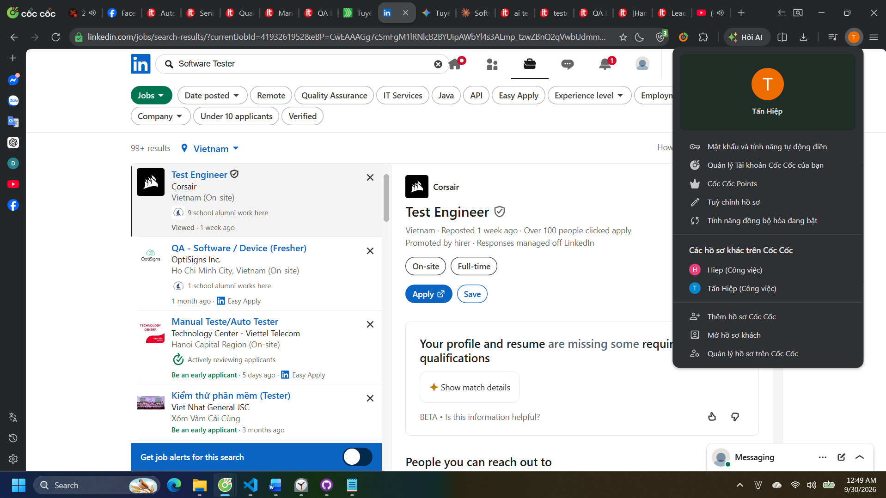

| Mục | Nội dung |
|---|---|
| Link | [link](https://www.linkedin.com/jobs/view/4193261952/) |
| Ngày đăng | 23/09/2026 (hiển thị "1 week ago" lúc 30/09/2026) |
| Mô tả công việc | - Kiểm thử cho các sản phẩm Elgato: camera, capture card, micro, đèn<br>- Kết hợp kiểm thử thủ công và tự động<br>- Xây dựng và cải tiến test case, ghi nhận dữ liệu và phân tích kết quả |
| Kỹ năng bắt buộc | Khả năng kiểm thử tốt; Python; hiểu biết về PC, console, thiết bị thông minh; xử lý sự cố trên Windows, macOS, Android, iOS; tiếng Anh B2 trở lên  |
| Kỹ năng ưu tiên | Có kinh nghiệm trong kiểm thử hoặc tự động hoá |
| Kỹ năng AI / công cụ AI | Không có |
| Mức lương | Không công bố |
| **AI Impact Analysis** | **Thay thế:** Viết báo cáo và viết script kiểm thử. **Hỗ trợ:** Viết script automation, gợi ý test case, phân tích log lỗi. **Không thay thế:** Kiểm thử trên các sản phẩm Elgato (camera, micro, đèn), xử lý sự cố phần cứng thực tế trên các hệ điều hành và đưa khuyến nghị cho stakeholder. |

#### J02 – Software Testing Lead @ Công ty cổ phần dịch vụ công nghệ tin học HPT

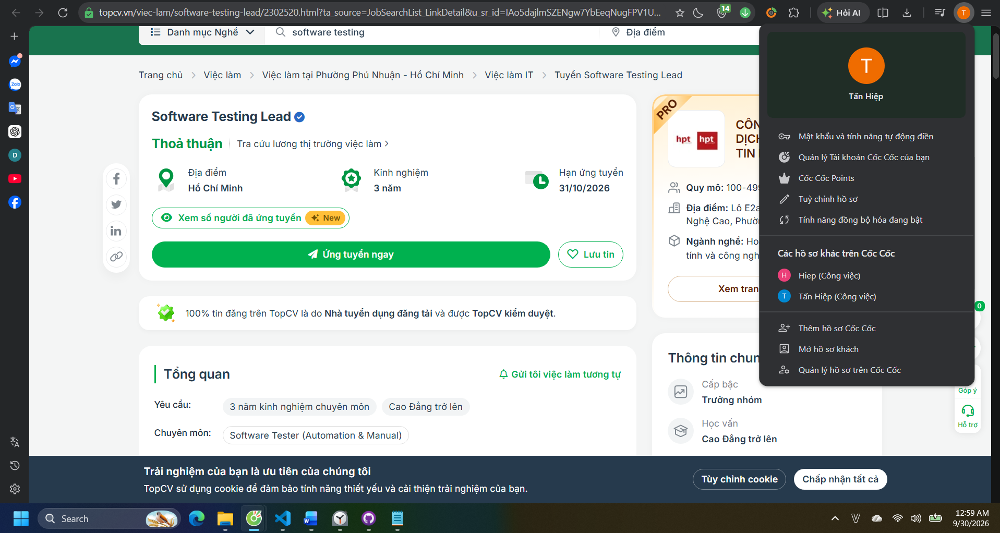
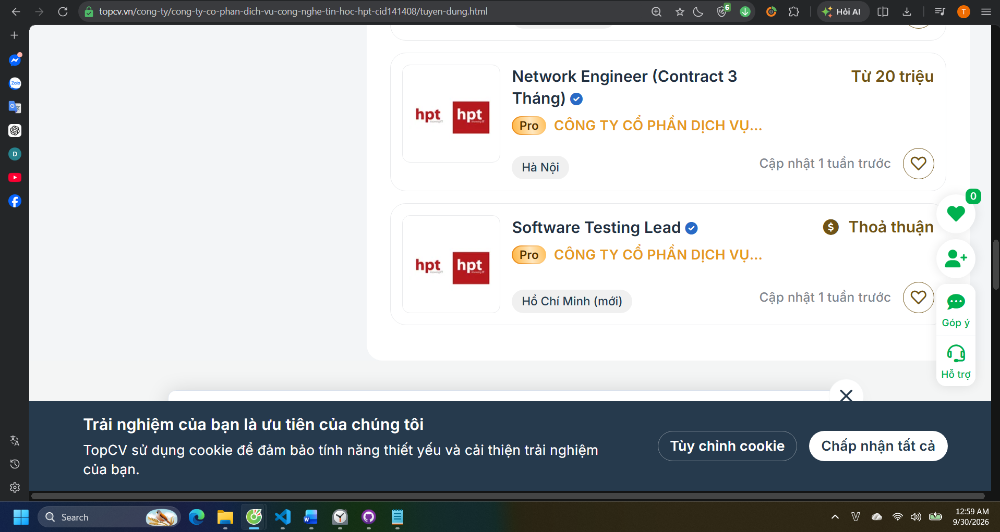

| Mục | Nội dung |
|---|---|
| Link | [link](https://www.topcv.vn/viec-lam/software-testing-lead/2302520.html) |
| Ngày đăng | 23/09/2026 (hiển thị "Cập nhật 1 tuần trước" lúc 30/09/2026); hạn nộp hồ sơ 31/10/2026 |
| Mô tả công việc | - Phân tích tài liệu nghiệp vụ (BRD, User Story, Acceptance Criteria) và thiết kế kịch bản kiểm thử theo logic nghiệp vụ<br>- Thực hiện kiểm thử thủ công ở nhiều cấp độ, chạy các kịch bản tự động có sẵn<br>- Ghi nhận và theo dõi lỗi trên Azure DevOps hoặc Jira<br>- Báo cáo tiến độ kiểm thử, tham gia các buổi họp Agile/Scrum |
| Kỹ năng bắt buộc | 3–5 năm kinh nghiệm QA/Tester; Functional và Non-functional testing; thiết kế test case; hiểu SDLC, Agile/Scrum; có kinh nghiệm với hệ thống Bảo hiểm / Dịch vụ tài chính; tư duy phân tích, giao tiếp, quản lý stakeholder |
| Kỹ năng ưu tiên | Chứng chỉ ISTQB Foundation; Postman, JMeter, Azure DevOps, Jira; automation với Selenium / Appium / Cypress; API integration testing |
| Kỹ năng AI / công cụ AI | Không có |
| Mức lương | Thoả thuận |
| **AI Impact Analysis** | **Thay thế:** Viết báo cáo dùng Azure DevOps hoặc Jira. **Hỗ trợ:** Viết và bảo trì automation script, sinh data test. **Không thay thế:** Hiểu nghiệp vụ, stakeholder, dẫn dắt nhóm và đưa ra các ý kiến mang tính quyết định. |

#### J03 – QA Engineer (Tester/ QA QC) @ OL Vietnam

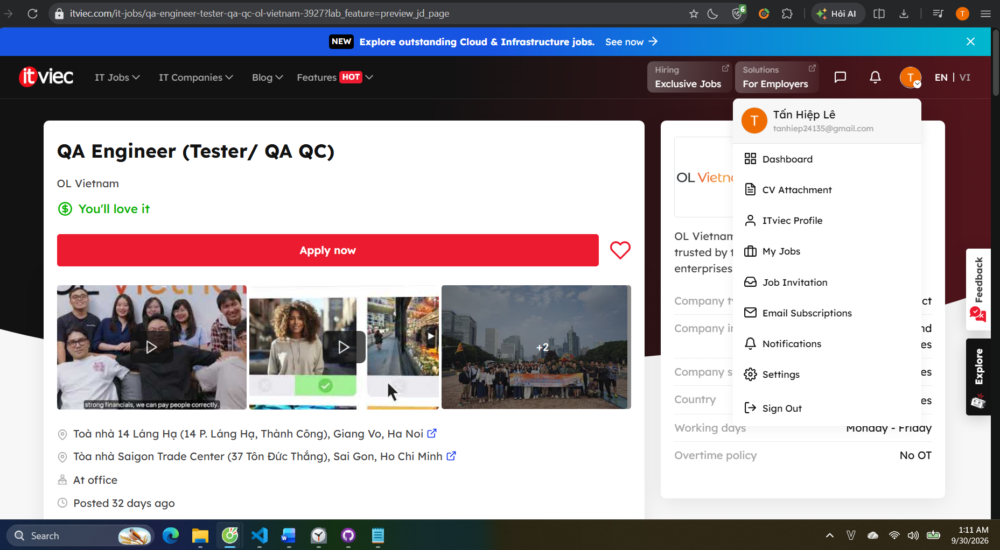

| Mục | Nội dung |
|---|---|
| Link | [link](https://itviec.com/it-jobs/qa-engineer-tester-qa-qc-ol-vietnam-3927) |
| Ngày đăng | 29/08/2026 |
| Mô tả công việc | - Xây dựng chiến lược và thực hiện kiểm thử thủ công để phát hiện lỗi trước khi đến tay người dùng<br>- Đảm bảo tính năng hoạt động đúng trên tất cả các phiên bản đang được hỗ trợ<br>- Đánh giá tính năng mới dưới góc nhìn người dùng cuối<br>- Chủ động đề xuất cải tiến sản phẩm và phương pháp kiểm thử |
| Kỹ năng bắt buộc | Nhiều kinh nghiệm manual testing trên ứng dụng phức tạp; tiếng Anh tốt (nói và viết); nắm vững nền tảng phát triển phần mềm; kỷ luật, chịu được deadline gấp |
| Kỹ năng ưu tiên | Accessibility testing (WCAG, chứng chỉ WAS); automation với Cypress / Selenium; ngôn ngữ script (TypeScript, Java, JavaScript, C#) |
| Kỹ năng AI / công cụ AI | Không có |
| Mức lương | Không công bố ("You'll love it") |
| **AI Impact Analysis** | **Thay thế:** Chạy các execution testing **Hỗ trợ:** Gợi ý design testing, tìm các lỗi accessibility, viết script chạy automation. **Không thay thế:** Đánh giá tính năng dưới góc nhìn người dùng cuối, kiểm thử accessibility testing, đề xuất cải tiến sản phẩm và phương pháp kiểm thử. |

#### J04 – Manual Tester (QA/QC, Good English) @ Netcompany

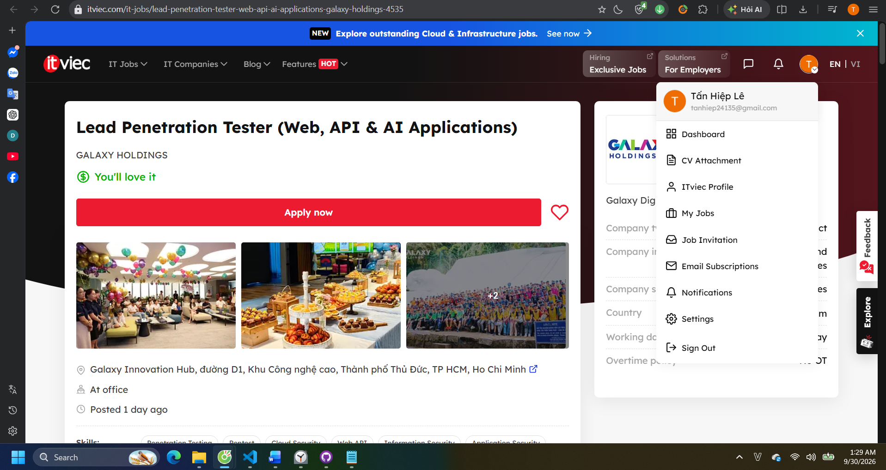

| Mục | Nội dung |
|---|---|
| Link | [link](https://itviec.com/it-jobs/manual-tester-qa-qc-good-english-netcompany-2659) |
| Ngày đăng | 09/09/2026 |
| Mô tả công việc | - Đọc hiểu đặc tả nghiệp vụ và kỹ thuật của các dự án nhiều lĩnh vực<br>- Thiết kế và thực thi test case: chức năng, phi chức năng, kỹ thuật, usability<br>- Quản lý lỗi và đánh giá mức độ nghiêm trọng (severity)<br>- Làm việc trong team Agile giữa Việt Nam và châu Âu, tự lập kế hoạch và báo cáo tiến độ |
| Kỹ năng bắt buộc | Bằng Cử nhân/Thạc sĩ CNTT; tiếng Anh tốt (nói và viết); kinh nghiệm vị trí tương đương (nhận Fresher); nắm lý thuyết kiểm thử; dùng được công cụ quản lý test và bug; ước lượng công việc và đúng hạn |
| Kỹ năng ưu tiên | Chứng chỉ ISTQB; học công nghệ mới nhanh |
| Kỹ năng AI / công cụ AI | Không có |
| Mức lương | Không công bố ("You'll love it") |
| **AI Impact Analysis** | **Thay thế:** Viết báo cáo, sinh các test case cơ bản. **Hỗ trợ:** Đọc hiểu nhanh các dự án đa lĩnh vực, hỗ trợ giao tiếp với team Agile châu Âu. **Không thay thế:** Kiểm thử usability, đánh giá mức độ nghiêm trọng, giao tiếp các team Agile. |

#### J05 – Quality Control Intern (Software Tester) @ Phu Hung Securities (PHS)

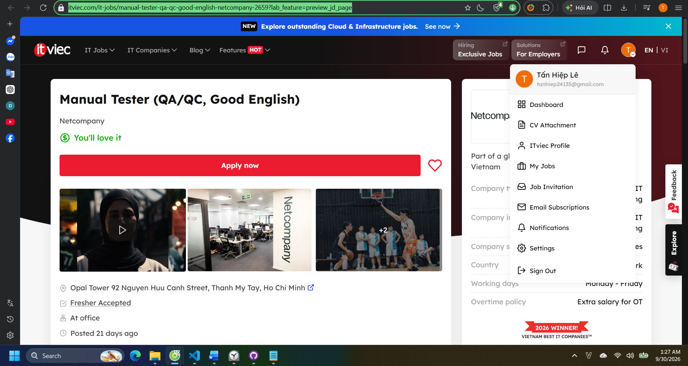

| Mục | Nội dung |
|---|---|
| Link | [link](https://itviec.com/it-jobs/quality-control-intern-software-tester-phu-hung-securities-phs-1247) |
| Ngày đăng | 29/09/2026 |
| Mô tả công việc | - Viết và thực thi test case, test scenario, checklist cho ứng dụng web<br>- Kiểm thử chức năng, hồi quy (regression) và giao diện (UI)<br>- Ghi nhận lỗi trên công cụ quản lý issue, xác nhận bản sửa và retest<br>- Hỗ trợ kiểm thử API (REST) cơ bản dưới sự hướng dẫn<br>- Duy trì tài liệu và báo cáo kết quả kiểm thử |
| Kỹ năng bắt buộc | Sinh viên CNTT/KHMT; nắm khái niệm kiểm thử và SDLC; hiểu ứng dụng web; viết test case và bug report rõ ràng; cẩn thận, tư duy phân tích; giao tiếp, làm việc nhóm; tiếng Anh cơ bản |
| Kỹ năng ưu tiên | Có nền tảng về testing; kiến thức cơ bản HTML, CSS, JavaScript; sẵn sàng học công cụ kiểm thử |
| Kỹ năng AI / công cụ AI | Không có |
| Mức lương | Không công bố ("You'll love it"); trợ cấp 2.000.000 VND/tháng + 400.000 VND/tháng phí gửi xe |
| **AI Impact Analysis** | **Thay thế:** Viết script kiểm thử và chạy execution testing, kiểm thử giao diện, viết báo cáo. **Hỗ trợ:** Kiểm thử API, học công cụ kiểm thử mới. **Không thay thế:** Học để lên cấp, hiểu luồng nghiệp vụ và làm việc với khách hàng. |

#### J06 – Senior/Middle Automation Test (QA QC) @ 8Seneca

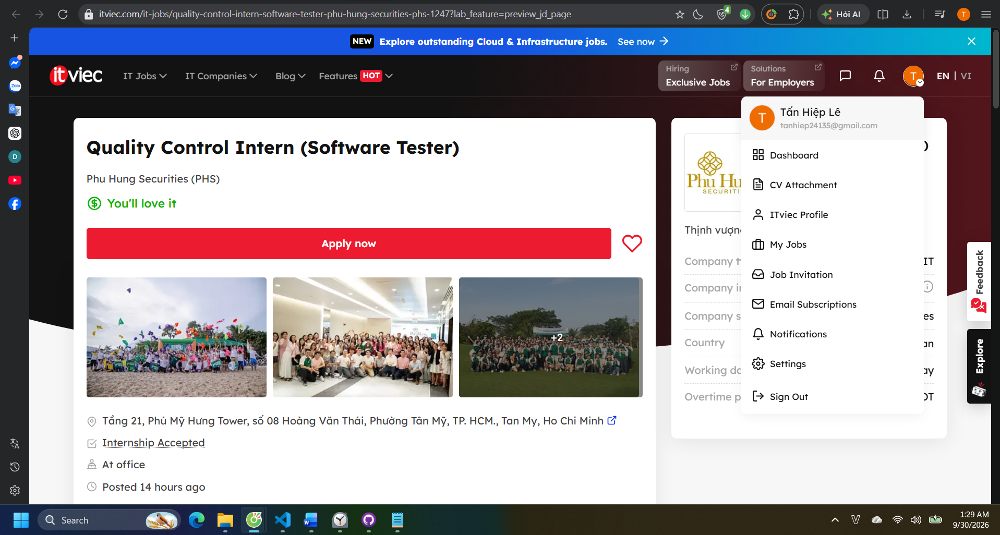

| Mục | Nội dung |
|---|---|
| Link | [link](https://itviec.com/it-jobs/senior-middle-automation-test-qa-qc-8seneca-1756) |
| Ngày đăng | 29/09/2026 |
| Mô tả công việc | - Xây dựng hệ thống kiểm thử từ đầu: automation framework, chiến lược test data, CI pipeline<br>- Xây dựng quy trình QA dựa trên AI: chuyển business rule thành test chạy được ở quy mô lớn<br>- Kiểm tra tính tương đương (parity) giữa hệ thống cũ và mới trong dự án migration; ra quyết định go/no-go<br>- Phối hợp với BA biến đặc tả thành test oracle, duy trì truy vết test ↔ business rule<br>- Dẫn dắt 2 kỹ sư QA/BA, tổ chức UAT với khách hàng |
| Kỹ năng bắt buộc | Senior: 5+ năm QA/automation, 2+ năm lead (Middle: 3+ năm); từng tự xây automation framework; Playwright, Selenium, REST Assured, Postman/Newman; Java / TypeScript / Python; SQL (Oracle); làm chủ test strategy; tiếng Anh tốt |
| Kỹ năng ưu tiên | Công cụ test dạng agent/MCP (Playwright MCP, browser agent, self-healing locator); đối soát dữ liệu lớn; kinh nghiệm migration hệ thống legacy; CI/CD (GitLab CI, Jenkins, OpenShift/Kubernetes); contract/API testing; WCAG; performance (JMeter, k6) |
| Kỹ năng AI / công cụ AI | **Bắt buộc:** đã dùng AI coding agent (Claude Code, Cursor, Copilot hoặc tương tự) để sinh và bảo trì test code; phân biệt được test do AI sinh đúng hay "trông hợp lý nhưng sai". **Ưu tiên:** Playwright MCP, browser agent |
| Mức lương | Không công bố ("You'll love it") |
| **AI Impact Analysis** | **Thay thế:** Các việc viết và bảo trì test. **Hỗ trợ:** Chuyển business rule thành test, kiểm tra parity giữa hệ thống migration. **Không thay thế:** Xây dựng hệ thống kiểm thử, test oracle với BA, dẫn dắt 2 kỹ sư QA/BA, tổ chức UAT với khách hàng, ra quyết định go/no-go. |

#### J07 – Automation Tester (QA QC/ Tester/ Japanese N3+) @ TrustedAI

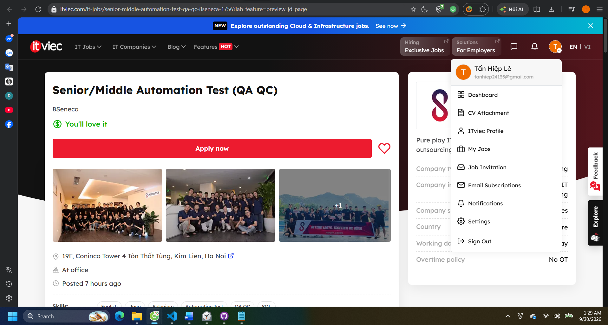

| Mục | Nội dung |
|---|---|
| Link | [link](https://itviec.com/it-jobs/automation-tester-qa-qc-tester-japanese-n3-trustedai-2550) |
| Ngày đăng | 24/09/2026 |
| Mô tả công việc | - Xác định quy trình và phạm vi rủi ro kiểm thử ngay từ đầu dự án<br>- Kiểm thử chức năng và hồi quy trên nhiều trình duyệt/thiết bị, kiểm thử đa ngôn ngữ (Nhật, Việt, Anh)<br>- Phát hiện, phân loại lỗi kèm bước tái hiện rõ ràng<br>- Tự động hóa quy trình test, xây dựng tài liệu test case và QC checklist |
| Kỹ năng bắt buộc | 3+ năm QA/Tester, từng làm Test Leader; có nền tảng lập trình; tự lập test plan, test case và quy trình quản lý bug; kinh nghiệm automation testing; tiếng Nhật N3 trở lên; đọc hiểu tiếng Anh kỹ thuật |
| Kỹ năng ưu tiên | Kinh nghiệm kiểm thử sản phẩm AI, chatbot hoặc ứng dụng xử lý ngôn ngữ tự nhiên (NLP) |
| Kỹ năng AI / công cụ AI | "Ứng dụng AI vào các tác vụ test"; ưu tiên kinh nghiệm test chatbot/AI/RAG |
| Mức lương | 800 – 1,500 USD |
| **AI Impact Analysis** | **Thay thế:** Viết và kiểm thử chức năng hồi quy trên nhiều trình duyệt/ thiết bị. **Hỗ trợ:** Xây dựng tài liệu test case và QC checklist, kiểm thử đa ngôn ngữ. **Không thay thế:** Xác định quy trình và phạm vi rủi ro kiểm thử từ đầu, kiểm thử sản phẩm AI. |

#### J08 – QA Engineer (Claude Code, Python, React, Manual Tester) @ Brarista

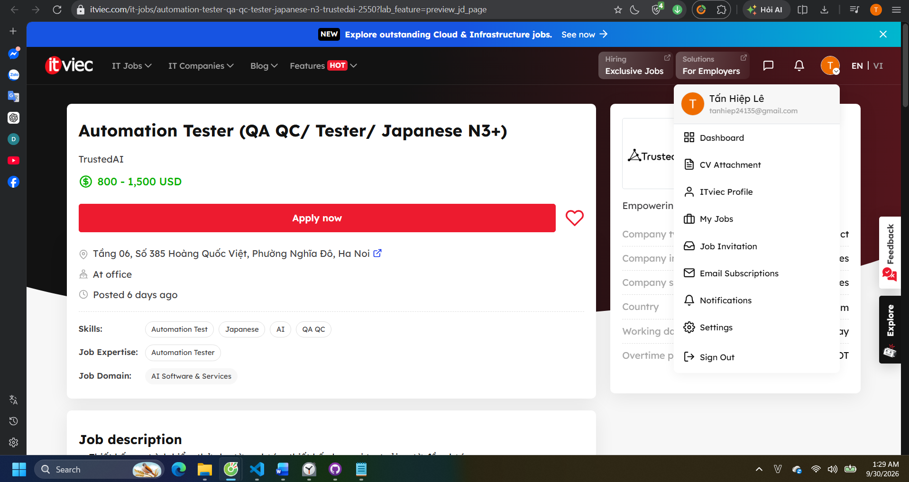
| Mục | Nội dung |
|---|---|
| Link | [link](https://itviec.com/it-jobs/qa-engineer-claude-code-python-react-manual-tester-brarista-4435) |
| Ngày đăng | 08/09/2026 |
| Mô tả công việc | - Kiểm thử "sizing engine" (quy đổi size) trên 11 hệ size khu vực với hàng nghìn tổ hợp, dùng Claude Code để sinh test matrix và bộ regression<br>- Kiểm soát chất lượng dữ liệu catalogue, xác minh các tag sản phẩm do AI gợi ý<br>- Chịu trách nhiệm chất lượng bản release và viết release note cho khách hàng<br>- Tái hiện và phân loại bug do khách hàng báo, ghi lại cho kỹ sư xử lý |
| Kỹ năng bắt buộc | Cực kỳ tỉ mỉ; thành thạo Claude Code (kể cả phát hiện lỗi do nó sinh ra); tư duy edge case (giá trị rỗng, trùng lặp, ký tự lạ, giá trị biên); viết tiếng Anh rõ ràng; quan tâm đến domain size thời trang |
| Kỹ năng ưu tiên | Intercom, Gleap hoặc công cụ báo lỗi tương tự; viết changelog/release note; automation (pytest, Playwright); kinh nghiệm E-commerce / Shopify |
| Kỹ năng AI / công cụ AI | **Bắt buộc:** Claude Code (phải chứng minh được); team dùng Cursor và Claude Code, phần lớn code do AI viết có người review |
| Mức lương | 800 – 1,000 USD |
| **AI Impact Analysis** | **Thay thế:** Sinh test matrix và bộ regression. **Hỗ trợ:** Kiểm soát chất lượng catalogue và viết release note cơ bản. **Không thay thế:** Kỹ năng dùng AI, tư duy edge case, domain size thời trang, tái hiện và phân loại bug. |

#### J09 – [Hanoi] Fullstack QA Engineer Lead (Manual, Auto, AI) @ Money Forward Vietnam

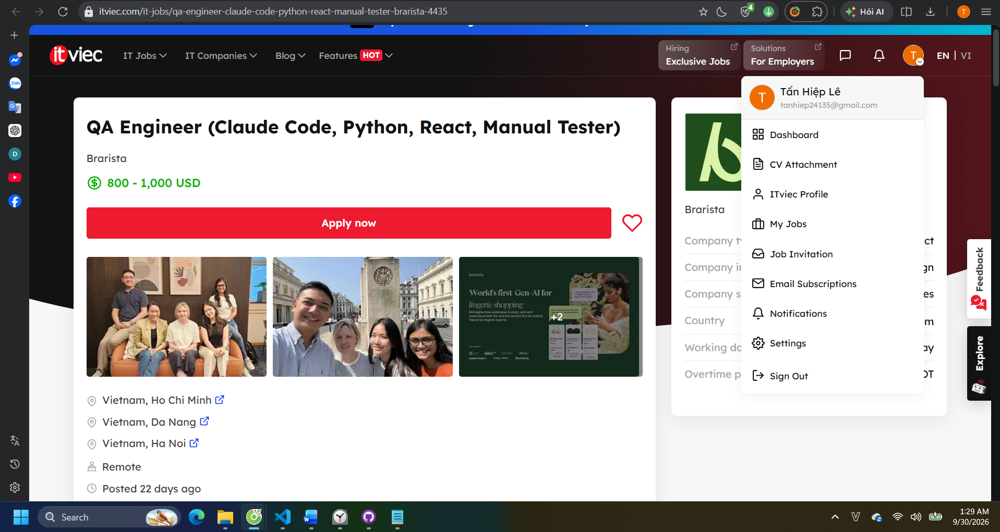

| Mục | Nội dung |
|---|---|
| Link | [link](https://itviec.com/it-jobs/hanoi-fullstack-qa-engineer-lead-manual-auto-ai-money-forward-vietnam-co-ltd-4636) |
| Ngày đăng | 30/09/2026 |
| Mô tả công việc | - Làm cầu nối kỹ thuật với PM/Dev phía Nhật về yêu cầu nghiệp vụ và phi chức năng (NFR)<br>- Ra quyết định release cấp squad dựa trên đánh giá rủi ro<br>- Thiết kế automation framework cho web và API (Playwright/TypeScript hoặc Python), review code automation<br>- Hỗ trợ đội QA outsource, thúc đẩy Shift-Left testing<br>- Dẫn dắt team áp dụng GenAI trong test; kiểm thử khám phá cho các tính năng AI (chatbot, agent) |
| Kỹ năng bắt buộc | 8+ năm QA/SDET, 3+ năm lead; automation JS/TS với Playwright / Cypress / Selenium; API testing (REST/GraphQL), SQL; CI/CD, Docker; dùng GenAI hằng ngày; tiếng Anh lưu loát; tư duy chiến lược chất lượng và quản lý rủi ro release |
| Kỹ năng ưu tiên | Giao tiếp tiếng Nhật; kinh nghiệm performance testing |
| Kỹ năng AI / công cụ AI | Cursor, GitHub Copilot, LLM assistant dùng cho thiết kế test, sinh script và triage; kiểm thử và validate output của tính năng AI (chatbot, agent, gợi ý tự động); xây dựng hướng dẫn dùng AI an toàn trong team |
| Mức lương | Không công bố ("You'll love it") |
| **AI Impact Analysis** | **Thay thế:** Viết script automation. **Hỗ trợ:** Thiết kế test, review code automation. **Không thay thế:** Yêu cầu nghiệp vụ và phi chức năng, ra quyết định release, hỗ trợ QA outsource, dẫn dắt áp dụng GenAI trong test, tư duy chiến lược và quản lý rủi ro release. |

#### J10 – Lead Penetration Tester (Web, API & AI Applications) @ Galaxy Holdings

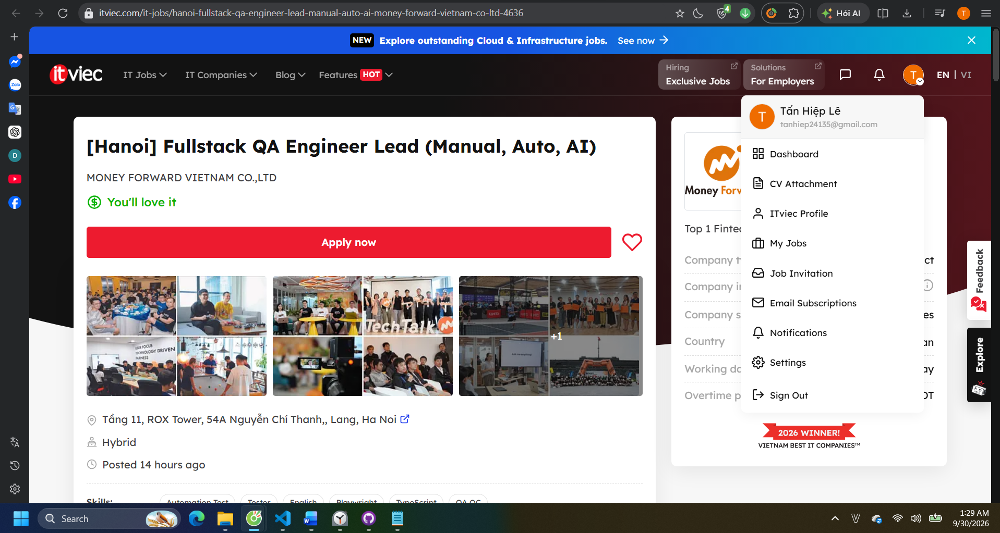

| Mục | Nội dung |
|---|---|
| Link | [link](https://itviec.com/it-jobs/lead-penetration-tester-web-api-ai-applications-galaxy-holdings-4535) |
| Ngày đăng | 29/09/2026 |
| Mô tả công việc | - Dẫn dắt kiểm thử xâm nhập cho web, API, mobile backend và ứng dụng tích hợp AI/LLM<br>- Xây dựng mô hình kiểm thử liên tục (CTEM/PTaaS), kết hợp manual với automation và tích hợp CI/CD (DevSecOps)<br>- Pentest hạ tầng cloud-native (Container, Kubernetes, Serverless) và chuỗi cung ứng phần mềm<br>- Chuyển kết quả kiểm thử thành khuyến nghị giảm thiểu rủi ro cho Blue Team/SOC, dẫn dắt Purple Team<br>- Quản lý đội, báo cáo rủi ro cho lãnh đạo; đảm bảo tuân thủ ISO 27001, PCI DSS và luật an ninh mạng |
| Kỹ năng bắt buộc | 6+ năm IT/an ninh mạng, 4+ năm pentest web/API, 2+ năm quản lý team ≥ 3 người; OWASP, PTES, NIST SP 800-115, MITRE ATT&CK, CVSS 4.0; Python, Go, Bash, JavaScript; OAuth 2.0/OIDC, SAML, JWT, Zero Trust; DevSecOps, SAST/DAST/SCA, SBOM |
| Kỹ năng ưu tiên | Chứng chỉ OSCP/OSCP+, OSWE, OSWA, BSCP, GWAPT, CISSP, CISM, CREST...; kinh nghiệm Red Team, Bug Bounty; kinh nghiệm đánh giá bảo mật ứng dụng AI/LLM; domain tài chính, ngân hàng, hàng không |
| Kỹ năng AI / công cụ AI | Kiểm thử ứng dụng AI/LLM và Agentic AI: prompt injection, rò rỉ dữ liệu qua RAG, lạm dụng quyền của agent/tool, kiểm soát kết nối MCP; OWASP Top 10 for LLM, NIST AI RMF, AI red teaming; dùng AI/LLM để tăng tốc phân tích và viết báo cáo |
| Mức lương | Không công bố ("You'll love it") |
| **AI Impact Analysis** | **Thay thế:** Tăng tốc phân tích, viết báo cáo, chạy quét lỗ hổng. **Hỗ trợ:** Phân tích kết quả, viết kịch bản kiểm thử xâm nhập. **Không thay thế:** Kinh nghiệm đánh giá bảo mật ứng dụng, domain tài chính, ngân hàng, hàng không. |

### 1.3 Mindmap vai trò QA/QC do AI sinh và 3 lỗi

**Prompt:** xem `Prompt #10` – Phụ lục A

**Mindmap do AI sinh (bản gốc):**

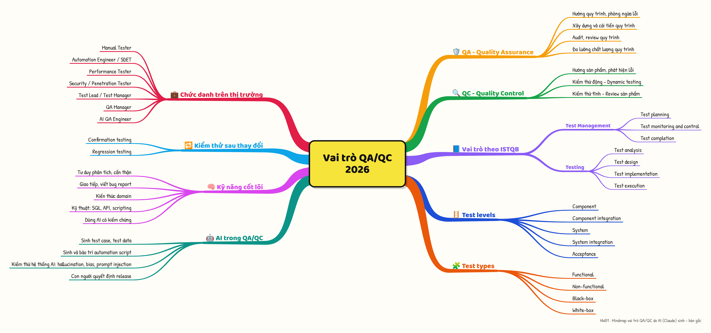

**3 lỗi phát hiện:**

| # | Vị trí trong mindmap | AI viết | Vì sao sai | Căn cứ | Sửa thành |
|---|---|---|---|---|---|
| E1 | 3 nhánh lớn: "Test levels", "Test types", "Kiểm thử sau thay đổi" | Đặt 3 nhánh kiến thức kỹ thuật lại cùng cấp với các nhánh vai trò (như QA, QC, Chức danh,...) | Đề thì yêu cầu mindmap vai trò QA/QC. Mà test levels, test types và kiểm thử sau thay đổi chính là kiến thức kỹ thuật mà mọi vai trò cần nắm, không phải vai trò. Đặt cùng cấp như vậy làm cho mindmap không còn ý chính về vai trò nữa. Với lại trong CTFL v4.0 thì "Kiểm thử sau thay đổi" cũng là một Test types thuộc về "Test types", vậy nên đưa nó vào "Test types" sẽ hợp lý hơn | Yêu cầu (AI Tool draws a QA/QC role mindmap); CTFL v4.0 chương 2.2 xếp các mục này là kiến thức về kiểm thử, không phải vai trò | Gộp nhánh "Kiêm thử sau thay đổi vào trong "Test types" tức là sau "Test types" sẽ có: "Functional", "Non-functional", "Black-box", "White-box", "Kiểm thử sau thay đổi". Còn các nhánh con của "Kiểm thử sau thay đổi giữ nguyên". Tiếp tục gộp 2 nhánh "Test types" và "Test levels" thành một nhánh lớn "Kiến thức nền tảng" (giữ nguyên nội dung trong tương tự), tách rõ khỏi các nhánh vai trò|
| E2 | Nhánh lớn "Chức danh trên thị trường" | Liệt kê 7 chức danh, không có chức danh nào là QC hoặc là thuộc QC | Thiếu chức danh QC, cách gọi phổ biến của nghề kiểm thử tại Việt Nam (Bằng chứng là có 4 JD ghi là QC); Có thể là vì AI nghĩ QA QC là một nên không liệt kê, hoặc là ảnh hưởng từ data của nước ngoài | Từ R1: 4/10 JD có chữ QC trong tên vị trí (J03, J04, J05, J06); Outcomes của đề: "Describe the 2026+ QA/QC job-market landscape" | Thêm "QC Intern / Fresher" vào nhánh lớn "Chức danh trên thị trường" |
| E3 | Nhánh lớn "AI trong QA/QC" | Nhánh con "Con người quyết định release" nằm chung với việc AI hỗ trợ/thay thế (sinh test case, sinh script, kiểm thử hệ thống AI) | Những nhánh con đó không cùng chung ngữ nghĩa: các mục còn lại là việc AI làm, còn quyết định release thì là trách nhiệm của con người. | Vào ngữ nghĩa của nhánh lớn, rồi suy xuống nhánh con | Bỏ luôn "Con người quyết định Release" trong nhánh lớn "AI trong QA/QC" |

**Mindmap sau khi sửa:**

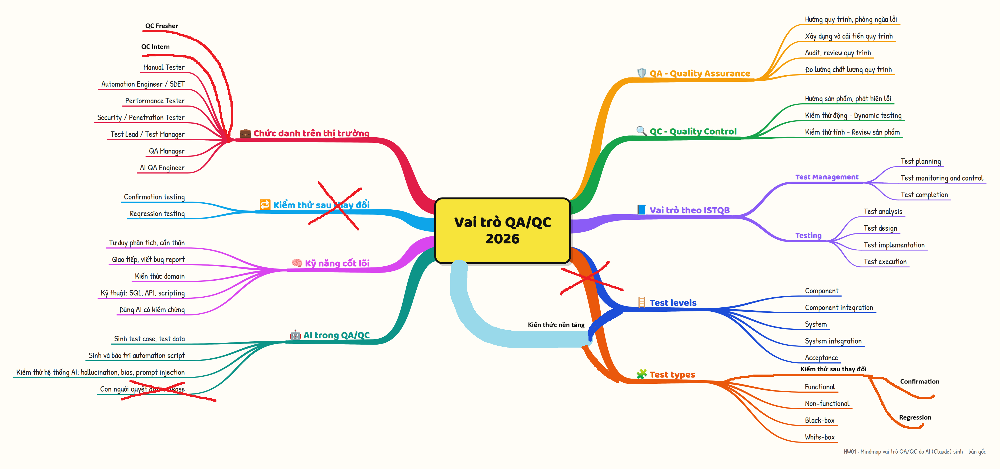


### 1.4 Tổng hợp xu hướng thị trường 2026+

**Thống kê từ 10 tin:**

| Chỉ số | Giá trị |
|---|---|
| Số tin Manual / Automation / AI-QA / Khác | 4 / 2 / 3 / 1 <br>• Manual: J02, J03, J04, J05<br>• Automation: J01, J07<br>• AI-QA (AI là kỹ năng bắt buộc): J06, J08, J09<br>• Khác (Security testing): J10 |
| Số tin yêu cầu AI/LLM | 5/10 (J06–J10); trong đó 4 tin bắt buộc (J06, J08, J09, J10), 1 tin ưu tiên (J07) |
| Dải lương | Chỉ 3/10 tin công bố lương:<br>• Intern: trợ cấp 2.000.000 VND/tháng + 400.000 VND gửi xe (J05)<br>• Fresher – Middle: 800 – 1,000 USD (J08)<br>• Middle: 800 – 1,500 USD (J07)<br>• Senior / Lead: không tin nào công bố (J02, J06, J09, J10) |
| Top 5 kỹ năng xuất hiện nhiều nhất (/10) | 1. Tiếng Anh (8/10)<br>2. Automation testing – Selenium / Playwright / Cypress... (8/10)<br>3. Lập trình / scripting – Java, TypeScript, Python, JS (8/10)<br>4. Sử dụng công cụ AI / kiểm thử sản phẩm AI (5/10)<br>5. API testing – REST, Postman (5/10) |
| Công cụ AI được nhắc đến | Claude Code (J06, J08), Cursor (J06, J08, J09), GitHub Copilot (J06, J09), ChatGPT (J06), LLM assistants (J09), Playwright MCP / browser agents (J06 – ưu tiên) |

**Phân loại công việc QA/QC theo mức độ tác động của AI:**

| Nhóm | Công việc cụ thể | Minh chứng từ tin tuyển dụng |
|---|---|---|
| AI **có thể thay thế** (phần lớn khối lượng, người chỉ review) | Sinh test matrix cho số lượng tổ hợp lớn; sinh và bảo trì test script / automation code; chuyển business rule thành test chạy được; soạn nháp báo cáo | J08 (Claude Code sinh test matrix, regression suite), J06 (AI coding agent sinh test code, pipeline "business rule → test case"), J09 (script generation), J10 (dùng AI soạn báo cáo) |
| AI **hỗ trợ** (người vẫn quyết định) | Thiết kế test case, triage bug; phân tích kết quả kiểm thử; gắn tag / phân loại dữ liệu (người phải kiểm tra lại output của AI) | J09 (GenAI tăng tốc test design và triage), J10 (AI tăng tốc phân tích), J08 (verify tag sản phẩm do AI gợi ý), J06 (phân biệt test AI sinh đúng với test "trông hợp lý nhưng sai") |
| AI **không thay thế** | Quyết định go/no-go release dựa trên rủi ro; exploratory testing (đặc biệt với tính năng AI); UAT và giao tiếp với khách hàng / stakeholder; dẫn dắt, mentor team; đặt quy định dùng AI an toàn; kiểm thử bảo mật cho chính hệ thống AI | J06 (go/no-go, UAT, lead 2 kỹ sư), J09 (release decision theo rủi ro, exploratory testing chatbot/agent, guideline dùng AI an toàn, cầu nối với PM Nhật), J10 (prompt injection, rò rỉ dữ liệu qua RAG, AI red teaming), J02 (quản lý stakeholder) |

**Nhận xét (3–5 câu):** Thị trường QA/QC 2026 đang chia hai rõ rệt. Các vị trí đầu vào (Intern/Fresher: J04, J05) vẫn chủ yếu là manual testing và không yêu cầu AI, còn phần lớn vị trí Middle trở lên đòi hỏi automation, lập trình và dùng AI như một kỹ năng bắt buộc (J06, J08, J09). AI đang đảm nhận phần "sinh ra" (test case, script, test matrix), trong khi con người chuyển sang phần "kiểm chứng và quyết định": kiểm tra output của AI, đánh giá rủi ro, quyết định release. Ngoài ra còn xuất hiện nhu cầu mới là **kiểm thử chính hệ thống AI** (chatbot, agent, RAG, prompt injection – J07, J09, J10). Đây là mảng mà kiến thức kiểm thử truyền thống chưa đủ. Mức lương hầu như không được công bố (7/10 tin), nên khó so sánh chênh lệch thu nhập giữa tester có kỹ năng AI và tester không có.

---

## 2. Requirement 2 – 20 Software Defects 2022–2026

> 📝 **Hướng dẫn:**
> - 20 defect được **công bố** trong 2022–2026. Ghi ngày công bố của nguồn.
> - Ít nhất **5 defect AI/LLM** (hallucination, prompt injection, bias, jailbreak, data leak qua LLM...).
> - Ưu tiên nguồn gốc: postmortem/official statement của hãng, báo lớn (Reuters, The Verge, BBC...), CVE/NVD, AI Incident Database (incidentdatabase.ai).
> - Định nghĩa thang severity trước (bảng 2.0) rồi áp dụng nhất quán.

### 2.0 Thang đánh giá Severity

| Mức | Định nghĩa áp dụng trong bài |
|---|---|
| Critical | [VD: gây thiệt hại tài chính/an toàn lớn, sập hệ thống diện rộng, lộ dữ liệu quy mô lớn] |
| High | [VD: mất chức năng chính, ảnh hưởng nhiều người dùng, có workaround khó] |
| Medium | [VD: lỗi chức năng phụ, có workaround] |
| Low | [VD: lỗi hiển thị, ảnh hưởng nhỏ] |

### 2.1 Bảng 20 defect

**Bảng tổng quan:**

| ID | Tên defect | Năm công bố | Tổ chức / Sản phẩm | Nhóm | Loại lỗi | Severity | Nguồn |
|---|---|---|---|---|---|---|---|
| D01 | [...] | [2022–2026] | [...] | [AI/LLM / Non-AI] | [VD: Hallucination / Prompt injection / Bias / Logic / Config / Security...] | [...] | [link] |
| D02 | [...] | [...] | [...] | [...] | [...] | [...] | [link] |
| D03 | [...] | [...] | [...] | [...] | [...] | [...] | [link] |
| D04 | [...] | [...] | [...] | [...] | [...] | [...] | [link] |
| D05 | [...] | [...] | [...] | [...] | [...] | [...] | [link] |
| D06 | [...] | [...] | [...] | [...] | [...] | [...] | [link] |
| D07 | [...] | [...] | [...] | [...] | [...] | [...] | [link] |
| D08 | [...] | [...] | [...] | [...] | [...] | [...] | [link] |
| D09 | [...] | [...] | [...] | [...] | [...] | [...] | [link] |
| D10 | [...] | [...] | [...] | [...] | [...] | [...] | [link] |
| D11 | [...] | [...] | [...] | [...] | [...] | [...] | [link] |
| D12 | [...] | [...] | [...] | [...] | [...] | [...] | [link] |
| D13 | [...] | [...] | [...] | [...] | [...] | [...] | [link] |
| D14 | [...] | [...] | [...] | [...] | [...] | [...] | [link] |
| D15 | [...] | [...] | [...] | [...] | [...] | [...] | [link] |
| D16 | [...] | [...] | [...] | [...] | [...] | [...] | [link] |
| D17 | [...] | [...] | [...] | [...] | [...] | [...] | [link] |
| D18 | [...] | [...] | [...] | [...] | [...] | [...] | [link] |
| D19 | [...] | [...] | [...] | [...] | [...] | [...] | [link] |
| D20 | [...] | [...] | [...] | [...] | [...] | [...] | [link] |

**Thống kê:** AI/LLM: [x]/20 (yêu cầu >= 5) · Critical [x] · High [x] · Medium [x] · Low [x]

**Bảng chi tiết:**

> 📝 Mỗi ô 1–3 câu. "Giải pháp" = cách hãng đã khắc phục thực tế (theo nguồn) + bài học kiểm thử (loại test nào lẽ ra bắt được lỗi này).

| ID | Mô tả | Hậu quả | Giải pháp (thực tế) | Bài học kiểm thử |
|---|---|---|---|---|
| D01 | [...] | [...] | [...] | [...] |
| D02 | [...] | [...] | [...] | [...] |
| D03 | [...] | [...] | [...] | [...] |
| D04 | [...] | [...] | [...] | [...] |
| D05 | [...] | [...] | [...] | [...] |
| D06 | [...] | [...] | [...] | [...] |
| D07 | [...] | [...] | [...] | [...] |
| D08 | [...] | [...] | [...] | [...] |
| D09 | [...] | [...] | [...] | [...] |
| D10 | [...] | [...] | [...] | [...] |
| D11 | [...] | [...] | [...] | [...] |
| D12 | [...] | [...] | [...] | [...] |
| D13 | [...] | [...] | [...] | [...] |
| D14 | [...] | [...] | [...] | [...] |
| D15 | [...] | [...] | [...] | [...] |
| D16 | [...] | [...] | [...] | [...] |
| D17 | [...] | [...] | [...] | [...] |
| D18 | [...] | [...] | [...] | [...] |
| D19 | [...] | [...] | [...] | [...] |
| D20 | [...] | [...] | [...] | [...] |

### 2.2 Chỗ AI bias / hallucinate khi giải thích defect

> 📝 **Hướng dẫn:**
> - Hỏi AI giải thích 1 defect trong danh sách (hỏi về ngày, con số thiệt hại, nguyên nhân gốc, số người ảnh hưởng, ai chịu trách nhiệm là những chỗ AI hay bịa).
> - Đối chiếu với nguồn gốc, chỉ ra **chính xác câu nào sai**, sai kiểu gì (hallucination: bịa sự kiện/số liệu/trích dẫn; bias: quy lỗi thiên lệch, đánh giá một chiều).
> - 🔒 Screenshot khung chat thật, khoanh đỏ câu sai.

| Mục | Nội dung |
|---|---|
| Defect được hỏi | [D..] – [tên] |
| Prompt | `P[..]` – Phụ lục A |
| Câu AI trả lời sai (trích nguyên văn) | "[...]" |
| Loại | [Hallucination / Bias] |
| Sự thật theo nguồn | [...] – [link nguồn] |
| Vì sao AI sai (giả thuyết) | [VD: dữ liệu huấn luyện trước sự kiện, trộn 2 sự cố tương tự, thiên về nguồn truyền thông...] |
| Cách phát hiện / phòng tránh | [...] |


---

## 3. Requirement 3 – Test thiết bị vật lý

### 3.1 Thông tin thiết bị (ảnh + thẻ SV)

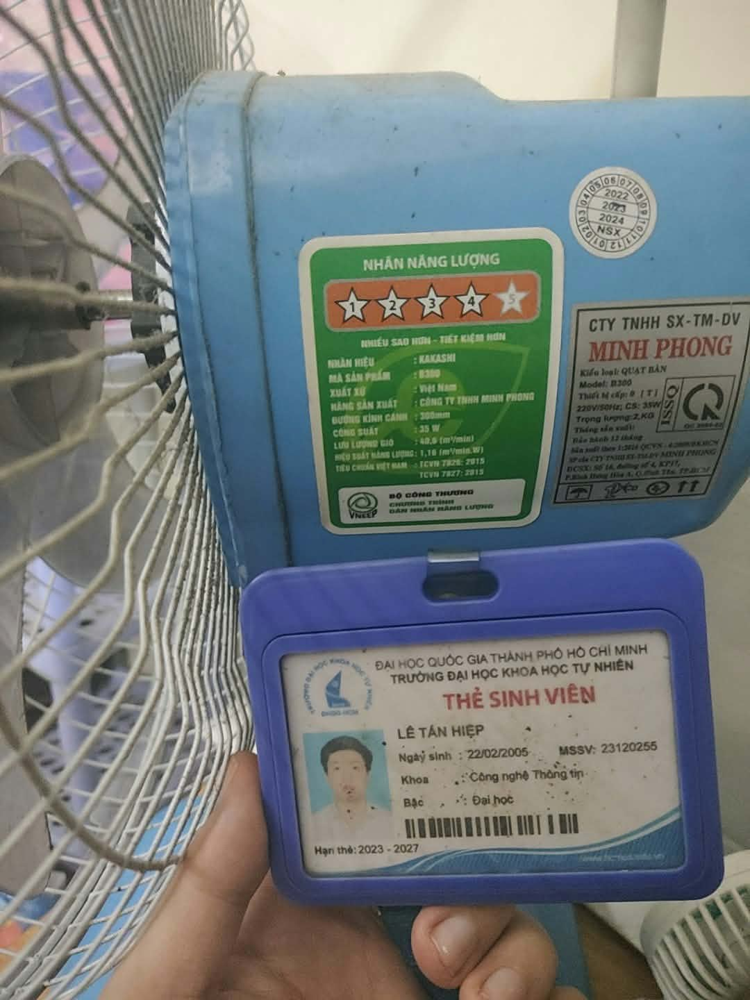 🔒

| Thuộc tính | Giá trị |
|---|---|
| Loại thiết bị | Quạt điện |
| Thương hiệu | Kakashi |
| Model | B300 |
| Năm sản xuất / mua | Không biết/2023 |
| Serial number | Đã tìm kết hợp tra cứu, quạt không có serial number |
| Thông số kỹ thuật chính | Công suất 35W, điện áp 220V |
| Tình trạng | Đã dùng 3 năm |
| Chức năng | Thổi gió, làm mát |

### 3.2 Phạm vi và chiến lược kiểm thử

**Các chức năng / đặc tính của thiết bị (test conditions):**

| Mã | Chức năng / đặc tính | Trong phạm vi? |
|---|---|---|
| F1 | Bảng điều khiển gồm các phím cơ dạng piano: 0 (tắt), 1, 2, 3. Nhấn một phím số thì phím đang chọn bật lên. | Có |
| F2 | Chế độ xoay được bật/tắt bằng núm cơ (nhấn xuống/kéo lên) trên đỉnh hộp motor. |  Có |
| F3 | Cơ cấu xoay chạy chung motor cánh, nên xoay chỉ hoạt động khi quạt đang quay. |  Có |
| F4 | Nguồn điện 220V / 50Hz, dùng ổ cắm dân dụng. | Có |
| F5 | Test chống nước, quá áp |  Không – lý do: nguy hiểm/phá hủy thiết bị |

**Loại kiểm thử bao phủ:** Functional, Usability

**Môi trường test:** Nguồn điện 220V, nhiệt độ phòng 39°C, dụng cụ đo: đồng hồ bấm giờ / app đo âm thanh

**Ngoài phạm vi (và lý do):** test chống nước, quá áp do nguy hiểm/mất bảo hành

### 3.3 Bảng 15 test case

| TC ID | Objective |  Precondition | Input / Test data | Steps | Expected | Actual | Verdict | Nguồn |
|---|---|---|---|---|---|---|---|---|
| TC01 | Bật quạt ở số 1 từ trạng thái tắt | Quạt đặt trên mặt bàn phẳng, khô, đã cắm điện 220V. Phím ở 0, xoay tắt, đầu quạt hướng thẳng. Phòng không bật quạt/điều hòa khác. | Phím 1 | 1. Nhấn phím 1<br>2. Quan sát cánh trong 10 s | Phím 1 giữ ở trạng thái nhấn. Cánh bắt đầu quay trong <= 3 s và đạt tốc độ ổn định. Không có tiếng lạ. | Phím 1 giữ ở trạng thái nhấn. Cánh bắt đầu quay trong <= 2.6s và đạt tốc độ ổn định. Không có tiếng lạ. | Pass | AI |
| TC02 | Bật quạt ở số 3 từ trạng thái tắt | Quạt đặt trên mặt bàn phẳng, khô, đã cắm điện 220V. Phím ở 0, xoay tắt, đầu quạt hướng thẳng. Phòng không bật quạt/điều hòa khác. | Phím 3 | 1. Nhấn phím 3<br>2. Quan sát 10 s | Phím 3 giữ. Cánh quay mạnh nhất. Quạt không rung lắc bất thường. | Phím 3 giữ. Cánh quay mạnh nhất. Quạt không rung lắc bất thường. | Pass | AI |
| TC03 | Tắt quạt bằng phím 0 khi đang chạy tối đa | Quạt đang ở số 3 >= 30 s | Phím 0 | 1. Nhấn phím 0<br>2. Bấm giờ từ lúc nhấn đến khi cánh dừng hẳn | Phím 3 bật lên. Motor ngắt điện ngay. Cánh quay chậm dần rồi dừng hoàn toàn, không quay ngược, không có tiếng va chạm. Ghi lại thời gian dừng (s). | Phím 3 bật lên. Motor ngắt điện ngay. Cánh quay chậm dần rồi dừng hoàn toàn, không quay ngược, không có tiếng va chạm. Dừng hẳn sau 6s | Pass | AI |
| TC04 | Tốc độ tăng dần đúng thứ tự 1 < 2 < 3 | Quạt đặt trên mặt bàn phẳng, khô, đã cắm điện 220V. Phím ở 0, xoay tắt, đầu quạt hướng thẳng. Phòng không bật quạt/điều hòa khác; app đo dB sẵn sàng | Phím 1, 2, 3 (mỗi mức giữ 15 s) | 1. Nhấn 1, chờ 15 s, ghi dB và góc lệch dải giấy<br>2. Nhấn 2, lặp lại<br>3. Nhấn 3, lặp lại | Cả dB và góc lệch dải giấy tăng dần theo thứ tự số 1 < số 2 < số 3. Mỗi lần chuyển số, chỉ phím mới được giữ. | Dải trống trông càng cố bay cao hơn với mỗi số tăng, dB tăng lần lượt theo: 90dB < 92dB < 95dB | Pass | AI |
| TC05 | Chuyển trực tiếp từ số 3 xuống số 1 | Quạt ở số 3 >= 15 s | Phím 1 | 1. Nhấn phím 1<br>2. Quan sát 15 s | Phím 3 bật lên, phím 1 giữ. Cánh giảm tốc về mức số 1 (bằng TC01), không dừng hẳn giữa chừng. | Phím 3 bật lên, phím 1 giữ. Cánh giảm tốc về mức số 1 chứ không dừng hẳn giữa chừng. | Pass | AI |
| TC06 | Bật chế độ xoay khi quạt đang chạy | Quạt ở số 1, xoay tắt, đã dán mốc biên | Núm xoay: bật | 1. Bật núm xoay<br>2. Bấm giờ 3 chu kỳ liên tiếp<br>3. Quan sát 2 biên | Đầu quạt xoay qua lại đều giữa 2 biên. Thời gian các chu kỳ gần bằng nhau (chênh <= 10%). Không giật, không kẹt tại biên. | Đầu quạt xoay qua lại đều giữa 2 biên. Thời gian các chu kỳ gần bằng nhau (đều khoảng 10s). Không giật, không kẹt tại biên. | Pass | AI |
| TC07 | Tắt xoay giữa hành trình | Quạt số 2, đang xoay, đầu quạt ở khoảng giữa 2 biên | Núm xoay: tắt | 1. Tắt núm xoay khi đầu quạt ở giữa hành trình<br>2. Quan sát 10 s | Đầu quạt dừng tại vị trí hiện tại (hoặc chỉ trôi rất ít), cánh vẫn quay số 2 bình thường. | Đầu quạt dừng ngay tại vị trí hiện tại, cánh vẫn quay số 2 bình thường. | Pass | AI |
| TC08 | Bật núm xoay khi quạt đang tắt | Quạt đặt trên mặt bàn phẳng, khô, đã cắm điện 220V. Phím ở 0, xoay tắt, đầu quạt hướng thẳng. Phòng không bật quạt/điều hòa khác. | Núm xoay: bật; phím 0 | 1. Bật núm xoay<br>2. Quan sát 10 s<br>3. Nhấn phím 1 và quan sát tiếp | Bước 2: đầu quạt không xoay, cánh không quay. Bước 3: cánh quay và đầu quạt bắt đầu xoay (theo G3). | Sau khi bật núm xoay và quan sát, thì cánh và đầu quạt không quay, sau khi nhấn phím 1 và quan sát thì cánh quay và đầu quạt bắt đầu xoay | Pass | AI |
| TC09 | Mất điện khi đang chạy và có điện trở lại | Quạt số 2, xoay bật | Rút phích cắm, chờ 10 s, cắm lại | 1. Rút phích<br>2. Chờ cánh dừng hẳn<br>3. Cắm lại phích | Bước 2: quạt dừng. Bước 3: vì phím cơ vẫn giữ số 2, quạt tự chạy lại ở số 2 và vẫn xoay ngay khi có điện (cần lưu ý an toàn: người dùng có thể không lường trước). | Lúc rút ra thì cánh quạt bắt đầu dừng, rồi dừng hẳn sau đó, khi cắm lại thì quạt bắt đầu chạy lại ngay khi cắm | Pass | AI |
| TC10 | Nhấn lại phím đang được chọn / nhấn 0 khi đã tắt | a) Quạt ở số 2; b) Quạt đang tắt | a) Phím 2; b) Phím 0 | 1. (a) Nhấn lại phím 2, quan sát 5 s<br>2. (b) Chuyển về trạng thái tắt, nhấn lại phím 0, quan sát 5 s | (a) Quạt tiếp tục chạy số 2, không bị tắt hay đổi số. (b) Quạt vẫn tắt, không có phím nào bị kẹt. | (a) Quạt vẫn chạy số 2, không bị tắt hay đổi số (b) Quạt vẫn giữ trạng thái tắt| Pass | AI |
| TC11 | Ấn phím số 1 và phím số 2 cùng lúc rồi thả ra cùng lúc |  Quạt đặt trên mặt bàn phẳng, khô, đã cắm điện 220V. Phím ở 0, xoay tắt, đầu quạt hướng thẳng. Phòng không bật quạt/điều hòa khác. | Phím 1 và phím 2 | 1. Nhấn phím 1 và phím 2 (dưới 0.5s) rồi thả ra<br>2. Quan sát 10 s | Quạt quay nhẹ, sau khi thả ra thì quạt dừng lại, các phím đều về trạng thái ban đầu  | Ngay lúc ấn thì quạt quay nhẹ, sau khi thả ra thì quạt dừng lại, các phím đều về trạng thái ban đầu | Pass | Tự viết (edge case) |
| TC12 | Ấn một lúc 2 phím khác khi quạt đang chạy | Quạt ở số 1, xoay tắt | Phím 2 và phím 3 | 1. Nhấn phím 2 và phím 3 (dưới 0.5s)<br>2. Quan sát 10 s | Tất cả các phím đều tắt, quạt ngừng quay | Phím 1 bị nảy lên (tắt), phím 2 và phím 3 cũng trở về trạng thái ban đầu, quạt bắt đầu ngừng quay | Pass | Tự viết (edge case) |
| TC13 | Ấn và giữ phím số 1 và phím số 2 cùng lúc, sau đó thả ra cùng lúc |  Quạt đặt trên mặt bàn phẳng, khô, đã cắm điện 220V. Phím ở 0, xoay tắt, đầu quạt hướng thẳng. Phòng không bật quạt/điều hòa khác. | Phím 1 và phím 2 |1. Nhấn và giữ phím 1 và phím 2 cùng lúc<br>2. Giữ nguyên và quan sát trong 10s<br>3. Thả ra và quan sát trong 10s | Lúc nhấn và giữ phím thì quạt chạy, thả ra thì các phím về trạng thái ban đầu, quạt ngừng quay | Ngay lúc nhấn và giữ phím thì quạt chạy, sau khi thả ra thì quạt ngừng chạy, các phím cũng về vị trí ban đầu | Pass | Tự viết (edge case) |
| TC14 | Ấn và giữ phím số 2 và phím số 3 cùng lúc, sau đó thả ra cùng lúc |  Quạt đặt trên mặt bàn phẳng, khô, đã cắm điện 220V. Phím ở 0, xoay tắt, đầu quạt hướng thẳng. Phòng không bật quạt/điều hòa khác. | Phím 2 và phím 3 | 1. Nhấn và giữ phím 2 và phím 3 cùng lúc<br>2. Giữ nguyên và quan sát trong 10s<br>3. Thả ra và quan sát trong 10s | Lúc nhấn và giữ phím thì quạt chạy, thả ra thì các phím về trạng thái ban đầu, quạt ngừng quay | Ngay lúc nhấn và giữ phím thì quạt chạy, sau khi thả ra thì quạt vẫn tiếp tục chạy, cả 2 phím 2 và 3 đều ở trạng thái bật | Fail | Tự viết (edge case) |
| TC15 | Quạt duy trì hoạt động dù bị tác động nhẹ ở dây nguồn |  Quạt ở số 1, xoay tắt | Dây điện của quạt | 1. Quan sát ổ cắm ban đầu 5s<br>2. Đụng dây điện rồi quan sát quạt<br>3. Quan sát lại ổ cắm  | Ban đầu quạt chạy bình thường, ổ cắm cũng bình thường, sau khi đụng dây điện nhẹ thì quạt vẫn chạy, nhìn lại ổ cắm vẫn trong ổ bình thường. | Ban đầu quạt chạy bình thường, ổ cắm cũng bình thường, sau khi đụng dây điện nhẹ thì quạt tắt, nhìn lại ổ cắm vẫn trong ổ bình thường. | Fail | Tự viết (edge case) |

**Ma trận truy vết (TC ↔ chức năng):**

| Chức năng | TC bao phủ |
|---|---|
| F1 | TC01, TC02, TC03, TC04, TC05, TC09, TC10, TC11, TC12, TC13, TC14, TC15 |
| F2 | TC06, TC07 |
| F3 | TC08 |
| F4 | Tất cả |

### 3.4 5 edge case AI bỏ sót

**Output test case gốc của AI:** `appendix/ai-outputs/HW01_R3_TestCases_AI_Draft.md` của Prompt #4 – Phụ lục A (AI sinh [x] TC)

| TC ID | Edge case | Vì sao đây là edge case | Vì sao AI bỏ sót | Bằng chứng AI không có |
|---|---|---|---|---|
| TC11 | Ấn phím số 1 và phím số 2 cùng lúc rồi thả ra cùng lúc | Vì người dùng chỉ thường sử dụng 1 phím trong 1 lần | Vì AI chỉ nghĩ đến Happy Case là sử dụng 1 trong các chức năng hoặc các phím 1 lần, chứ không nghĩ dùng nhiều phím 1 lúc. Cái này thường được trẻ em hoặc là những người hiếu kì với máy móc nên thử. Nếu xử lý không tốt có thể gây nóng hoặc thậm chí là nổ. | Xem trong file `appendix/ai-outputs/HW01_R3_TestCases_AI_Draft.md` của Prompt #4 thì không thấy TC nào nhắc đến|
| TC12 | Ấn một lúc 2 phím khác khi quạt đang chạy | Vì người dùng chỉ thường sử dụng 1 phím trong 1 lần. Đây là trường hợp sử dụng 2 nút khi mà quạt đang chạy | Vì AI chỉ nghĩ đến Happy Case là sử dụng 1 trong các chức năng hoặc các phím 1 lần, chứ không nghĩ dùng nhiều phím 1 lúc. Cái này thường được trẻ em hoặc là những người hiếu kì với máy móc nên thử. Nếu xử lý không tốt có thể gây nóng hoặc thậm chí là nổ.| Xem trong file `appendix/ai-outputs/HW01_R3_TestCases_AI_Draft.md` của Prompt #4 thì không thấy TC nào nhắc đến | 
| TC13 | Ấn và giữ phím số 1 và phím số 2 cùng lúc, sau đó thả ra cùng lúc | Vì người dùng chỉ thường sử dụng 1 phím trong 1 lần. Đây kiểm tra cơ chế khoá phím của phím số 1 và phím số 2. | Vì AI chỉ nghĩ đến Happy Case là sử dụng 1 trong các chức năng hoặc các phím 1 lần, chứ không nghĩ dùng nhiều phím 1 lúc. Cái này thường được trẻ em hoặc là những người hiếu kì với máy móc nên thử. Nếu xử lý không tốt có thể gây nóng, chập điện hoặc thậm chí là nổ. | Xem trong file `appendix/ai-outputs/HW01_R3_TestCases_AI_Draft.md` của Prompt #4 thì không thấy TC nào nhắc đến | 
| TC14 | Ấn và giữ phím số 2 và phím số 3 cùng lúc, sau đó thả ra cùng lúc | Vì người dùng chỉ thường sử dụng 1 phím trong 1 lần. Đây kiểm tra cơ chế khoá phím của số 2 và phím số 3. | Vì AI chỉ nghĩ đến Happy Case là sử dụng 1 trong các chức năng hoặc các phím 1 lần, chứ không nghĩ dùng nhiều phím 1 lúc. Cái này thường được trẻ em hoặc là những người hiếu kì với máy móc nên thử. Nếu xử lý không tốt có thể gây nóng, chập điện hoặc thậm chí là nổ. | Xem trong file `appendix/ai-outputs/HW01_R3_TestCases_AI_Draft.md` của Prompt #4 thì không thấy TC nào nhắc đến | 
| TC15 | Quạt duy trì hoạt động dù bị tác động nhẹ ở dây nguồn | Vì thiết bị của người dùng tốt, dây điện của quạt thường nằm yên, với những người sử dụng lâu năm, dây quạt ở vị trí tương tác thì mới gặp edge case này | Vì trường hợp này ít xảy ra, cũng như tình trạng quạt hiện tại, mặc dù đã biết sử dụng 3 năm nhưng mà khó để hội tụ được quạt yếu, dễ đụng dây điện. Đây là một trường hợp khó giải thích vì khi cắm vào thì cố gắng thử tương tác với ổ cắm cho đến khi quạt quay được. | Xem trong file `appendix/ai-outputs/HW01_R3_TestCases_AI_Draft.md` của Prompt #4 thì không thấy TC nào nhắc đến | 

**Kiểm chứng lại:** gửi 5 edge case này cho AI hỏi "bạn có tìm ra không / vì sao bỏ sót" → `Prompt #5`. Tóm tắt phản hồi: Một số có nghĩ nhưng không đưa ra output, còn lại thì không nghĩ tới do không có thiết bị thật, thường liệt kê kịch bản phổ biến.

### 3.5 Kết quả chạy thật và link video

| TC ID | Ngày chạy | Người chạy | Actual result | Verdict | Video (YouTube Unlisted) | Thời lượng |
|---|---|---|---|---|---|---|
| TC01 | 29/09/2026 | Lê Tấn Hiệp | Phím 1 giữ ở trạng thái nhấn. Cánh bắt đầu quay trong <= 2.6s và đạt tốc độ ổn định. Không có tiếng lạ. | Pass | [link](https://youtube.com/shorts/hYVlc8Ss0AA) | 43s |
| TC08 | 29/09/2026 | Lê Tấn Hiệp | Sau khi bật núm xoay và quan sát, thì cánh và đầu quạt không quay, sau khi nhấn phím 1 và quan sát thì cánh quay và đầu quạt bắt đầu xoay | Pass | [link](https://youtube.com/shorts/oNhAVh2MhJg) | 43s |
| TC13 | 29/09/2026 | Lê Tấn Hiệp | Ngay lúc nhấn và giữ phím thì quạt chạy, sau khi thả ra thì quạt ngừng chạy, các phím cũng về vị trí ban đầu | Pass | [link](https://youtube.com/shorts/A_vSgwTg9FM) | 49s |
| TC14 | 29/09/2026 | Lê Tấn Hiệp | Ngay lúc nhấn và giữ phím thì quạt chạy, sau khi thả ra thì quạt vẫn tiếp tục chạy, cả 2 phím 2 và 3 đều ở trạng thái bật | Fail | [link](https://youtube.com/shorts/N6g_rdBOvq8) | 45s |
| TC15 | 29/09/2026 | Lê Tấn Hiệp | Ban đầu quạt chạy bình thường, ổ cắm cũng bình thường, sau khi đụng dây điện nhẹ thì quạt tắt, nhìn lại ổ cắm vẫn trong ổ bình thường. | Fail | [link](https://youtube.com/shorts/5e5LxFaJfJ0) | 48s |

**Kết luận & đánh giá chất lượng thiết bị:** Quạt về các chức năng cơ bản, các trường hợp thông dụng thì vẫn bình thường, ổn định sau khi pass 13/15 Test cases. Nhưng với các trường hợp biên như sử dụng 2 nút cùng 1 lúc thì kết quả không giống như đã dự kiến, và cũng không nhất quán mặc dù thao tác gần như tương đương (TC13, TC14). Quạt có lẽ đã cũ, yếu khi bị lỏng ở phích cắm, mặc dù cắm trong ổ điện bình thường, một va chạm nhỏ với dây điện cũng làm quạt dừng quay mặc dù phích cắm chưa ra khỏi ổ điện. Có thể với hoạt động chập chờn như vậy gây nóng, chập điện nếu kết quả quạt dừng xảy ra liên tục rồi sau đó cũng mở lại liên tục.

---

## 4. AI Audit Report

> 📝 **Hướng dẫn:**
> - **Mỗi artifact có dùng AI** = 1 entry 5 mục. Output AI phải để **nguyên văn** hoặc screenshot viền đỏ có chú thích — không tóm tắt.
> - Verdict: **VALID** (dùng được nguyên), **INVALID** (sai), **INCOMPLETE** (đúng một phần / thiếu).
> - Reasoning 2–5 câu, **dẫn slide hoặc mục ISTQB cụ thể**.
> - Student fix: **highlight phần thay đổi** (dùng `**in đậm**` hoặc `~~gạch~~` → mới).
> - Nếu output nguyên văn quá dài, để nguyên văn ở file AI-02 (Phụ lục B) và dẫn chiếu ở đây.

**Danh sách artifact có dùng AI:**

| Mã | Artifact | Section | Prompt | Verdict |
|---|---|---|---|---|
| A01 | Mindmap vai trò QA/QC | 1.3 | P[..] | [...] |
| A02 | [VD: Phân tích AI Impact cho J..] | 1.2 | P[..] | [...] |
| A03 | [VD: Danh sách defect gợi ý] | 2.1 | P[..] | [...] |
| A04 | Giải thích defect D.. (hallucination) | 2.2 | P[..] | [...] |
| A05 | Test case thiết bị (bộ gốc) | 3.3 | P[..] | [...] |
| A.. | [...] | [...] | P[..] | [...] |

> 📝 Với A05 (bộ test case), có thể đánh giá **từng TC** trong bảng con để tính tỉ lệ chính xác sát hơn.

### A01 – Mindmap vai trò QA/QC

| Mục | Nội dung |
|---|---|
| (1) Prompt + tool | **Tool:** Claude [model/version] · **Thời gian:** [HH:MM dd/mm/2026]<br>**Prompt:** "[nguyên văn]" |
| (2) AI output | [Nguyên văn hoặc ảnh `images/audit_A01.png` viền đỏ có chú thích] |
| (3) Verdict | [VALID / INVALID / INCOMPLETE] |
| (4) Reasoning | [2–5 câu, dẫn ISTQB CTFL v4.0 §... / slide ...] |
| (5) Student fix | [Phần đã sửa – highlight thay đổi] |

### A02 – [...]

| Mục | Nội dung |
|---|---|
| (1) Prompt + tool | **Tool:** [...] · **Thời gian:** [HH:MM dd/mm/2026]<br>**Prompt:** "[...]" |
| (2) AI output | [...] |
| (3) Verdict | [...] |
| (4) Reasoning | [...] |
| (5) Student fix | [...] |

### A03 – [...]

| Mục | Nội dung |
|---|---|
| (1) Prompt + tool | **Tool:** [...] · **Thời gian:** [HH:MM dd/mm/2026]<br>**Prompt:** "[...]" |
| (2) AI output | [...] |
| (3) Verdict | [...] |
| (4) Reasoning | [...] |
| (5) Student fix | [...] |

### A04 – [...]

| Mục | Nội dung |
|---|---|
| (1) Prompt + tool | **Tool:** [...] · **Thời gian:** [HH:MM dd/mm/2026]<br>**Prompt:** "[...]" |
| (2) AI output | [...] |
| (3) Verdict | [...] |
| (4) Reasoning | [...] |
| (5) Student fix | [...] |

### A05 – Test case thiết bị

| Mục | Nội dung |
|---|---|
| (1) Prompt + tool | **Tool:** [...] · **Thời gian:** [HH:MM dd/mm/2026]<br>**Prompt:** "[...]" |
| (2) AI output | [...] |
| (3) Verdict | [...] |
| (4) Reasoning | [...] |
| (5) Student fix | [...] |

**Đánh giá từng TC do AI sinh:**

| TC của AI | Verdict | Lý do ngắn | Xử lý (giữ / sửa → TC.. / loại) |
|---|---|---|---|
| AI-TC01 | [...] | [...] | [...] |
| AI-TC.. | [...] | [...] | [...] |

### 4.x Tổng kết độ chính xác của AI

| Verdict | Số lượng | Tỉ lệ |
|---|---|---|
| VALID | [x] | [..%] |
| INVALID | [x] | [..%] |
| INCOMPLETE | [x] | [..%] |
| **Tổng** | [x] | 100% |

**Khi nào NÊN dùng AI cho bài này:** [VD: brainstorm test condition ban đầu, gợi ý nguồn defect, định dạng bảng...]

**Khi nào KHÔNG NÊN dùng AI:** [VD: số liệu/ngày tháng của defect cần kiểm chứng, edge case phụ thuộc thiết bị thật, tin tuyển dụng hiện hành...]

---

## 5. AI Critique

> 📝 **Hướng dẫn:** 1 đoạn **200–300 từ**, tự viết. Trả lời đủ 3 câu hỏi của đề:
> 1. AI sai / bias / thiếu ở đâu? → dẫn ví dụ cụ thể (E1–E3 mindmap, hallucination 2.2, edge case 3.4).
> 2. Vì sao AI không bắt được? → thiếu ngữ cảnh vật lý, dữ liệu huấn luyện có hạn, xu hướng trả lời "trung bình/phổ biến", tự tin khi không chắc...
> 3. Nguyên tắc rút ra khi cộng tác với AI? → 1–2 nguyên tắc cụ thể, có thể áp dụng lại ở HW sau.

[Đoạn văn 200–300 từ]

**Số từ:** [...]

---

## 6. Mandatory Disclosure

> 📝 Điền cụ thể, khớp với cột "Nguồn" ở 3.3 và danh sách artifact ở mục 4. Không để lại dấu ngoặc vuông.

*"[Mindmap vai trò QA/QC (1.3), bộ test case ban đầu (3.3), ...] was initially generated by [Claude – model ...]; I reviewed and modified [section 1.3 – 3 errors E1–E3, section 3.3 – TC.., TC.., ...], added [edge cases TC13, TC14, TC15]; [section 1.1–1.2 job research, 2.1 defect verification, 3.5 execution & videos, 5 AI Critique] was written entirely by me. The detailed AI Audit Report is attached as Appendix A. I confirm I did not use AI to generate any artifact listed in the prohibited category below."*

**Prohibited category (không dùng AI):** ảnh thiết bị + thẻ SV; giọng thuyết minh video; 10 screenshot tin tuyển dụng; prompt log có timestamp.

---

## 7. Tự đánh giá

| No. | Tiêu chí | Điểm tối đa | Tự đánh giá | Căn cứ / tự nhận xét |
|---|---|---|---|---|
| 1 | Job Market 2026+ (10 jobs × 3 pts + AI Impact) | 40 | [..] | [VD: đủ 10 tin trong 60 ngày, x tin AI, đủ screenshot...] |
| 2 | Software Defects 2022–2026 (20 defects) | 20 | [..] | [...] |
| 3 | Physical-product test design (15 TCs + 5 videos) | 25 | [..] | [...] |
| AI-1 | [AI-02] AI Audit Report (5-section) attached | 8 | [..] | [...] |
| AI-2 | AI Critique 200–300 words + [AI-03] Disclosure attached | 4 | [..] | [...] |
| AI-3 | [AI-05] Checklist signed + anti-cheat artifacts | 3 | [..] | [...] |
| | **Tổng** | **100** | **[...]** | |

> 📝 Tổng tự đánh giá = 3 chữ số trong tên file `23120255_HW01_AI_<grade>.zip`.

**Checklist trước khi nộp:**

- [ ] 10 tin đều trong 60 ngày, >= 3 tin AI, mọi screenshot thấy username + ngày
- [ ] 20 defect 2022–2026, >= 5 defect AI/LLM, đủ link nguồn
- [ ] 1 chỗ AI hallucinate/bias có screenshot
- [ ] Mindmap AI + 3 lỗi + bản sửa (PNG/Markdown)
- [ ] Ảnh thiết bị + thẻ SV cùng khung; serial đã che 4 ký tự giữa
- [ ] 15 TC, >= 3 edge case SV tự tìm có chứng minh
- [ ] >= 5 video <= 60s, có giọng thuyết minh, YouTube Unlisted
- [ ] Screenshot trang chủ Mantis (username = 23120255) + bug report
- [ ] File Excel: Test Cases / Checklist / Test Summary Report
- [ ] AI Audit Report 5 mục cho mọi artifact + tỉ lệ VALID/INVALID/INCOMPLETE
- [ ] AI Critique 200–300 từ
- [ ] Mandatory Disclosure đã điền cụ thể
- [ ] AI-02, AI-03 (đã ký), AI-05 (đã ký); AI-06 đã ký từ tuần 1
- [ ] Prompt log .md có timestamp mọi prompt
- [ ] Đã xóa hết khối 📝 và dấu `[...]`
- [ ] Tên file zip: `23120255_HW01_AI_<grade>.zip`

---

## Phụ lục

### A: Prompt log

> 📝 🔒 Tự ghi, **mọi prompt** gửi AI đều phải có. Nộp kèm file riêng `prompt_log.md`; ở đây để bảng tóm tắt.

| Mã | Thời gian (HH:MM dd/mm/yyyy) | Tool / model | Mục đích | Dùng ở section | File/đoạn output |
|---|---|---|---|---|---|
| P01 | [..:.. ../../2026] | Claude [...] | [...] | [..] | [prompt_log.md#p01] |
| P02 | [...] | [...] | [...] | [...] | [...] |

Mẫu mỗi entry trong `prompt_log.md`:

```markdown
## P01 – [HH:MM dd/mm/yyyy] – Claude [model]
**Mục đích:** [...]
**Prompt:**
> [nguyên văn]
**Output:** [nguyên văn hoặc link screenshot]
**Dùng ở:** Section [..] – Audit entry A[..]
```

### B: AI-02, AI-03, AI-05

| Template | File | Trạng thái |
|---|---|---|
| [AI-02] AI Audit Report | `AI-02_AuditReport_23120255.[pdf/docx]` | [ ] |
| [AI-03] AI Disclosure Form (ký) | `AI-03_Disclosure_23120255.pdf` | [ ] |
| [AI-05] Privacy & Responsible Use Checklist (ký) | `AI-05_Checklist_23120255.pdf` | [ ] |
| [AI-06] Student Acknowledgement (ký tuần 1) | [đã nộp ngày ../../2026] | [ ] |

### C: Git commit log

> 📝 Chạy `git log --oneline --date=format:'%H:%M %d/%m/%Y' --pretty=format:'%h %ad %s'` trong thư mục HW01 và dán kết quả hoặc screenshot.

```text
[commit log]
```

### D: Cấu trúc thư mục nộp (zip + GitHub)

```text
23120255_HW01_AI_<grade>.zip
├── 23120255_HW01_Report.pdf
├── prompt_log.md
├── HW01_TestCases.xlsx          # sheets: Test Cases / Checklist / Test Summary Report
├── mindmap/
│   ├── mindmap_ai.png
│   └── mindmap_fixed.(png|md)
├── images/
│   ├── J01.png … J10.png
│   ├── device_with_student_id.jpg
│   ├── mantis_home.png, mantis_bug_*.png
│   └── ...
├── videos.md                    # >= 5 link YouTube Unlisted
└── ai-templates/
    ├── AI-02_AuditReport_23120255.*
    ├── AI-03_Disclosure_23120255.pdf
    └── AI-05_Checklist_23120255.pdf
```