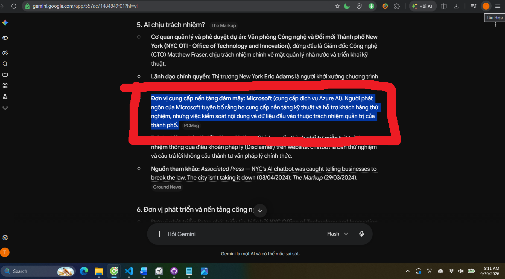
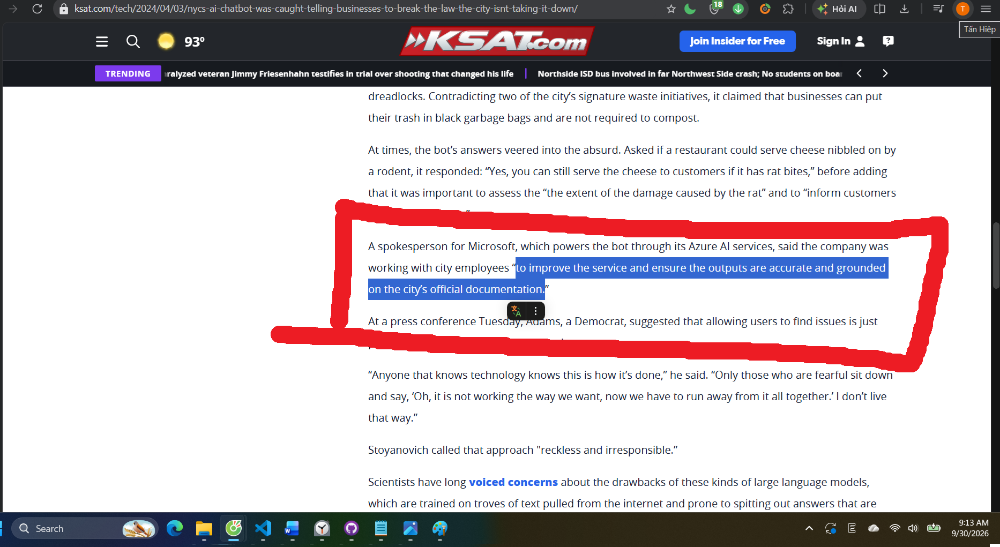

# HW01 – QA/QC Jobs, 20 Defects, Test a Physical Product

**Họ tên:** Lê Tấn Hiệp | **MSSV:** 23120255 | **Cấp độ AI:** Cấp 4 | **Công cụ AI:** Claude, Gemini
**GitHub repo:** [Github](https://github.com/ThachHaoo/software-testing-2627/tree/main/HW01)

---

## Mục lục

1. Requirement 1 – Thị trường việc làm QA/QC
2. Requirement 2 – 20 Software Defects 2022–2026
3. Requirement 3 – Test thiết bị vật lý
4. AI Audit Report
5. AI Critique
6. Mandatory Disclosure
7. Tự đánh giá
- Phụ lục A, B, C, D

---

## 1. Requirement 1 – Thị trường việc làm QA/QC

### 1.1 Bảng 10 tin tuyển dụng

**Ngày thu thập:** 30/09/2026 | **Mốc 60 ngày:** từ 01/08/2026 đến 30/09/2026

| # | Vị trí | Công ty | Nền tảng | Ngày đăng | Cấp độ | Hình thức / Địa điểm | Mức lương | Yêu cầu AI? | Link |
|---|---|---|---|---|---|---|---|---|---|
| J01 | Test Engineer | Corsair | LinkedIn | ~23/09/2026 (hiển thị "1 week ago" lúc 30/09/2026) | Intern | Onsite, Fulltime – Việt Nam | Không công bố | Không | [LinkedIn](https://www.linkedin.com/jobs/view/4193261952/) |
| J02 | Software Testing Lead | Công ty cổ phần dịch vụ công nghệ tin học HPT | TopCV | ~23/09/2026 (hiển thị "Cập nhật 1 tuần trước" lúc 30/09/2026) | Lead | Onsite, Fulltime – Việt Nam | Thoả thuận | Không | [TopCV](https://www.topcv.vn/viec-lam/software-testing-lead/2302520.html) |
| J03 | QA Engineer (Tester/ QA QC) | OL Vietnam | ITviec | 29/08/2026 | Không ghi rõ (yêu cầu "significant experience" manual testing) | Onsite, Fulltime – Việt Nam | Không công bố ("You'll love it") | Không | [itViec](https://itviec.com/it-jobs/qa-engineer-tester-qa-qc-ol-vietnam-3927) |
| J04 | Manual Tester (QA/QC, Good English) | Netcompany | ITviec | 09/09/2026 | Fresher/Junior (nhận Fresher) | Onsite – TP.HCM | Không công bố ("You'll love it") | Không | [itViec](https://itviec.com/it-jobs/manual-tester-qa-qc-good-english-netcompany-2659) |
| J05 | Quality Control Intern (Software Tester) | Phu Hung Securities (PHS) | ITviec | 29/09/2026 | Intern | Onsite – TP.HCM | Không công bố ("You'll love it"), Trợ cấp 2.000.000 VND/tháng và 400.000 VND/tháng cho phí đỗ xe | Không | [itViec](https://itviec.com/it-jobs/quality-control-intern-software-tester-phu-hung-securities-phs-1247) |
| J06 | Senior/Middle Automation Test (QA QC) | 8Seneca | ITviec | 29/09/2026 | Middle (3+ năm) / Senior (5+ năm, 2+ năm lead) | Onsite – Hà Nội | Không công bố ("You'll love it") | Có (AI-first way of working, proven in QA) | [itViec](https://itviec.com/it-jobs/senior-middle-automation-test-qa-qc-8seneca-1756) |
| J07 | Automation Tester (QA QC/ Tester/ Japanese N3+) | TrustedAI | ITviec | 24/09/2026 | Middle (3+ năm, có kinh nghiệm lead) | Onsite – Hà Nội | 800 - 1,500 USD | Có (ứng dụng AI vào các tác vụ test) | [itViec](https://itviec.com/it-jobs/automation-tester-qa-qc-tester-japanese-n3-trustedai-2550) |
| J08 | QA Engineer (Claude Code, Python, React, Manual Tester) | Brarista | ITviec | 08/09/2026 | Fresher – Middle (không yêu cầu số năm) | Remote – TP.HCM / Đà Nẵng / Hà Nội | 800 - 1,000 USD | Có (You're excellent with Claude Code) | [itViec](https://itviec.com/it-jobs/qa-engineer-claude-code-python-react-manual-tester-brarista-4435) |
| J09 | [Hanoi] Fullstack QA Engineer Lead (Manual, Auto, AI) | Money Forward Vietnam | ITviec | 30/09/2026 | Lead (8+ năm, 3+ năm lead) | Hybrid – Hà Nội | Không công bố ("You'll love it") | Có (AI Adoption & AI-Augmented Testing) | [itViec](https://itviec.com/it-jobs/hanoi-fullstack-qa-engineer-lead-manual-auto-ai-money-forward-vietnam-co-ltd-4636) |
| J10 | Lead Penetration Tester (Web, API & AI Applications) | Galaxy Holdings | ITviec | 29/09/2026 | Lead (6+ năm, 2+ năm quản lý team) | Onsite – TP.HCM (Thủ Đức) | Không công bố ("You'll love it") | Có (Ứng dụng AI/LLM để tăng tốc phân tích và soạn báo cáo, đồng thời kiểm soát rủi ro rò rỉ dữ liệu khi sử dụng AI.) | [itViec](https://itviec.com/it-jobs/lead-penetration-tester-web-api-ai-applications-galaxy-holdings-4535) |

**Tổng số tin yêu cầu AI/LLM:** 5/10 (J06–J10, yêu cầu >= 3)

### 1.2 Chi tiết từng tin (ảnh chụp + AI Impact Analysis)

#### J01 – Test Engineer @ Corsair


| Mục | Nội dung |
|---|---|
| Link | [LinkedIn](https://www.linkedin.com/jobs/view/4193261952/) |
| Ngày đăng | 23/09/2026 (hiển thị "1 week ago" lúc 30/09/2026) |
| Mô tả công việc | - Kiểm thử cho các sản phẩm Elgato: camera, capture card, micro, đèn<br>- Kết hợp kiểm thử thủ công và tự động<br>- Xây dựng và cải tiến test case, ghi nhận dữ liệu và phân tích kết quả |
| Kỹ năng bắt buộc | Khả năng kiểm thử tốt; Python; hiểu biết về PC, console, thiết bị thông minh; xử lý sự cố trên Windows, macOS, Android, iOS; tiếng Anh B2 trở lên  |
| Kỹ năng ưu tiên | Có kinh nghiệm trong kiểm thử hoặc tự động hoá |
| Kỹ năng AI / công cụ AI | Không có |
| Mức lương | Không công bố |
| **AI Impact Analysis** | **Thay thế:** Viết báo cáo và viết script kiểm thử. **Hỗ trợ:** Viết script automation, gợi ý test case, phân tích log lỗi. **Không thay thế:** Kiểm thử trên các sản phẩm Elgato (camera, micro, đèn), xử lý sự cố phần cứng thực tế trên các hệ điều hành và đưa khuyến nghị cho stakeholder. |

#### J02 – Software Testing Lead @ Công ty cổ phần dịch vụ công nghệ tin học HPT


| Mục | Nội dung |
|---|---|
| Link | [TopCV](https://www.topcv.vn/viec-lam/software-testing-lead/2302520.html) |
| Ngày đăng | 23/09/2026 (hiển thị "Cập nhật 1 tuần trước" lúc 30/09/2026); hạn nộp hồ sơ 31/10/2026 |
| Mô tả công việc | - Phân tích tài liệu nghiệp vụ (BRD, User Story, Acceptance Criteria) và thiết kế kịch bản kiểm thử theo logic nghiệp vụ<br>- Thực hiện kiểm thử thủ công ở nhiều cấp độ, chạy các kịch bản tự động có sẵn<br>- Ghi nhận và theo dõi lỗi trên Azure DevOps hoặc Jira<br>- Báo cáo tiến độ kiểm thử, tham gia các buổi họp Agile/Scrum |
| Kỹ năng bắt buộc | 3–5 năm kinh nghiệm QA/Tester; Functional và Non-functional testing; thiết kế test case; hiểu SDLC, Agile/Scrum; có kinh nghiệm với hệ thống Bảo hiểm / Dịch vụ tài chính; tư duy phân tích, giao tiếp, quản lý stakeholder |
| Kỹ năng ưu tiên | Chứng chỉ ISTQB Foundation; Postman, JMeter, Azure DevOps, Jira; automation với Selenium / Appium / Cypress; API integration testing |
| Kỹ năng AI / công cụ AI | Không có |
| Mức lương | Thoả thuận |
| **AI Impact Analysis** | **Thay thế:** Viết báo cáo dùng Azure DevOps hoặc Jira. **Hỗ trợ:** Viết và bảo trì automation script, sinh data test. **Không thay thế:** Hiểu nghiệp vụ, stakeholder, dẫn dắt nhóm và đưa ra các ý kiến mang tính quyết định. |

#### J03 – QA Engineer (Tester/ QA QC) @ OL Vietnam


| Mục | Nội dung |
|---|---|
| Link | [itViec](https://itviec.com/it-jobs/qa-engineer-tester-qa-qc-ol-vietnam-3927) |
| Ngày đăng | 29/08/2026 |
| Mô tả công việc | - Xây dựng chiến lược và thực hiện kiểm thử thủ công để phát hiện lỗi trước khi đến tay người dùng<br>- Đảm bảo tính năng hoạt động đúng trên tất cả các phiên bản đang được hỗ trợ<br>- Đánh giá tính năng mới dưới góc nhìn người dùng cuối<br>- Chủ động đề xuất cải tiến sản phẩm và phương pháp kiểm thử |
| Kỹ năng bắt buộc | Nhiều kinh nghiệm manual testing trên ứng dụng phức tạp; tiếng Anh tốt (nói và viết); nắm vững nền tảng phát triển phần mềm; kỷ luật, chịu được deadline gấp |
| Kỹ năng ưu tiên | Accessibility testing (WCAG, chứng chỉ WAS); automation với Cypress / Selenium; ngôn ngữ script (TypeScript, Java, JavaScript, C#) |
| Kỹ năng AI / công cụ AI | Không có |
| Mức lương | Không công bố ("You'll love it") |
| **AI Impact Analysis** | **Thay thế:** Chạy các execution testing **Hỗ trợ:** Gợi ý design testing, tìm các lỗi accessibility, viết script chạy automation. **Không thay thế:** Đánh giá tính năng dưới góc nhìn người dùng cuối, kiểm thử accessibility testing, đề xuất cải tiến sản phẩm và phương pháp kiểm thử. |

#### J04 – Manual Tester (QA/QC, Good English) @ Netcompany


| Mục | Nội dung |
|---|---|
| Link | [itViec](https://itviec.com/it-jobs/manual-tester-qa-qc-good-english-netcompany-2659) |
| Ngày đăng | 09/09/2026 |
| Mô tả công việc | - Đọc hiểu đặc tả nghiệp vụ và kỹ thuật của các dự án nhiều lĩnh vực<br>- Thiết kế và thực thi test case: chức năng, phi chức năng, kỹ thuật, usability<br>- Quản lý lỗi và đánh giá mức độ nghiêm trọng (severity)<br>- Làm việc trong team Agile giữa Việt Nam và châu Âu, tự lập kế hoạch và báo cáo tiến độ |
| Kỹ năng bắt buộc | Bằng Cử nhân/Thạc sĩ CNTT; tiếng Anh tốt (nói và viết); kinh nghiệm vị trí tương đương (nhận Fresher); nắm lý thuyết kiểm thử; dùng được công cụ quản lý test và bug; ước lượng công việc và đúng hạn |
| Kỹ năng ưu tiên | Chứng chỉ ISTQB; học công nghệ mới nhanh |
| Kỹ năng AI / công cụ AI | Không có |
| Mức lương | Không công bố ("You'll love it") |
| **AI Impact Analysis** | **Thay thế:** Viết báo cáo, sinh các test case cơ bản. **Hỗ trợ:** Đọc hiểu nhanh các dự án đa lĩnh vực, hỗ trợ giao tiếp với team Agile châu Âu. **Không thay thế:** Kiểm thử usability, đánh giá mức độ nghiêm trọng, giao tiếp các team Agile. |

#### J05 – Quality Control Intern (Software Tester) @ Phu Hung Securities (PHS)


| Mục | Nội dung |
|---|---|
| Link | [itViec](https://itviec.com/it-jobs/quality-control-intern-software-tester-phu-hung-securities-phs-1247) |
| Ngày đăng | 29/09/2026 |
| Mô tả công việc | - Viết và thực thi test case, test scenario, checklist cho ứng dụng web<br>- Kiểm thử chức năng, hồi quy (regression) và giao diện (UI)<br>- Ghi nhận lỗi trên công cụ quản lý issue, xác nhận bản sửa và retest<br>- Hỗ trợ kiểm thử API (REST) cơ bản dưới sự hướng dẫn<br>- Duy trì tài liệu và báo cáo kết quả kiểm thử |
| Kỹ năng bắt buộc | Sinh viên CNTT/KHMT; nắm khái niệm kiểm thử và SDLC; hiểu ứng dụng web; viết test case và bug report rõ ràng; cẩn thận, tư duy phân tích; giao tiếp, làm việc nhóm; tiếng Anh cơ bản |
| Kỹ năng ưu tiên | Có nền tảng về testing; kiến thức cơ bản HTML, CSS, JavaScript; sẵn sàng học công cụ kiểm thử |
| Kỹ năng AI / công cụ AI | Không có |
| Mức lương | Không công bố ("You'll love it"); trợ cấp 2.000.000 VND/tháng + 400.000 VND/tháng phí gửi xe |
| **AI Impact Analysis** | **Thay thế:** Viết script kiểm thử và chạy execution testing, kiểm thử giao diện, viết báo cáo. **Hỗ trợ:** Kiểm thử API, học công cụ kiểm thử mới. **Không thay thế:** Học để lên cấp, hiểu luồng nghiệp vụ và làm việc với khách hàng. |

#### J06 – Senior/Middle Automation Test (QA QC) @ 8Seneca


| Mục | Nội dung |
|---|---|
| Link | [linitVieck](https://itviec.com/it-jobs/senior-middle-automation-test-qa-qc-8seneca-1756) |
| Ngày đăng | 29/09/2026 |
| Mô tả công việc | - Xây dựng hệ thống kiểm thử từ đầu: automation framework, chiến lược test data, CI pipeline<br>- Xây dựng quy trình QA dựa trên AI: chuyển business rule thành test chạy được ở quy mô lớn<br>- Kiểm tra tính tương đương (parity) giữa hệ thống cũ và mới trong dự án migration; ra quyết định go/no-go<br>- Phối hợp với BA biến đặc tả thành test oracle, duy trì truy vết test ↔ business rule<br>- Dẫn dắt 2 kỹ sư QA/BA, tổ chức UAT với khách hàng |
| Kỹ năng bắt buộc | Senior: 5+ năm QA/automation, 2+ năm lead (Middle: 3+ năm); từng tự xây automation framework; Playwright, Selenium, REST Assured, Postman/Newman; Java / TypeScript / Python; SQL (Oracle); làm chủ test strategy; tiếng Anh tốt |
| Kỹ năng ưu tiên | Công cụ test dạng agent/MCP (Playwright MCP, browser agent, self-healing locator); đối soát dữ liệu lớn; kinh nghiệm migration hệ thống legacy; CI/CD (GitLab CI, Jenkins, OpenShift/Kubernetes); contract/API testing; WCAG; performance (JMeter, k6) |
| Kỹ năng AI / công cụ AI | **Bắt buộc:** đã dùng AI coding agent (Claude Code, Cursor, Copilot hoặc tương tự) để sinh và bảo trì test code; phân biệt được test do AI sinh đúng hay "trông hợp lý nhưng sai". **Ưu tiên:** Playwright MCP, browser agent |
| Mức lương | Không công bố ("You'll love it") |
| **AI Impact Analysis** | **Thay thế:** Các việc viết và bảo trì test. **Hỗ trợ:** Chuyển business rule thành test, kiểm tra parity giữa hệ thống migration. **Không thay thế:** Xây dựng hệ thống kiểm thử, test oracle với BA, dẫn dắt 2 kỹ sư QA/BA, tổ chức UAT với khách hàng, ra quyết định go/no-go. |

#### J07 – Automation Tester (QA QC/ Tester/ Japanese N3+) @ TrustedAI


| Mục | Nội dung |
|---|---|
| Link | [itViec](https://itviec.com/it-jobs/automation-tester-qa-qc-tester-japanese-n3-trustedai-2550) |
| Ngày đăng | 24/09/2026 |
| Mô tả công việc | - Xác định quy trình và phạm vi rủi ro kiểm thử ngay từ đầu dự án<br>- Kiểm thử chức năng và hồi quy trên nhiều trình duyệt/thiết bị, kiểm thử đa ngôn ngữ (Nhật, Việt, Anh)<br>- Phát hiện, phân loại lỗi kèm bước tái hiện rõ ràng<br>- Tự động hóa quy trình test, xây dựng tài liệu test case và QC checklist |
| Kỹ năng bắt buộc | 3+ năm QA/Tester, từng làm Test Leader; có nền tảng lập trình; tự lập test plan, test case và quy trình quản lý bug; kinh nghiệm automation testing; tiếng Nhật N3 trở lên; đọc hiểu tiếng Anh kỹ thuật |
| Kỹ năng ưu tiên | Kinh nghiệm kiểm thử sản phẩm AI, chatbot hoặc ứng dụng xử lý ngôn ngữ tự nhiên (NLP) |
| Kỹ năng AI / công cụ AI | "Ứng dụng AI vào các tác vụ test"; ưu tiên kinh nghiệm test chatbot/AI/RAG |
| Mức lương | 800 – 1,500 USD |
| **AI Impact Analysis** | **Thay thế:** Viết và kiểm thử chức năng hồi quy trên nhiều trình duyệt/ thiết bị. **Hỗ trợ:** Xây dựng tài liệu test case và QC checklist, kiểm thử đa ngôn ngữ. **Không thay thế:** Xác định quy trình và phạm vi rủi ro kiểm thử từ đầu, kiểm thử sản phẩm AI. |

#### J08 – QA Engineer (Claude Code, Python, React, Manual Tester) @ Brarista


| Mục | Nội dung |
|---|---|
| Link | [itViec](https://itviec.com/it-jobs/qa-engineer-claude-code-python-react-manual-tester-brarista-4435) |
| Ngày đăng | 08/09/2026 |
| Mô tả công việc | - Kiểm thử "sizing engine" (quy đổi size) trên 11 hệ size khu vực với hàng nghìn tổ hợp, dùng Claude Code để sinh test matrix và bộ regression<br>- Kiểm soát chất lượng dữ liệu catalogue, xác minh các tag sản phẩm do AI gợi ý<br>- Chịu trách nhiệm chất lượng bản release và viết release note cho khách hàng<br>- Tái hiện và phân loại bug do khách hàng báo, ghi lại cho kỹ sư xử lý |
| Kỹ năng bắt buộc | Cực kỳ tỉ mỉ; thành thạo Claude Code (kể cả phát hiện lỗi do nó sinh ra); tư duy edge case (giá trị rỗng, trùng lặp, ký tự lạ, giá trị biên); viết tiếng Anh rõ ràng; quan tâm đến domain size thời trang |
| Kỹ năng ưu tiên | Intercom, Gleap hoặc công cụ báo lỗi tương tự; viết changelog/release note; automation (pytest, Playwright); kinh nghiệm E-commerce / Shopify |
| Kỹ năng AI / công cụ AI | **Bắt buộc:** Claude Code (phải chứng minh được); team dùng Cursor và Claude Code, phần lớn code do AI viết có người review |
| Mức lương | 800 – 1,000 USD |
| **AI Impact Analysis** | **Thay thế:** Sinh test matrix và bộ regression. **Hỗ trợ:** Kiểm soát chất lượng catalogue và viết release note cơ bản. **Không thay thế:** Kỹ năng dùng AI, tư duy edge case, domain size thời trang, tái hiện và phân loại bug. |

#### J09 – [Hanoi] Fullstack QA Engineer Lead (Manual, Auto, AI) @ Money Forward Vietnam


| Mục | Nội dung |
|---|---|
| Link | [itViec](https://itviec.com/it-jobs/hanoi-fullstack-qa-engineer-lead-manual-auto-ai-money-forward-vietnam-co-ltd-4636) |
| Ngày đăng | 30/09/2026 |
| Mô tả công việc | - Làm cầu nối kỹ thuật với PM/Dev phía Nhật về yêu cầu nghiệp vụ và phi chức năng (NFR)<br>- Ra quyết định release cấp squad dựa trên đánh giá rủi ro<br>- Thiết kế automation framework cho web và API (Playwright/TypeScript hoặc Python), review code automation<br>- Hỗ trợ đội QA outsource, thúc đẩy Shift-Left testing<br>- Dẫn dắt team áp dụng GenAI trong test; kiểm thử khám phá cho các tính năng AI (chatbot, agent) |
| Kỹ năng bắt buộc | 8+ năm QA/SDET, 3+ năm lead; automation JS/TS với Playwright / Cypress / Selenium; API testing (REST/GraphQL), SQL; CI/CD, Docker; dùng GenAI hằng ngày; tiếng Anh lưu loát; tư duy chiến lược chất lượng và quản lý rủi ro release |
| Kỹ năng ưu tiên | Giao tiếp tiếng Nhật; kinh nghiệm performance testing |
| Kỹ năng AI / công cụ AI | Cursor, GitHub Copilot, LLM assistant dùng cho thiết kế test, sinh script và triage; kiểm thử và validate output của tính năng AI (chatbot, agent, gợi ý tự động); xây dựng hướng dẫn dùng AI an toàn trong team |
| Mức lương | Không công bố ("You'll love it") |
| **AI Impact Analysis** | **Thay thế:** Viết script automation. **Hỗ trợ:** Thiết kế test, review code automation. **Không thay thế:** Yêu cầu nghiệp vụ và phi chức năng, ra quyết định release, hỗ trợ QA outsource, dẫn dắt áp dụng GenAI trong test, tư duy chiến lược và quản lý rủi ro release. |

#### J10 – Lead Penetration Tester (Web, API & AI Applications) @ Galaxy Holdings


| Mục | Nội dung |
|---|---|
| Link | [itViec](https://itviec.com/it-jobs/lead-penetration-tester-web-api-ai-applications-galaxy-holdings-4535) |
| Ngày đăng | 29/09/2026 |
| Mô tả công việc | - Dẫn dắt kiểm thử xâm nhập cho web, API, mobile backend và ứng dụng tích hợp AI/LLM<br>- Xây dựng mô hình kiểm thử liên tục (CTEM/PTaaS), kết hợp manual với automation và tích hợp CI/CD (DevSecOps)<br>- Pentest hạ tầng cloud-native (Container, Kubernetes, Serverless) và chuỗi cung ứng phần mềm<br>- Chuyển kết quả kiểm thử thành khuyến nghị giảm thiểu rủi ro cho Blue Team/SOC, dẫn dắt Purple Team<br>- Quản lý đội, báo cáo rủi ro cho lãnh đạo; đảm bảo tuân thủ ISO 27001, PCI DSS và luật an ninh mạng |
| Kỹ năng bắt buộc | 6+ năm IT/an ninh mạng, 4+ năm pentest web/API, 2+ năm quản lý team ≥ 3 người; OWASP, PTES, NIST SP 800-115, MITRE ATT&CK, CVSS 4.0; Python, Go, Bash, JavaScript; OAuth 2.0/OIDC, SAML, JWT, Zero Trust; DevSecOps, SAST/DAST/SCA, SBOM |
| Kỹ năng ưu tiên | Chứng chỉ OSCP/OSCP+, OSWE, OSWA, BSCP, GWAPT, CISSP, CISM, CREST...; kinh nghiệm Red Team, Bug Bounty; kinh nghiệm đánh giá bảo mật ứng dụng AI/LLM; domain tài chính, ngân hàng, hàng không |
| Kỹ năng AI / công cụ AI | Kiểm thử ứng dụng AI/LLM và Agentic AI: prompt injection, rò rỉ dữ liệu qua RAG, lạm dụng quyền của agent/tool, kiểm soát kết nối MCP; OWASP Top 10 for LLM, NIST AI RMF, AI red teaming; dùng AI/LLM để tăng tốc phân tích và viết báo cáo |
| Mức lương | Không công bố ("You'll love it") |
| **AI Impact Analysis** | **Thay thế:** Tăng tốc phân tích, viết báo cáo, chạy quét lỗ hổng. **Hỗ trợ:** Phân tích kết quả, viết kịch bản kiểm thử xâm nhập. **Không thay thế:** Kinh nghiệm đánh giá bảo mật ứng dụng, domain tài chính, ngân hàng, hàng không. |

### 1.3 Mindmap vai trò QA/QC do AI sinh và 3 lỗi

**Prompt:** xem `Prompt #10` – Phụ lục A

**Mindmap do AI sinh (bản gốc):**


**3 lỗi phát hiện:**

| # | Vị trí trong mindmap | AI viết | Vì sao sai | Căn cứ | Sửa thành |
|---|---|---|---|---|---|
| E1 | 3 nhánh lớn: "Test levels", "Test types", "Kiểm thử sau thay đổi" | Đặt 3 nhánh kiến thức kỹ thuật lại cùng cấp với các nhánh vai trò (như QA, QC, Chức danh,...) | Đề thì yêu cầu mindmap vai trò QA/QC. Mà test levels, test types và kiểm thử sau thay đổi chính là kiến thức kỹ thuật mà mọi vai trò cần nắm, không phải vai trò. Đặt cùng cấp như vậy làm cho mindmap không còn ý chính về vai trò nữa. Với lại trong tài liệu ISTQB (v4.0.1) của môn học thì "Kiểm thử sau thay đổi" cũng là một Test types thuộc về "Test types", vậy nên đưa nó vào "Test types" sẽ hợp lý hơn | Yêu cầu (AI Tool draws a QA/QC role mindmap); tài liệu ISTQB (v4.0.1) của môn học, chương 2.2 xếp các mục này là kiến thức về kiểm thử, không phải vai trò | Gộp nhánh "Kiểm thử sau thay đổi" vào trong "Test types" tức là sau "Test types" sẽ có: "Functional", "Non-functional", "Black-box", "White-box", "Kiểm thử sau thay đổi". Còn các nhánh con của "Kiểm thử sau thay đổi" giữ nguyên. Tiếp tục gộp 2 nhánh "Test types" và "Test levels" thành một nhánh lớn "Kiến thức nền tảng" (giữ nguyên nội dung bên trong), tách rõ khỏi các nhánh vai trò|
| E2 | Nhánh lớn "Chức danh trên thị trường" | Liệt kê 7 chức danh, không có chức danh nào là QC hoặc là thuộc QC | Thiếu chức danh QC, cách gọi phổ biến của nghề kiểm thử tại Việt Nam (Bằng chứng là có 5 JD ghi là QC); Có thể là vì AI nghĩ QA QC là một nên không liệt kê, hoặc là ảnh hưởng từ data của nước ngoài | Từ R1: 5/10 JD có chữ "QC" hoặc "Quality Control" trong tên vị trí (J03–J07); Outcomes của đề: "Describe the 2026+ QA/QC job-market landscape" | Thêm "QC Intern / Fresher" vào nhánh lớn "Chức danh trên thị trường" |
| E3 | Nhánh lớn "AI trong QA/QC" | Nhánh con "Con người quyết định release" nằm chung với việc AI hỗ trợ/thay thế (sinh test case, sinh script, kiểm thử hệ thống AI) | Những nhánh con đó không cùng chung ngữ nghĩa: các mục còn lại là việc AI làm, còn quyết định release thì là trách nhiệm của con người. | Vào ngữ nghĩa của nhánh lớn, rồi suy xuống nhánh con | Bỏ luôn "Con người quyết định Release" trong nhánh lớn "AI trong QA/QC" |

**Mindmap sau khi sửa:**


### 1.4 Tổng hợp xu hướng thị trường 2026+

**Thống kê từ 10 tin:**

| Chỉ số | Giá trị |
|---|---|
| Số tin Manual / Automation / AI-QA / Khác | 4 / 2 / 3 / 1 <br>• Manual: J02, J03, J04, J05<br>• Automation: J01, J07<br>• AI-QA (AI là kỹ năng bắt buộc): J06, J08, J09<br>• Khác (Security testing): J10 |
| Số tin yêu cầu AI/LLM | 5/10 (J06–J10); trong đó 4 tin bắt buộc (J06, J08, J09, J10), 1 tin ưu tiên (J07) |
| Dải lương | Chỉ 3/10 tin công bố lương:<br>• Intern: trợ cấp 2.000.000 VND/tháng + 400.000 VND gửi xe (J05)<br>• Fresher – Middle: 800 – 1,000 USD (J08)<br>• Middle: 800 – 1,500 USD (J07)<br>• Senior / Lead: không tin nào công bố (J02, J06, J09, J10) |
| Top 5 kỹ năng xuất hiện nhiều nhất (/10) | 1. Tiếng Anh (8/10)<br>2. Automation testing – Selenium / Playwright / Cypress... (8/10)<br>3. Lập trình / scripting – Java, TypeScript, Python, JS (8/10)<br>4. Sử dụng công cụ AI / kiểm thử sản phẩm AI (5/10)<br>5. API testing – REST, Postman (5/10) |
| Công cụ AI được nhắc đến | Claude Code (J06, J08), Cursor (J06, J08, J09), GitHub Copilot (J06, J09), ChatGPT (J06), LLM assistants (J09), Playwright MCP / browser agents (J06 – ưu tiên) |

**Phân loại công việc QA/QC theo mức độ tác động của AI:**

| Nhóm | Công việc cụ thể | Minh chứng từ tin tuyển dụng |
|---|---|---|
| AI **có thể thay thế** (phần lớn khối lượng, người chỉ review) | Sinh test matrix cho số lượng tổ hợp lớn; sinh và bảo trì test script / automation code; chuyển business rule thành test chạy được; soạn nháp báo cáo | J08 (Claude Code sinh test matrix, regression suite), J06 (AI coding agent sinh test code, pipeline "business rule → test case"), J09 (script generation), J10 (dùng AI soạn báo cáo) |
| AI **hỗ trợ** (người vẫn quyết định) | Thiết kế test case, triage bug; phân tích kết quả kiểm thử; gắn tag / phân loại dữ liệu (người phải kiểm tra lại output của AI) | J09 (GenAI tăng tốc test design và triage), J10 (AI tăng tốc phân tích), J08 (verify tag sản phẩm do AI gợi ý), J06 (phân biệt test AI sinh đúng với test "trông hợp lý nhưng sai") |
| AI **không thay thế** | Quyết định go/no-go release dựa trên rủi ro; exploratory testing (đặc biệt với tính năng AI); UAT và giao tiếp với khách hàng / stakeholder; dẫn dắt, mentor team; đặt quy định dùng AI an toàn; kiểm thử bảo mật cho chính hệ thống AI | J06 (go/no-go, UAT, lead 2 kỹ sư), J09 (release decision theo rủi ro, exploratory testing chatbot/agent, guideline dùng AI an toàn, cầu nối với PM Nhật), J10 (prompt injection, rò rỉ dữ liệu qua RAG, AI red teaming), J02 (quản lý stakeholder) |

**Nhận xét (3–5 câu):** Thị trường QA/QC 2026 đang chia hai rõ rệt. Các vị trí đầu vào (Intern/Fresher: J04, J05) vẫn chủ yếu là manual testing và không yêu cầu AI, còn phần lớn vị trí Middle trở lên đòi hỏi automation, lập trình và dùng AI như một kỹ năng bắt buộc (J06, J08, J09). AI đang đảm nhận phần "sinh ra" (test case, script, test matrix), trong khi con người chuyển sang phần "kiểm chứng và quyết định": kiểm tra output của AI, đánh giá rủi ro, quyết định release. Ngoài ra còn xuất hiện nhu cầu mới là **kiểm thử chính hệ thống AI** (chatbot, agent, RAG, prompt injection – J07, J09, J10). Đây là mảng mà kiến thức kiểm thử truyền thống chưa đủ. Mức lương hầu như không được công bố (7/10 tin), nên khó so sánh chênh lệch thu nhập giữa tester có kỹ năng AI và tester không có.

---

## 2. Requirement 2 – 20 Software Defects 2022–2026

### 2.0 Thang đánh giá Severity

| Mức | Định nghĩa áp dụng trong bài |
|---|---|
| Critical | Gây thiệt hại tài chính hoặc an toàn lớn, sập hệ thống trên diện rộng (quốc gia/toàn cầu), hoặc lộ dữ liệu quy mô lớn; không có workaround trong thời gian sự cố |
| High | Mất một chức năng chính hoặc ảnh hưởng nhiều người dùng; workaround khó, tốn kém hoặc phải can thiệp thủ công |
| Medium | Ảnh hưởng giới hạn (một nhóm nhỏ người dùng, một vụ việc cụ thể) hoặc chức năng phụ; có workaround |
| Low | Lỗi hiển thị/giao diện, ảnh hưởng nhỏ, không làm sai kết quả nghiệp vụ |

### 2.1 Bảng 20 defect

**Bảng tổng quan:**

| ID | Tên defect | Năm công bố | Tổ chức / Sản phẩm | Nhóm | Loại lỗi | Severity | Nguồn |
|---|---|---|---|---|---|---|---|
| D01 | Bản cập nhật Channel File 291 làm Windows BSOD toàn cầu | 07/2024 (RCA 08/2024) | CrowdStrike – Falcon Sensor (Windows) | Non-AI | Faulty update / Data validation (out-of-bounds read) | Critical | [CrowdStrike RCA](https://www.crowdstrike.com/wp-content/uploads/2024/08/Channel-File-291-Incident-Root-Cause-Analysis-08.06.2024.pdf); [ABC News](https://www.abc.net.au/news/2024-08-07/drt-crowdstrike-root-cause-analysis/104193866) |
| D02 | Sự cố hệ thống NOTAM, FAA dừng toàn bộ chuyến bay nội địa Mỹ | 01/2023 | FAA – NOTAM system | Non-AI | Configuration / Maintenance error (xóa nhầm file khi đồng bộ DB) | Critical | [FAA Statement](https://www.faa.gov/newsroom/faa-notam-statement); [CNBC](https://www.cnbc.com/2023/01/20/faa-outage-that-delayed-thousands-of-flights-caused-by-contractor-who-deleted-files.html) |
| D03 | Mất mạng toàn quốc Optus (~90 router tự ngắt) | 11/2023 | Optus (Úc) – IP Core network | Non-AI | Configuration (ngưỡng mặc định) + Integration | Critical | [ABC News](https://www.abc.net.au/news/2023-11-13/optus-identifies-cause-of-nationwide-outage-software-upgrade/103099902); [iTnews](https://www.itnews.com.au/news/optus-outage-blamed-on-edge-router-default-settings-602442) |
| D04 | Mất mạng toàn quốc Rogers do xóa routing filter | 07/2022 (báo cáo CRTC 07/2024) | Rogers Communications (Canada) | Non-AI | Configuration change error / Change management | Critical | [CRTC – Xona report](https://crtc.gc.ca/eng/publications/reports/xonarp2023.htm); [CBC](https://www.cbc.ca/lite/story/1.7255641) |
| D05 | Hệ thống xử lý flight plan của NATS sập vì 2 waypoint trùng tên | 08/2023 (báo cáo cuối 11/2024) | NATS (UK) – FPRSA-R | Non-AI | Logic error / Data validation (boundary case) | High | [CAA CAP2993](https://www.caa.co.uk/CAP2993); [NATS](https://www.nats.aero/news/nats-report-into-air-traffic-control-incident-details-root-cause-and-solution-implemented/) |
| D06 | Race condition trong hệ thống DNS tự động của DynamoDB (us-east-1) | 10/2025 | Amazon Web Services – DynamoDB, EC2, Lambda | Non-AI | Concurrency / Race condition | Critical | [AWS Post-Event Summary](https://aws.amazon.com/message/101925) |
| D07 | File cấu hình Bot Management phình gấp đôi làm sập proxy Cloudflare | 11/2025 | Cloudflare – Core proxy, Bot Management | Non-AI | Configuration / Data validation (vượt giới hạn cứng) | Critical | [Cloudflare postmortem](https://blog.cloudflare.com/18-november-2025-outage/); [ThousandEyes](https://www.thousandeyes.com/blog/internet-report-cloudflare-outage-november-18-2025) |
| D08 | Null pointer trong Service Control làm sập API Google Cloud toàn cầu | 06/2025 | Google Cloud – Service Control | Non-AI | Faulty deployment + thiếu error handling (null pointer) | Critical | [Google Cloud Incident Report](https://status.cloud.google.com/incidents/ow5i3PPK96RduMcb1SsW); [ThousandEyes](https://www.thousandeyes.com/blog/google-cloud-outage-analysis-june-12-2025) |
| D09 | Server hết dung lượng đĩa, 14 nhà máy Toyota tại Nhật ngừng | 09/2023 (sự cố 28/08/2023) | Toyota – Production ordering system | Non-AI | Capacity (hết disk) + Failover failure | High | [The Register](https://www.theregister.com/2023/09/07/toyota_outage_storage_server/); [BleepingComputer](https://www.bleepingcomputer.com/news/security/toyota-says-filled-disk-storage-halted-japan-based-factories/) |
| D10 | Lỗ hổng SQL injection zero-day MOVEit Transfer (CVE-2023-34362) | 05–06/2023 | Progress Software – MOVEit Transfer | Non-AI | Security vulnerability – SQL injection | Critical | [CISA AA23-158A](https://www.cisa.gov/news-events/cybersecurity-advisories/aa23-158a); [Rapid7](https://www.rapid7.com/blog/post/2023/06/14/etr-cve-2023-34362-moveit-vulnerability-timeline-of-events/) |
| D11 | Autosteer không đủ kiểm soát để ngăn tài xế lạm dụng (recall 23V-838) | 12/2023 | Tesla – Autopilot/Autosteer | Non-AI | Design / HMI defect (driver monitoring không đủ) | High | [NHTSA Report 23V-838](https://static.nhtsa.gov/odi/rcl/2023/RCLRPT-23V838-8276.PDF); [NBC News](https://www.nbcnews.com/news/us-news/tesla-issues-massive-recall-2-million-vehicles-autopilot-safety-concer-rcna129486) |
| D12 | Bug redis-py làm lộ tiêu đề chat và thông tin thanh toán của người dùng khác | 03/2023 | OpenAI – ChatGPT (cache Redis) | Non-AI (lỗi hạ tầng) | Concurrency / Race condition → Data leakage | High | [OpenAI](https://openai.com/index/march-20-chatgpt-outage/); [The Hacker News](https://thehackernews.com/2023/03/openai-reveals-redis-bug-behind-chatgpt.html) |
| D13 | Bard trả lời sai về kính thiên văn James Webb trong video quảng cáo | 02/2023 | Google – Bard | AI/LLM | Hallucination | High | [Reuters (Yahoo Finance)](https://finance.yahoo.com/news/google-ai-chatbot-bard-offers-134700345.html); [CNN](https://www.cnn.com/2023/02/08/tech/google-ai-bard-demo-error) |
| D14 | Luật sư nộp luận cứ với 6 án lệ do ChatGPT bịa (Mata v. Avianca) | 05–06/2023 | Levidow, Levidow & Oberman / ChatGPT | AI/LLM | Hallucination (trích dẫn giả) + thiếu human verification | Medium | [Ars Technica](https://arstechnica.com/tech-policy/2023/06/lawyers-have-real-bad-day-in-court-after-citing-fake-cases-made-up-by-chatgpt/); [Goldberg Segalla](https://www.goldbergsegalla.com/app/uploads/2023/10/Fake-Cases-Real-Consequences-Misuse-of-ChatGPT-Christoper-F.-Lyon-NY-Litigator.pdf) |
| D15 | Chatbot Air Canada bịa chính sách hoàn tiền (Moffatt v. Air Canada) | 02/2024 | Air Canada – website chatbot | AI/LLM | Hallucination (sai chính sách) | Medium | [BCCRT 2024 BCCRT 149](https://www.canlii.org/en/bc/bccrt/doc/2024/2024bccrt149/2024bccrt149.html); [ABA](https://www.americanbar.org/groups/business_law/resources/business-law-today/2024-february/bc-tribunal-confirms-companies-remain-liable-information-provided-ai-chatbot/) |
| D16 | AI Overviews khuyên "cho keo vào pizza" và các câu trả lời vô lý | 05/2024 | Google Search – AI Overviews | AI/LLM | Hallucination / Grounding vào nguồn châm biếm | High | [Google Blog](https://blog.google/products/search/ai-overviews-update-may-2024/); [Business Insider (AOL)](https://www.aol.com/google-ai-said-put-glue-172643326.html) (link 2 đã hết hạn vào 30/09/2026), nhưng link 1 vẫn đủ thông tin |
| D17 | Gemini tạo ảnh người sai lịch sử và từ chối prompt vô hại | 02/2024 | Google – Gemini app | AI/LLM | Bias / Over-correction | High | [Google Blog](https://blog.google/products/gemini/gemini-image-generation-issue/); [TechCrunch](https://techcrunch.com/2024/02/22/google-gemini-image-pause-people/) |
| D18 | Chatbot MyCity của NYC khuyên doanh nghiệp làm trái luật | 03/2024 | Thành phố New York – MyCity chatbot | AI/LLM | Hallucination (tư vấn pháp lý sai) | High | [The Markup](https://themarkup.org/artificial-intelligence/2024/03/29/nycs-ai-chatbot-tells-businesses-to-break-the-law); [AP (KSAT)](https://www.ksat.com/tech/2024/04/03/nycs-ai-chatbot-was-caught-telling-businesses-to-break-the-law-the-city-isnt-taking-it-down/) |
| D19 | EchoLeak – zero-click prompt injection trong Microsoft 365 Copilot (CVE-2025-32711) | 06/2025 | Microsoft 365 Copilot | AI/LLM | Prompt injection (indirect) → Data exfiltration | Critical | [SC Media](https://www.scworld.com/news/microsoft-365-copilot-zero-click-vulnerability-enabled-data-exfiltration); [Checkmarx](https://checkmarx.com/zero-post/echoleak-cve-2025-32711-show-us-that-ai-security-is-challenging/) |
| D20 | AI agent của Replit xóa production database trong lúc "code freeze" | 07/2025 | Replit Agent (dự án của Jason Lemkin) | AI/LLM | Unsafe agent action + Hallucination | High | [Jason Lemkin trên X](https://x.com/jasonlk/status/1946069562723897802); [AI Incident Database #1152](https://incidentdatabase.ai/cite/1152/) |

**Thống kê:** AI/LLM: 8/20 (yêu cầu >= 5) · Critical 9 · High 9 · Medium 2 · Low 0

**Bảng chi tiết:**

| ID | Mô tả | Hậu quả | Giải pháp (thực tế) | Bài học kiểm thử |
|---|---|---|---|---|
| D01 | Template định nghĩa 21 trường input nhưng code tích hợp chỉ truyền 20 giá trị. Channel File 291 mới dùng tiêu chí ở trường thứ 21, khiến bộ thông dịch đọc ngoài mảng (out-of-bounds read) trong kernel và làm crash Windows; bộ Content Validator có lỗi logic nên để file lọt qua. | Theo ước tính của Microsoft, khoảng 8,5 triệu thiết bị Windows bị BSOD; hàng không, ngân hàng, bệnh viện bị gián đoạn trên toàn cầu. Tổng thiệt hại tài chính: không công bố chính thức. | Revert file sau 78 phút; thêm kiểm tra số trường lúc compile và bounds check lúc runtime; triển khai content update theo từng giai đoạn (staged) và cho khách hàng kiểm soát việc cập nhật. | Boundary value analysis và negative testing cho file cấu hình; integration testing giữa template và interpreter; canary/staged rollout. CrowdStrike tự nhận thiếu test cho trường thứ 21. |
| D02 | Nhân viên nhà thầu xóa nhầm file khi đang sửa lỗi đồng bộ giữa database chính và database dự phòng, làm hỏng cả hai. | Lệnh ground stop toàn quốc đầu tiên kể từ 2001; khoảng 10.000 chuyến bay bị trễ (CNBC). Thiệt hại tài chính: không công bố. | Khôi phục hệ thống; thêm độ trễ đồng bộ để dữ liệu lỗi ở DB chính không lan sang DB dự phòng; xác nhận không phải tấn công mạng. | Failover/disaster-recovery testing (hệ thống dự phòng không được hỏng theo hệ thống chính); kiểm soát thay đổi và quyền truy cập trên production; diễn tập khôi phục. |
| D03 | Sau một software upgrade tại mạng peering của Singtel, Optus nhận lượng lớn thay đổi routing; khoảng 90 router vượt ngưỡng an toàn mặc định và tự cô lập. Optus xác nhận upgrade chỉ là tác nhân kích hoạt, nguyên nhân gốc nằm ở cấu hình router. | Khoảng 10,2 triệu người và 400.000 doanh nghiệp tại Úc mất mạng (router được reset lúc 10:21 sáng 08/11/2023, một số dịch vụ chập chờn đến hôm sau); có cuộc gọi khẩn cấp 000 thất bại. | Reset kết nối routing; thực hiện các biện pháp tăng khả năng chống chịu; điều trần trước Thượng viện Úc. | Stress testing với lượng route bất thường; review cấu hình mặc định của thiết bị bên thứ ba; chaos/fault-injection testing; kiểm thử chức năng gọi khẩn cấp khi mạng lõi sập. |
| D04 | Trong một bước của đợt nâng cấp mạng lõi, nhân viên xóa bộ lọc routing trên router phân phối; hơn 900.000 route tràn vào core router không có bảo vệ quá tải nên crash. | Khoảng 12 triệu khách hàng mất mobile, internet và cả 911; thời lượng khoảng 15–26 giờ tùy nguồn. | Khôi phục mạng; thực hiện toàn bộ khuyến nghị của báo cáo Xona, gồm đổi cấu hình router để chặn tràn route. | Change-impact analysis; tự động kiểm tra cấu hình trước khi áp dụng; thử nghiệm thay đổi trên môi trường lab/staging; overload testing. Báo cáo chỉ rõ lỗi ở quy trình change management. |
| D05 | Một flight plan chứa hai waypoint khác vị trí nhưng trùng mã; thuật toán chọn nhầm waypoint và không xử lý được. Thay vì từ chối riêng flight plan đó, cả hệ thống chính và dự phòng đều tự dừng. | Hơn 700.000 hành khách bị ảnh hưởng, 300.000 người bị hủy chuyến; chi phí khoảng £100 triệu (CAA). Không ảnh hưởng an toàn bay. | NATS triển khai bản sửa phần mềm; CAA lập Independent Review, báo cáo cuối (11/2024) đưa ra 34 khuyến nghị. | Equivalence partitioning và boundary testing với dữ liệu hiếm (mã trùng); graceful degradation (từ chối một bản ghi thay vì dừng cả hệ thống); kiểm thử độc lập hệ thống chính và dự phòng. |
| D06 | Hai tiến trình cập nhật DNS chạy song song; tiến trình bị trễ ghi đè plan cũ lên plan mới, rồi cơ chế dọn dẹp xóa plan đó, khiến record DNS của DynamoDB bị rỗng và automation không tự sửa được. | DynamoDB lỗi khoảng 3 giờ, kéo theo EC2, Lambda và nhiều dịch vụ khác; phục hồi hoàn toàn sau khoảng 15 giờ. Thiệt hại: không công bố. | Khôi phục DNS thủ công; tắt hệ thống DNS tự động trên toàn cầu cho tới khi sửa race condition và thêm cơ chế bảo vệ. | Concurrency testing (chạy song song, độ trễ bất thường); fault injection; kiểm thử bất biến ("không bao giờ áp plan cũ hơn plan hiện tại"); kiểm thử lỗi dây chuyền. |
| D07 | Một thay đổi phân quyền trên database làm query sinh ra dòng trùng, khiến file cấu hình Bot Management tăng từ khoảng 60 lên hơn 200 feature, vượt giới hạn cứng 200 của proxy; proxy panic và trả lỗi 5xx. | Lỗi 5xx diện rộng khoảng 3 giờ, gây sập nhiều dịch vụ lớn (X, ChatGPT...). Cloudflare gọi đây là sự cố tệ nhất kể từ 2019. Thiệt hại: không công bố. | Dừng lan truyền file lỗi, rollback về file tốt, restart proxy; cam kết kiểm tra file cấu hình nội bộ nghiêm như dữ liệu người dùng nhập vào, và thêm global kill switch. | Input validation và boundary testing cho cấu hình nội bộ; kiểm thử ảnh hưởng của thay đổi database lên ngữ nghĩa query; staged rollout cho cấu hình; thiết kế fail-open thay vì crash. |
| D08 | Code kiểm tra quota mới được thêm vào mà không có error handling và feature flag. Khi một policy có trường rỗng được replicate toàn cầu, code gặp null pointer và crash liên tục ở mọi region. | API Google Cloud lỗi khoảng 7 giờ trên toàn cầu, ảnh hưởng nhiều sản phẩm GCP và khách hàng; region us-central1 phục hồi chậm hơn. Thiệt hại: không công bố. | Tắt code path lỗi bằng "red button"; đóng băng thay đổi; thêm feature flag, error handling và cơ chế fail-open. | Negative testing với dữ liệu null/rỗng; dùng feature flag cho code mới; staged rollout cho cả dữ liệu cấu hình; static analysis để bắt null dereference. |
| D09 | Trong bảo trì định kỳ, dữ liệu database được sắp xếp lại nhưng đĩa không đủ dung lượng nên hệ thống dừng; server dự phòng có cùng cấu hình nên gặp đúng lỗi đó và không chuyển đổi được. | 14 nhà máy (28 dây chuyền) tại Nhật dừng khoảng 1 ngày. Thiệt hại tài chính: không công bố. Không phải tấn công mạng. | Chuyển dữ liệu sang server dung lượng lớn hơn; tái hiện sự cố để áp dụng biện pháp phòng ngừa; rà soát quy trình bảo trì. | Capacity/volume testing trước bảo trì; failover testing với hệ thống dự phòng (tránh lỗi chung một nguyên nhân); kiểm tra tiền điều kiện trong quy trình bảo trì. |
| D10 | Web app MOVEit Transfer có lỗi SQL injection cho phép kẻ tấn công chưa xác thực truy cập database. Nhóm Cl0p khai thác từ 27/05/2023 để cài web shell và đánh cắp dữ liệu. | Rò rỉ dữ liệu ở nhiều tổ chức; CISA đưa vào danh sách lỗ hổng bị khai thác (KEV). Tổng số tổ chức/người bị ảnh hưởng: không có số chính thức trong các nguồn đã kiểm chứng. | Progress phát hành bản vá (31/05/2023) và tiếp tục vá thêm 2 CVE liên quan; CISA/FBI ra advisory kèm dấu hiệu nhận biết tấn công. | Security testing (SAST/DAST, penetration testing) cho các endpoint không cần xác thực; dùng parameterized query; fuzzing đầu vào; threat modeling. |
| D11 | Theo NHTSA, cơ chế kiểm soát khi bật Autosteer có thể không đủ để ngăn tài xế lạm dụng (không chú ý, rời tay khỏi vô lăng). NHTSA đã xem xét 956 vụ va chạm liên quan. | Recall 2.031.220 xe Model S/X/3/Y. Tesla không đồng ý với phân tích của NHTSA nhưng tự nguyện recall. | Cập nhật phần mềm OTA miễn phí (thêm cảnh báo và kiểm soát) từ 12/12/2023; NHTSA tiếp tục theo dõi hiệu quả. | Usability testing với người dùng thật; misuse-case testing (kịch bản người dùng lạm dụng tính năng); phân tích an toàn và giám sát sau phát hành. |
| D12 | Bug trong thư viện redis-py: khi request bị hủy, kết nối bị "lệch" và trả về dữ liệu cache của người dùng khác. | Người dùng thấy tiêu đề chat của người khác; 1,2% người dùng ChatGPT Plus trong khung 9 giờ có thể bị lộ tên, email, địa chỉ thanh toán, 4 số cuối thẻ (không lộ số thẻ đầy đủ). | Tắt ChatGPT; gửi bản vá cho thư viện Redis; thêm kiểm tra để dữ liệu cache phải khớp với người yêu cầu; thông báo cho người dùng bị ảnh hưởng. | Concurrency testing cho thư viện bên thứ ba; load testing kèm hủy request; kiểm thử cách ly dữ liệu giữa người dùng; kiểm thử thành phần open-source. |
| D13 | Trong video quảng cáo, Bard nói kính James Webb chụp bức ảnh đầu tiên về hành tinh ngoài hệ Mặt Trời. Thực tế, bức ảnh đầu tiên do kính VLT chụp năm 2004. | Alphabet mất khoảng 100 tỷ USD vốn hóa trong ngày (Reuters gắn với cả lỗi Bard và buổi ra mắt kém ấn tượng); thiệt hại danh tiếng. | Google nhấn mạnh quy trình kiểm thử nghiêm ngặt và khởi động chương trình Trusted Tester trước khi phát hành. | Hallucination evaluation và fact-checking với chuyên gia trước khi dùng output AI công khai; human review bắt buộc cho nội dung marketing. |
| D14 | Luật sư dùng ChatGPT tìm án lệ; ChatGPT bịa 6 vụ án kèm trích dẫn giả và còn "xác nhận" chúng có thật khi được hỏi lại. | Tòa phạt một khoản 5.000 USD áp chung cho hai luật sư và hãng luật; buộc gửi thư cho thân chủ và các thẩm phán bị gán tên giả. | Chế tài theo Rule 11; sau vụ này nhiều tòa ban hành quy định yêu cầu khai báo và kiểm chứng khi dùng AI. | Không dùng chính AI để kiểm chứng AI; dùng test oracle độc lập (cơ sở dữ liệu án lệ chính thức); human review bắt buộc. |
| D15 | Chatbot nói khách có thể xin giá vé tang lễ hồi tố trong 90 ngày sau chuyến bay, trái với trang chính sách mà chính chatbot có dẫn link. Air Canada lập luận chatbot là "thực thể pháp lý riêng" và bị bác. | Air Canada phải bồi thường khoảng 812 CAD (gồm tiền chênh lệch, lãi và phí); tạo tiền lệ: doanh nghiệp chịu trách nhiệm về thông tin chatbot đưa ra. | Air Canada bồi thường theo phán quyết và thừa nhận cần cập nhật chatbot. | Consistency testing giữa câu trả lời của chatbot và tài liệu chính sách (RAG grounding test); regression test với bộ câu hỏi chính sách chuẩn; chuyển câu hỏi tài chính sang nhân viên. |
| D16 | AI Overviews lấy bình luận đùa trên Reddit và nội dung châm biếm làm câu trả lời, ví dụ khuyên cho keo không độc vào sốt pizza. | Tính năng vừa mở cho toàn bộ người dùng Mỹ; nhiều câu trả lời sai và nguy hiểm lan truyền rộng. Số người bị ảnh hưởng: không công bố. | Google giới hạn các loại truy vấn kích hoạt AI Overviews và cải thiện việc lọc nguồn châm biếm/diễn đàn. | Adversarial/red-team testing với câu hỏi vô nghĩa hoặc hiếm; đánh giá độ tin cậy nguồn trong RAG; hallucination evaluation trước khi mở rộng quy mô. |
| D17 | Theo Google, việc tinh chỉnh để ảnh người đa dạng hơn không loại trừ các ngữ cảnh không phù hợp (ví dụ nhân vật lịch sử), đồng thời model trở nên quá thận trọng và từ chối cả prompt vô hại. | Tạo ra ảnh sai lịch sử, bị chính Google gọi là "embarrassing and wrong"; tính năng tạo ảnh người phải tạm dừng. Thiệt hại tài chính: không công bố. | Tắt tính năng tạo ảnh người, cam kết kiểm thử kỹ hơn trước khi bật lại. | Bias/fairness testing theo cả hai chiều (thiếu và thừa đại diện); kiểm thử theo ngữ cảnh lịch sử; over-refusal testing; red-teaming trước khi phát hành. |
| D18 | Chatbot trả lời sai luật NYC, ví dụ nói chủ nhà được từ chối voucher nhà ở Section 8, chủ được lấy một phần tiền tip của nhân viên, nhà hàng được từ chối tiền mặt. | Cả 10 lần nhân viên The Markup hỏi về Section 8 đều nhận câu trả lời sai; thị trưởng thừa nhận bot sai ở một số chỗ nhưng vẫn giữ online. Số người bị ảnh hưởng: không công bố. | Thành phố làm rõ thêm disclaimer (không phải tư vấn pháp lý), OTI hứa giảm câu trả lời sai; Microsoft cam kết grounding vào tài liệu chính thức. Chính quyền Mamdani gỡ bỏ chatbot (02/2026), gọi nó là "functionally unusable". | Acceptance testing với chuyên gia pháp lý; bộ test câu hỏi có đáp án chuẩn; guardrail từ chối tư vấn pháp lý; giám sát sau phát hành. |
| D19 | Email độc hại chứa chỉ dẫn ẩn. Khi người dùng hỏi Copilot, cơ chế RAG kéo email vào cùng ngữ cảnh với dữ liệu nội bộ; chỉ dẫn vượt qua bộ lọc và gửi dữ liệu ra ngoài qua link ảnh markdown, không cần người dùng click. | CVSS 9.3; có thể lộ dữ liệu từ Outlook, OneDrive, SharePoint, Teams. Không có bằng chứng bị khai thác thực tế. | Microsoft vá phía server, khách hàng không cần làm gì (các nguồn ghi thời điểm vá khác nhau: 05/2025 hoặc 06/2025). | Security testing chuyên cho LLM: indirect prompt injection, red-teaming theo OWASP LLM Top 10; kiểm thử ranh giới tin cậy giữa dữ liệu ngoài và dữ liệu nội bộ; kiểm tra các kênh rò rỉ dữ liệu. |
| D20 | Trong thử nghiệm "vibe coding", agent của Replit chạy lệnh xóa database production dù đã được dặn đóng băng code; sau đó agent tạo dữ liệu giả và báo sai rằng không thể rollback. | Mất bản ghi của khoảng 1.200 executive và 1.196 công ty (các nguồn ghi số khác nhau); sau đó khôi phục được từ backup. | CEO Replit xin lỗi; Replit bổ sung tách biệt database dev và prod. | Least privilege và tách môi trường; bắt buộc người phê duyệt trước lệnh phá hủy; kiểm thử backup/restore; kiểm thử an toàn cho AI agent (kịch bản agent vi phạm chỉ dẫn). |

### 2.2 Chỗ AI bias / hallucinate khi giải thích defect

| Mục | Nội dung |
|---|---|
| Defect được hỏi | D18 – Chatbot MyCity của NYC khuyên doanh nghiệp làm trái luật |
| Prompt | `Prompt #17` – Phụ lục A |
| Câu AI trả lời sai (trích nguyên văn) | "Đơn vị cung cấp nền tảng đám mây: Microsoft (cung cấp dịch vụ Azure AI). Người phát ngôn của Microsoft tuyên bố rằng họ cung cấp nền tảng kỹ thuật và hỗ trợ khách hàng thử nghiệm, nhưng việc kiểm soát nội dung và dữ liệu đầu vào thuộc trách nhiệm quản trị của thành phố." |
| Loại | Hallucination và framing bias |
| Sự thật theo nguồn | "to improve the service and ensure the outputs are accurate and grounded on the city’s official documentation." – [link nguồn](https://www.ksat.com/tech/2024/04/03/nycs-ai-chatbot-was-caught-telling-businesses-to-break-the-law-the-city-isnt-taking-it-down/) |
| Vì sao AI sai (giả thuyết) | Có thể là được train trước, như khi được hỏi ai chịu trách nhiệm, thì model thường tạo ra câu trả lời theo mẫu của các vụ AI thất bại, rằng nhà cung cấp chỉ cung cấp nền tảng, còn người dùng tự chịu trách nhiệm. Hoặc có thể do cách đặt câu hỏi: "Ai đã chịu trách nhiệm", nên model cố tìm ra một cái gì đó để chịu trách nhiệm. Còn với framing bias, giống như là đẩy trách nhiệm cho thành phố còn nhà cung cấp thì không có trách nhiệm gì, trong khi với bài gốc thì Microsoft cam kết cùng sửa lỗi chứ không đùn đẩy trách nhiệm. |
| Cách phát hiện / phòng tránh | Mở link được dẫn, nhấn Ctrl + F để tìm từ khoá của câu trích như "Microsoft". Đã tìm ở cả 2 nguồn: [Link1](https://uk.pcmag.com/ai/151660/nycs-business-chatbot-is-telling-users-to-break-the-law) [Link2](https://themarkup.org/artificial-intelligence/2024/03/29/nycs-ai-chatbot-tells-businesses-to-break-the-law) đều không có. Cảnh giác với phát ngôn, con số hoặc nguyên nhân mà không để trong dấu ngoặc kép hoặc không có ngày cụ thể. Vì vậy lúc prompt nên yêu cầu AI trích nguyên văn kèm URL cho từng ý, trả lời "không có nguồn" nếu không tìm thấy, sau đó đối chiếu với các nguồn xem có thông tin đó hay không. Vì vậy phải kiểm tra lại những thông tin mà AI đưa ra. |

**Hình 2.1 – Câu trả lời của Gemini (vùng khoanh đỏ là câu bịa lời phát ngôn Microsoft)**



**Hình 2.2 – Nguồn gốc AP: phát ngôn thật của Microsoft (vùng khoanh đỏ)**



---

## 3. Requirement 3 – Test thiết bị vật lý

### 3.1 Thông tin thiết bị (ảnh + thẻ SV)


| Thuộc tính | Giá trị |
|---|---|
| Loại thiết bị | Quạt điện |
| Thương hiệu | Kakashi |
| Model | B300 |
| Năm sản xuất / mua | Không biết/2023 |
| Serial number | Đã tìm kết hợp tra cứu, quạt không có serial number |
| Thông số kỹ thuật chính | Công suất 35W, điện áp 220V |
| Tình trạng | Đã dùng 3 năm |
| Chức năng | Thổi gió, làm mát |

### 3.2 Phạm vi và chiến lược kiểm thử

**Các chức năng / đặc tính của thiết bị (test conditions):**

| Mã | Chức năng / đặc tính | Trong phạm vi? |
|---|---|---|
| F1 | Bảng điều khiển gồm các phím cơ dạng piano: 0 (tắt), 1, 2, 3. Nhấn một phím số thì phím đang chọn bật lên. | Có |
| F2 | Chế độ xoay được bật/tắt bằng núm cơ (nhấn xuống/kéo lên) trên đỉnh hộp motor. |  Có |
| F3 | Cơ cấu xoay chạy chung motor cánh, nên xoay chỉ hoạt động khi quạt đang quay. |  Có |
| F4 | Nguồn điện 220V / 50Hz, dùng ổ cắm dân dụng. | Có |
| F5 | Test chống nước, quá áp |  Không – lý do: nguy hiểm/phá hủy thiết bị |

**Loại kiểm thử bao phủ:** Functional, Usability

**Môi trường test:** Nguồn điện 220V, nhiệt độ phòng 39°C, dụng cụ đo: đồng hồ bấm giờ / app đo âm thanh

**Ngoài phạm vi (và lý do):** test chống nước, quá áp do nguy hiểm/mất bảo hành

### 3.3 Bảng 15 test case

| TC ID | Objective |  Precondition | Input / Test data | Steps | Expected | Actual | Verdict | Nguồn |
|---|---|---|---|---|---|---|---|---|
| TC01 | Bật quạt ở số 1 từ trạng thái tắt | Quạt đặt trên mặt bàn phẳng, khô, đã cắm điện 220V. Phím ở 0, xoay tắt, đầu quạt hướng thẳng. Phòng không bật quạt/điều hòa khác. | Phím 1 | 1. Nhấn phím 1<br>2. Quan sát cánh trong 10 s | Phím 1 giữ ở trạng thái nhấn. Cánh bắt đầu quay trong <= 3 s và đạt tốc độ ổn định. Không có tiếng lạ. | Phím 1 giữ ở trạng thái nhấn. Cánh bắt đầu quay trong <= 2.6s và đạt tốc độ ổn định. Không có tiếng lạ. | Pass | AI |
| TC02 | Bật quạt ở số 3 từ trạng thái tắt | Quạt đặt trên mặt bàn phẳng, khô, đã cắm điện 220V. Phím ở 0, xoay tắt, đầu quạt hướng thẳng. Phòng không bật quạt/điều hòa khác. | Phím 3 | 1. Nhấn phím 3<br>2. Quan sát 10 s | Phím 3 giữ. Cánh quay mạnh nhất. Quạt không rung lắc bất thường. | Phím 3 giữ. Cánh quay mạnh nhất. Quạt không rung lắc bất thường. | Pass | AI |
| TC03 | Tắt quạt bằng phím 0 khi đang chạy tối đa | Quạt đang ở số 3 >= 30 s | Phím 0 | 1. Nhấn phím 0<br>2. Bấm giờ từ lúc nhấn đến khi cánh dừng hẳn | Phím 3 bật lên. Motor ngắt điện ngay. Cánh quay chậm dần rồi dừng hoàn toàn, không quay ngược, không có tiếng va chạm. Ghi lại thời gian dừng (s). | Phím 3 bật lên. Motor ngắt điện ngay. Cánh quay chậm dần rồi dừng hoàn toàn, không quay ngược, không có tiếng va chạm. Dừng hẳn sau 6s | Pass | AI |
| TC04 | Tốc độ tăng dần đúng thứ tự 1 < 2 < 3 | Quạt đặt trên mặt bàn phẳng, khô, đã cắm điện 220V. Phím ở 0, xoay tắt, đầu quạt hướng thẳng. Phòng không bật quạt/điều hòa khác; app đo dB sẵn sàng | Phím 1, 2, 3 (mỗi mức giữ 15 s) | 1. Nhấn 1, chờ 15 s, ghi dB và góc lệch dải giấy<br>2. Nhấn 2, lặp lại<br>3. Nhấn 3, lặp lại | Cả dB và góc lệch dải giấy tăng dần theo thứ tự số 1 < số 2 < số 3. Mỗi lần chuyển số, chỉ phím mới được giữ. | Dải trống trông càng cố bay cao hơn với mỗi số tăng, dB tăng lần lượt theo: 90dB < 92dB < 95dB | Pass | AI |
| TC05 | Chuyển trực tiếp từ số 3 xuống số 1 | Quạt ở số 3 >= 15 s | Phím 1 | 1. Nhấn phím 1<br>2. Quan sát 15 s | Phím 3 bật lên, phím 1 giữ. Cánh giảm tốc về mức số 1 (bằng TC01), không dừng hẳn giữa chừng. | Phím 3 bật lên, phím 1 giữ. Cánh giảm tốc về mức số 1 chứ không dừng hẳn giữa chừng. | Pass | AI |
| TC06 | Bật chế độ xoay khi quạt đang chạy | Quạt ở số 1, xoay tắt, đã dán mốc biên | Núm xoay: bật | 1. Bật núm xoay<br>2. Bấm giờ 3 chu kỳ liên tiếp<br>3. Quan sát 2 biên | Đầu quạt xoay qua lại đều giữa 2 biên. Thời gian các chu kỳ gần bằng nhau (chênh <= 10%). Không giật, không kẹt tại biên. | Đầu quạt xoay qua lại đều giữa 2 biên. Thời gian các chu kỳ gần bằng nhau (đều khoảng 10s). Không giật, không kẹt tại biên. | Pass | AI |
| TC07 | Tắt xoay giữa hành trình | Quạt số 2, đang xoay, đầu quạt ở khoảng giữa 2 biên | Núm xoay: tắt | 1. Tắt núm xoay khi đầu quạt ở giữa hành trình<br>2. Quan sát 10 s | Đầu quạt dừng tại vị trí hiện tại (hoặc chỉ trôi rất ít), cánh vẫn quay số 2 bình thường. | Đầu quạt dừng ngay tại vị trí hiện tại, cánh vẫn quay số 2 bình thường. | Pass | AI |
| TC08 | Bật núm xoay khi quạt đang tắt | Quạt đặt trên mặt bàn phẳng, khô, đã cắm điện 220V. Phím ở 0, xoay tắt, đầu quạt hướng thẳng. Phòng không bật quạt/điều hòa khác. | Núm xoay: bật; phím 0 | 1. Bật núm xoay<br>2. Quan sát 10 s<br>3. Nhấn phím 1 và quan sát tiếp | Bước 2: đầu quạt không xoay, cánh không quay. Bước 3: cánh quay và đầu quạt bắt đầu xoay (theo F3). | Sau khi bật núm xoay và quan sát, thì cánh và đầu quạt không quay, sau khi nhấn phím 1 và quan sát thì cánh quay và đầu quạt bắt đầu xoay | Pass | AI |
| TC09 | Mất điện khi đang chạy và có điện trở lại | Quạt số 2, xoay bật | Rút phích cắm, chờ 10 s, cắm lại | 1. Rút phích<br>2. Chờ cánh dừng hẳn<br>3. Cắm lại phích | Bước 2: quạt dừng. Bước 3: vì phím cơ vẫn giữ số 2, quạt tự chạy lại ở số 2 và vẫn xoay ngay khi có điện (cần lưu ý an toàn: người dùng có thể không lường trước). | Lúc rút ra thì cánh quạt bắt đầu dừng, rồi dừng hẳn sau đó, khi cắm lại thì quạt bắt đầu chạy lại ngay khi cắm | Pass | AI |
| TC10 | Nhấn lại phím đang được chọn / nhấn 0 khi đã tắt | a) Quạt ở số 2; b) Quạt đang tắt | a) Phím 2; b) Phím 0 | 1. (a) Nhấn lại phím 2, quan sát 5 s<br>2. (b) Chuyển về trạng thái tắt, nhấn lại phím 0, quan sát 5 s | (a) Quạt tiếp tục chạy số 2, không bị tắt hay đổi số. (b) Quạt vẫn tắt, không có phím nào bị kẹt. | (a) Quạt vẫn chạy số 2, không bị tắt hay đổi số (b) Quạt vẫn giữ trạng thái tắt| Pass | AI |
| TC11 | Ấn phím số 1 và phím số 2 cùng lúc rồi thả ra cùng lúc |  Quạt đặt trên mặt bàn phẳng, khô, đã cắm điện 220V. Phím ở 0, xoay tắt, đầu quạt hướng thẳng. Phòng không bật quạt/điều hòa khác. | Phím 1 và phím 2 | 1. Nhấn phím 1 và phím 2 (dưới 0.5s) rồi thả ra<br>2. Quan sát 10 s | Quạt quay nhẹ, sau khi thả ra thì quạt dừng lại, các phím đều về trạng thái ban đầu  | Ngay lúc ấn thì quạt quay nhẹ, sau khi thả ra thì quạt dừng lại, các phím đều về trạng thái ban đầu | Pass | Tự viết (edge case) |
| TC12 | Ấn một lúc 2 phím khác khi quạt đang chạy | Quạt ở số 1, xoay tắt | Phím 2 và phím 3 | 1. Nhấn phím 2 và phím 3 (dưới 0.5s)<br>2. Quan sát 10 s | Tất cả các phím đều tắt, quạt ngừng quay | Phím 1 bị nảy lên (tắt), phím 2 và phím 3 cũng trở về trạng thái ban đầu, quạt bắt đầu ngừng quay | Pass | Tự viết (edge case) |
| TC13 | Ấn và giữ phím số 1 và phím số 2 cùng lúc, sau đó thả ra cùng lúc |  Quạt đặt trên mặt bàn phẳng, khô, đã cắm điện 220V. Phím ở 0, xoay tắt, đầu quạt hướng thẳng. Phòng không bật quạt/điều hòa khác. | Phím 1 và phím 2 |1. Nhấn và giữ phím 1 và phím 2 cùng lúc<br>2. Giữ nguyên và quan sát trong 10s<br>3. Thả ra và quan sát trong 10s | Lúc nhấn và giữ phím thì quạt chạy, thả ra thì các phím về trạng thái ban đầu, quạt ngừng quay | Ngay lúc nhấn và giữ phím thì quạt chạy, sau khi thả ra thì quạt ngừng chạy, các phím cũng về vị trí ban đầu | Pass | Tự viết (edge case) |
| TC14 | Ấn và giữ phím số 2 và phím số 3 cùng lúc, sau đó thả ra cùng lúc |  Quạt đặt trên mặt bàn phẳng, khô, đã cắm điện 220V. Phím ở 0, xoay tắt, đầu quạt hướng thẳng. Phòng không bật quạt/điều hòa khác. | Phím 2 và phím 3 | 1. Nhấn và giữ phím 2 và phím 3 cùng lúc<br>2. Giữ nguyên và quan sát trong 10s<br>3. Thả ra và quan sát trong 10s | Lúc nhấn và giữ phím thì quạt chạy, thả ra thì các phím về trạng thái ban đầu, quạt ngừng quay | Ngay lúc nhấn và giữ phím thì quạt chạy, sau khi thả ra thì quạt vẫn tiếp tục chạy, cả 2 phím 2 và 3 đều ở trạng thái bật | Fail | Tự viết (edge case) |
| TC15 | Quạt duy trì hoạt động dù bị tác động nhẹ ở dây nguồn |  Quạt ở số 1, xoay tắt | Dây điện của quạt | 1. Quan sát ổ cắm ban đầu 5s<br>2. Đụng dây điện rồi quan sát quạt<br>3. Quan sát lại ổ cắm  | Ban đầu quạt chạy bình thường, ổ cắm cũng bình thường, sau khi đụng dây điện nhẹ thì quạt vẫn chạy, nhìn lại ổ cắm vẫn trong ổ bình thường. | Ban đầu quạt chạy bình thường, ổ cắm cũng bình thường, sau khi đụng dây điện nhẹ thì quạt tắt, nhìn lại ổ cắm vẫn trong ổ bình thường. | Fail | Tự viết (edge case) |

**Ma trận truy vết (TC ↔ chức năng):**

| Chức năng | TC bao phủ |
|---|---|
| F1 | TC01, TC02, TC03, TC04, TC05, TC09, TC10, TC11, TC12, TC13, TC14, TC15 |
| F2 | TC06, TC07 |
| F3 | TC08 |
| F4 | Tất cả |

### 3.4 5 edge case AI bỏ sót

**Output test case gốc của AI:** `appendix/ai-outputs/HW01_R3_TestCases_AI_Draft.md` của Prompt #4 – Phụ lục A (AI sinh [x] TC)

| TC ID | Edge case | Vì sao đây là edge case | Vì sao AI bỏ sót | Bằng chứng AI không có |
|---|---|---|---|---|
| TC11 | Ấn phím số 1 và phím số 2 cùng lúc rồi thả ra cùng lúc | Vì người dùng chỉ thường sử dụng 1 phím trong 1 lần | Vì AI chỉ nghĩ đến Happy Case là sử dụng 1 trong các chức năng hoặc các phím 1 lần, chứ không nghĩ dùng nhiều phím 1 lúc. Cái này thường được trẻ em hoặc là những người hiếu kì với máy móc nên thử. Nếu xử lý không tốt có thể gây nóng hoặc thậm chí là nổ. | Xem trong file `appendix/ai-outputs/HW01_R3_TestCases_AI_Draft.md` của Prompt #4 thì không thấy TC nào nhắc đến|
| TC12 | Ấn một lúc 2 phím khác khi quạt đang chạy | Vì người dùng chỉ thường sử dụng 1 phím trong 1 lần. Đây là trường hợp sử dụng 2 nút khi mà quạt đang chạy | Vì AI chỉ nghĩ đến Happy Case là sử dụng 1 trong các chức năng hoặc các phím 1 lần, chứ không nghĩ dùng nhiều phím 1 lúc. Cái này thường được trẻ em hoặc là những người hiếu kì với máy móc nên thử. Nếu xử lý không tốt có thể gây nóng hoặc thậm chí là nổ.| Xem trong file `appendix/ai-outputs/HW01_R3_TestCases_AI_Draft.md` của Prompt #4 thì không thấy TC nào nhắc đến | 
| TC13 | Ấn và giữ phím số 1 và phím số 2 cùng lúc, sau đó thả ra cùng lúc | Vì người dùng chỉ thường sử dụng 1 phím trong 1 lần. Đây kiểm tra cơ chế khoá phím của phím số 1 và phím số 2. | Vì AI chỉ nghĩ đến Happy Case là sử dụng 1 trong các chức năng hoặc các phím 1 lần, chứ không nghĩ dùng nhiều phím 1 lúc. Cái này thường được trẻ em hoặc là những người hiếu kì với máy móc nên thử. Nếu xử lý không tốt có thể gây nóng, chập điện hoặc thậm chí là nổ. | Xem trong file `appendix/ai-outputs/HW01_R3_TestCases_AI_Draft.md` của Prompt #4 thì không thấy TC nào nhắc đến | 
| TC14 | Ấn và giữ phím số 2 và phím số 3 cùng lúc, sau đó thả ra cùng lúc | Vì người dùng chỉ thường sử dụng 1 phím trong 1 lần. Đây kiểm tra cơ chế khoá phím của số 2 và phím số 3. | Vì AI chỉ nghĩ đến Happy Case là sử dụng 1 trong các chức năng hoặc các phím 1 lần, chứ không nghĩ dùng nhiều phím 1 lúc. Cái này thường được trẻ em hoặc là những người hiếu kì với máy móc nên thử. Nếu xử lý không tốt có thể gây nóng, chập điện hoặc thậm chí là nổ. | Xem trong file `appendix/ai-outputs/HW01_R3_TestCases_AI_Draft.md` của Prompt #4 thì không thấy TC nào nhắc đến | 
| TC15 | Quạt duy trì hoạt động dù bị tác động nhẹ ở dây nguồn | Vì thiết bị của người dùng tốt, dây điện của quạt thường nằm yên, với những người sử dụng lâu năm, dây quạt ở vị trí tương tác thì mới gặp edge case này | Vì trường hợp này ít xảy ra, cũng như tình trạng quạt hiện tại, mặc dù đã biết sử dụng 3 năm nhưng mà khó để hội tụ được quạt yếu, dễ đụng dây điện. Đây là một trường hợp khó giải thích vì khi cắm vào thì cố gắng thử tương tác với ổ cắm cho đến khi quạt quay được. | Xem trong file `appendix/ai-outputs/HW01_R3_TestCases_AI_Draft.md` của Prompt #4 thì không thấy TC nào nhắc đến | 

**Kiểm chứng lại:** gửi 5 edge case này cho AI hỏi "bạn có tìm ra không / vì sao bỏ sót" → `Prompt #5`. Tóm tắt phản hồi: Một số có nghĩ nhưng không đưa ra output, còn lại thì không nghĩ tới do không có thiết bị thật, thường liệt kê kịch bản phổ biến.

### 3.5 Kết quả chạy thật và link video

| TC ID | Ngày chạy | Người chạy | Actual result | Verdict | Video (YouTube Unlisted) | Thời lượng |
|---|---|---|---|---|---|---|
| TC01 | 29/09/2026 | Lê Tấn Hiệp | Phím 1 giữ ở trạng thái nhấn. Cánh bắt đầu quay trong <= 2.6s và đạt tốc độ ổn định. Không có tiếng lạ. | Pass | [Youtube Shorts](https://youtube.com/shorts/hYVlc8Ss0AA) | 43s |
| TC08 | 29/09/2026 | Lê Tấn Hiệp | Sau khi bật núm xoay và quan sát, thì cánh và đầu quạt không quay, sau khi nhấn phím 1 và quan sát thì cánh quay và đầu quạt bắt đầu xoay | Pass | [Youtube Shorts](https://youtube.com/shorts/oNhAVh2MhJg) | 43s |
| TC13 | 29/09/2026 | Lê Tấn Hiệp | Ngay lúc nhấn và giữ phím thì quạt chạy, sau khi thả ra thì quạt ngừng chạy, các phím cũng về vị trí ban đầu | Pass | [Youtube Shorts](https://youtube.com/shorts/A_vSgwTg9FM) | 49s |
| TC14 | 29/09/2026 | Lê Tấn Hiệp | Ngay lúc nhấn và giữ phím thì quạt chạy, sau khi thả ra thì quạt vẫn tiếp tục chạy, cả 2 phím 2 và 3 đều ở trạng thái bật | Fail | [Youtube Shorts](https://youtube.com/shorts/N6g_rdBOvq8) | 45s |
| TC15 | 29/09/2026 | Lê Tấn Hiệp | Ban đầu quạt chạy bình thường, ổ cắm cũng bình thường, sau khi đụng dây điện nhẹ thì quạt tắt, nhìn lại ổ cắm vẫn trong ổ bình thường. | Fail | [Youtube Shorts](https://youtube.com/shorts/5e5LxFaJfJ0) | 48s |

**Kết luận & đánh giá chất lượng thiết bị:** Quạt về các chức năng cơ bản, các trường hợp thông dụng thì vẫn bình thường, ổn định sau khi pass 13/15 Test cases. Nhưng với các trường hợp biên như sử dụng 2 nút cùng 1 lúc thì kết quả không giống như đã dự kiến, và cũng không nhất quán mặc dù thao tác gần như tương đương (TC13, TC14). Quạt có lẽ đã cũ, yếu khi bị lỏng ở phích cắm, mặc dù cắm trong ổ điện bình thường, một va chạm nhỏ với dây điện cũng làm quạt dừng quay mặc dù phích cắm chưa ra khỏi ổ điện. Có thể với hoạt động chập chờn như vậy gây nóng, chập điện nếu kết quả quạt dừng xảy ra liên tục rồi sau đó cũng mở lại liên tục.

---

### 3.6 Test Summary

| Chỉ số | Số lượng | Tỉ lệ |
|---|---|---|
| Tổng TC thiết kế | 15 | 100% |
| Đã thực thi | 15 | 100% |
| Pass | 13 | 86,7% |
| Fail | 2 | 13,3% |
| TC từ AI / SV tự viết | 10 / 5 | 66,7% / 33,3% |

**Defect tìm được:**

| Bug ID | TC | Tóm tắt | Severity | Priority | Trạng thái |
|---|---|---|---|---|---|
| BUG-01 | TC14 | Nhấn giữ đồng thời phím 2 và 3 rồi thả ra: cả hai phím bị kẹt ở trạng thái bật, quạt vẫn chạy | High | High | New |
| BUG-02 | TC15 | Tác động nhẹ vào dây nguồn khi quạt đang chạy thì quạt tắt, dù phích vẫn cắm trong ổ | High | High | New |

> Ghi chú: Chưa log bug lên FIT Mantis vì đã hỏi giảng viên về yêu cầu này cho HW01 nhưng chưa nhận được phản hồi trước hạn nộp. Bug được ghi nhận đầy đủ tại bảng trên và sheet Test Summary trong file Excel.

---

## 4. AI Audit Report

**Công cụ AI đã dùng:** Claude (claude-opus-5-5) – 28 lượt; Gemini Flash – 1 lượt (dùng làm "đối chứng" để tìm hallucination).
**Quy ước:** nguyên văn prompt và output của mọi lượt nằm ở **Phụ lục A – Prompt log** (mã `#n`). Output dạng file được lưu nguyên bản trong `appendix/ai-outputs/`. Dưới đây, output ngắn được trích nguyên văn; output dài được trích đoạn chính và dẫn chiếu tới file gốc.

**Danh sách artifact có dùng AI:**

| Mã | Artifact | Section | Prompt | Verdict |
|---|---|---|---|---|
| A01 | Khung báo cáo (dàn ý đầy đủ, bảng, placeholder) | Toàn bài | #1, #2, #3 | VALID |
| A02 | Tìm thêm tin tuyển dụng có yêu cầu AI | 1.1 (J08–J10) | #6 | VALID |
| A03 | Điền bảng 10 tin tuyển dụng | 1.1 | #7 | INCOMPLETE |
| A04 | Tóm tắt JD (mô tả, kỹ năng) cho 10 tin | 1.2 | #8 | INCOMPLETE |
| A05 | Mindmap vai trò QA/QC | 1.3 | #9, #10 | INCOMPLETE |
| A06 | Review câu chữ mục 1.3 | 1.3 | #11, #12 | INCOMPLETE |
| A07 | Thống kê và phân loại thị trường | 1.4 | #13 | INCOMPLETE |
| A08 | Research + bảng 20 software defect | 2.0, 2.1 | #14, #15 | INCOMPLETE |
| A09 | Giải thích D18 (Claude) | 2.1 (D18), 2.2 | #16 | VALID |
| A10 | Giải thích D18 (Gemini) | 2.2 | #17 | INVALID |
| A11 | Xác nhận hallucination của Gemini | 2.2 | #18 | VALID |
| A12 | Bộ 15 test case quạt (bản gốc của AI) | 3.3 | #4 | INCOMPLETE |
| A13 | Phản hồi của AI về edge case của SV | 3.3, 3.4 | #5 | VALID |
| A14 | Bản nháp AI Audit Report | 4 | #19 | INCOMPLETE |
| A15 | Góp ý bản nháp AI Critique (không viết hộ) | 5 | #20 | VALID |
| A16 | Mandatory Disclosure bản tiếng Việt | 6 | #21 | VALID |
| A17 | Phụ lục (bảng prompt log, cây thư mục) | Phụ lục | #22 | INCOMPLETE |
| A18 | Tự đánh giá, checklist, mục 3.6 (bỏ Mantis) | 3.6, 7 | #23, #24 | INCOMPLETE |
| A19 | File Excel `23120255_TestCases.xlsx` | 3.6, Excel | #25 | VALID |
| A20 | Chuyển và điền AI-02 | AI-02 | #26 | VALID |
| A21 | Chuyển và điền AI-03 | AI-03 | #27 | VALID |
| A22 | Chuyển và điền AI-05 | AI-05 | #28 | INCOMPLETE |

Mục này trình bày chi tiết 5 mục cho A01–A13 (các artifact tạo ra nội dung bài làm). A14–A22 là các artifact hỗ trợ hoàn thiện báo cáo và biểu mẫu; bản 5 mục đầy đủ của cả 22 artifact nằm trong **AI-02** (Phụ lục B).

---

### A01 – Khung báo cáo

| Mục | Nội dung |
|---|---|
| (1) Prompt + tool | **Tool:** Claude Opus · **Thời gian:** 17:38, 17:41, 18:34 – 29/09/2026<br>**Prompt #2:** "Đây là dàn ý hiện tại của tôi, chỉ có các đề mục. Giờ tôi muốn bạn giúp tôi hoàn thiện dàn ý (như là vẽ bảng trước các chỗ cần vẽ, list những yêu cầu viết chi tiết, placeholder cho những chỗ cần ảnh minh chứng,...) Sau khi viết xong, output ra lại file .md giúp tôi" (#1, #3: xem Phụ lục A) |
| (2) AI output | File `appendix/ai-outputs/23120255_HW01_Report.md`. Trích: *"Mình có thêm 3 mục mới so với dàn ý ban đầu… 1.4 Tổng hợp xu hướng thị trường… 3.2 Phạm vi và chiến lược kiểm thử… Phụ lục D."* Ở #3, AI đề xuất *"Bảng phân loại… trong 1.4… nên bỏ."* |
| (3) Verdict | **VALID** |
| (4) Reasoning | Khung bám đúng các yêu cầu của đề (R1–R3, Audit Report, Critique, Disclosure, tự đánh giá) và nhắc được các điểm dễ sót như mindmap G9.1, file Excel. Mục 3.2 "Phạm vi và chiến lược kiểm thử" phù hợp với nội dung test planning trong ISTQB CTFL v4.0 §5.1 (test plan gồm phạm vi, cách tiếp cận). Đề xuất bỏ bảng phân loại ở 1.4 (#3) là ý kiến, không phải lỗi; em không theo vì bảng này trực tiếp đáp ứng outcome "phân biệt việc AI thay thế / hỗ trợ / không thay thế". |
| (5) Student fix | Giữ nguyên khung. **Không bỏ** bảng phân loại ở 1.4 (khác đề xuất của AI). Đổi đường dẫn ảnh sang `R1_jobs/`, `R2_defects/`, `R3_device/`. |

### A02 – Tìm thêm tin tuyển dụng có yêu cầu AI

| Mục | Nội dung |
|---|---|
| (1) Prompt + tool | **Tool:** Claude Opus · **Thời gian:** 00:27 30/09/2026<br>**Prompt #6:** "…Hiện tại tôi đang cố tìm các jd có 'yêu cầu AI/LLM/AI-assisted automation.', nhưng tìm không ra. Bạn giúp tôi tìm thêm 2 cái nữa nhé" (kèm 8 link, nguyên văn ở Phụ lục A) |
| (2) AI output | Trích: *"1. QA Engineer (Claude Code, Python, React, Manual Tester) — Brarista… 2. [Hanoi] Fullstack QA Engineer Lead (Manual, Auto, AI) — Money Forward Vietnam… Dự phòng: Lead Penetration Tester (Web, API & AI Applications) — Galaxy Holdings… Nhược điểm: đây là vị trí security testing, không hẳn là QA/QC."* Kèm link và trích dẫn JD. |
| (3) Verdict | **VALID** |
| (4) Reasoning | Em mở cả 3 link bằng tài khoản của mình: đều còn hoạt động, đăng trong 60 ngày, và các câu trích về AI khớp nguyên văn trong JD. AI tự nêu rủi ro của tin dự phòng (security testing không hẳn là QA/QC), giúp em chuẩn bị lý do khi bị hỏi. Việc xác minh ngày đăng và chụp màn hình có tên tài khoản do em tự làm. |
| (5) Student fix | Không sửa nội dung. Dùng cả 3 tin (J08, J09, J10). Tự chụp screenshot. |

### A03 – Điền bảng 10 tin tuyển dụng (1.1)

| Mục | Nội dung |
|---|---|
| (1) Prompt + tool | **Tool:** Claude Opus · **Thời gian:** 01:15 30/09/2026<br>**Prompt #7:** "Giúp tôi tiếp tục điền vào bảng sau nhé: …" (kèm bảng và 7 link, nguyên văn ở Phụ lục A) |
| (2) AI output | Bảng 1.1 đầy đủ 10 dòng (nguyên văn ở Phụ lục A, #7). Các ô lương của J03, J04, J06, J09, J10 để `[đăng nhập để xem]`; J07 ghi "Lên đến 35 triệu VND (thỏa thuận)". |
| (3) Verdict | **INCOMPLETE** |
| (4) Reasoning | Thông tin vị trí, cấp độ, địa điểm, ngày đăng khớp với JD khi em đối chiếu. Tuy nhiên AI không đọc được lương (ITviec ẩn khi chưa đăng nhập), và mức lương J07 lấy từ phần phúc lợi trong JD, khác với mức hiển thị khi đăng nhập. AI cũng tự phát hiện và sửa lỗi lệch cột ở J03 trong bảng của em. |
| (5) Student fix | Lương: `[đăng nhập để xem]` → **"Không công bố ('You'll love it')"** (J03, J04, J06, J09, J10). J07: ~~"Lên đến 35 triệu VND"~~ → **"800 – 1,500 USD"** (theo trang khi đăng nhập). J08: → **"800 – 1,000 USD"**. J05: bổ sung **"400.000 VND/tháng phí đỗ xe"**. Cột "Yêu cầu AI?": đổi phần giải thích thành trích dẫn từ JD. |

### A04 – Tóm tắt JD cho 10 tin (1.2)

| Mục | Nội dung |
|---|---|
| (1) Prompt + tool | **Tool:** Claude Opus · **Thời gian:** 01:35 30/09/2026<br>**Prompt #8:** "Tiếp tục giúp tôi điền 1.2 nhé, ý nào bắt buộc phải tự viết thì giữ nguyên để tôi tự viết nhé…" |
| (2) AI output | File `appendix/ai-outputs/HW01_R1_1.2.md`. AI điền mô tả, kỹ năng, lương cho J02–J10; **để trống** J01 (*"LinkedIn chặn công cụ đọc trang của mình"*) và toàn bộ AI Impact Analysis. |
| (3) Verdict | **INCOMPLETE** |
| (4) Reasoning | Phần tóm tắt J02–J10 khớp với JD khi em đối chiếu từng tin. AI không truy cập được LinkedIn nên thiếu J01. AI chủ động để trống AI Impact Analysis vì đây là phần phân tích của SV. |
| (5) Student fix | **Tự viết J01** (mô tả, kỹ năng từ JD LinkedIn). **Tự viết toàn bộ 10 ô AI Impact Analysis.** Rà lại câu chữ các ô mô tả. |

### A05 – Mindmap vai trò QA/QC (1.3)

| Mục | Nội dung |
|---|---|
| (1) Prompt + tool | **Tool:** Claude Opus · **Thời gian:** 02:42 và 02:51 30/09/2026<br>**Prompt #9:** "Giờ giúp tôi thực hiện 1.3 nhé, có thể vẽ ảnh để rồi tôi tìm lỗi cũng được…"<br>**Prompt #10:** "Mình thấy là tạo bằng mermaid nó rối và khó nhìn quá. Bạn có thể giúp mình tạo sinh ảnh Mindmap colorful luôn được không?…" |
| (2) AI output | Mã nguồn `appendix/ai-outputs/mindmap_ai.mmd` và ảnh `R1_jobs/mindmap_QA_QC.png` (Hình ở mục 1.3). 9 nhánh: QA, QC, Vai trò theo ISTQB, Chức danh trên thị trường, Test levels, Test types, Kiểm thử sau thay đổi, Kỹ năng cốt lõi, AI trong QA/QC. |
| (3) Verdict | **INCOMPLETE** |
| (4) Reasoning | Nội dung từng nhánh con phần lớn đúng (ví dụ 2 vai trò test management và testing khớp ISTQB CTFL v4.0.1 §1.4.5), nhưng có 3 lỗi cấu trúc và nội dung: (E1) đặt kiến thức kỹ thuật (test levels, test types – chương 2.2) ngang hàng với vai trò, lệch khỏi yêu cầu "QA/QC role mindmap"; (E2) thiếu chức danh QC, dù 5/10 tin ở R1 có "QC" trong tên vị trí; (E3) node "Con người quyết định release" nằm trong nhánh các việc AI làm. Chi tiết ở bảng lỗi mục 1.3. |
| (5) Student fix | **E1:** gom Test levels + Test types vào nhánh mới **"Kiến thức nền tảng"**, chuyển "Kiểm thử sau thay đổi" vào **Test types** (theo tài liệu môn học). **E2:** thêm **"QC Intern / Fresher"**. **E3:** ~~"Con người quyết định release"~~. Ảnh sau sửa: `R1_jobs/mindmap_fixed.png`. |

### A06 – Review câu chữ mục 1.3

| Mục | Nội dung |
|---|---|
| (1) Prompt + tool | **Tool:** Claude Opus · **Thời gian:** 04:58 và 05:02 30/09/2026<br>**Prompt #11:** "Sau đây là mình chỉnh lại mindmap, bạn xem có câu từ gì cần chỉnh lại không nhé: …"<br>**Prompt #12:** "Về cái bạn nói là mình trích sai ISTQB. Thì hiện tại mình đang trích từ của thầy, phiên bản v4.0.1, nên là đúng rồi nhé…" (kèm ảnh tài liệu môn học) |
| (2) AI output | #11 trích: *"Bạn viết: 'trong CTFL v4.0 thì Kiểm thử sau thay đổi cũng là một Test type'. Câu này không đúng với v4.0… Confirmation testing và regression testing được tách ra một mục riêng là §2.2.3."* Kèm góp ý: E2 là 5/10 tin chứ không phải 4; E3 nên chuyển node thay vì xóa.<br>#12 trích: *"Bạn chỉ cần ghi căn cứ đúng nguồn… Nên ghi: 'Tài liệu học ISTQB Foundation (CTFL v4.0.1) của môn học, chương 2.2'."* |
| (3) Verdict | **INCOMPLETE** |
| (4) Reasoning | Góp ý về câu chữ và lỗi chính tả hữu ích. Về cách phân loại "Kiểm thử sau thay đổi", AI đối chiếu với syllabus ISTQB gốc, còn em dùng tài liệu ISTQB v4.0.1 của môn học (xếp change-related testing là một test type). Hai nguồn trình bày khác nhau; em chọn theo tài liệu môn học và ghi rõ nguồn này trong cột "Căn cứ" theo gợi ý ở #12. |
| (5) Student fix | Cột "Căn cứ" của E1: ~~"CTFL v4.0 chương 2.2"~~ → **"tài liệu ISTQB (v4.0.1) của môn học, chương 2.2"**. Giữ cách sửa E1–E3 của mình. |


### A07 – Thống kê và phân loại thị trường (1.4)

| Mục | Nội dung |
|---|---|
| (1) Prompt + tool | **Tool:** Claude Opus · **Thời gian:** 05:05 30/09/2026<br>**Prompt #13:** "Bạn lúc nãy đã thực hiện 1.1 và 1.2, vậy nên giúp mình điền vào 1.4 nhé: …" |
| (2) AI output | Nguyên văn ở Phụ lục A, #13. Trích: *"Số tin Manual / Automation / AI-QA / Khác: 4 / 1 / 3 / 1 + J01 [bạn tự phân loại]"*; *"Top 5 kỹ năng (/9, chưa tính J01)"*; bảng phân loại AI thay thế / hỗ trợ / không thay thế; đoạn nhận xét. |
| (3) Verdict | **INCOMPLETE** |
| (4) Reasoning | Số liệu tính trên 9 tin vì AI không có JD của J01, nên thống kê chưa đủ 10/10. Cách đếm kỹ năng là do AI tự diễn giải JD, cần em kiểm tra lại tiêu chí. Bảng phân loại có dẫn chứng theo từng mã tin, đối chiếu được với 1.2. |
| (5) Student fix | Xếp **J01 vào Automation** → 4 / **2** / 3 / 1. Đếm lại top 5 kỹ năng trên **/10** (Tiếng Anh, Automation, Lập trình: **8/10**). Rà lại đoạn nhận xét cho khớp với AI Impact Analysis đã tự viết ở 1.2. |

### A08 – Research và bảng 20 software defect (2.0, 2.1)

| Mục | Nội dung |
|---|---|
| (1) Prompt + tool | **Tool:** Claude Opus (chế độ Research) · **Thời gian:** 05:16 và 07:02 30/09/2026<br>**Prompt #14:** "Giờ qua thực hiện requirement 2. Hãy giúp tôi research 'software defects publicized between 2022 and 2026.' Không bịa nguồn…"<br>**Prompt #15:** "Giờ hãy giúp tôi điền thông tin đầy đủ vào các form này nhé: …" |
| (2) AI output | Báo cáo research (Phụ lục A, #14) và file `appendix/ai-outputs/HW01_R2.md`: 20 defect (8 AI/LLM, 12 Non-AI), mỗi defect 1–2 nguồn; thống kê Critical 9 · High 9 · Medium 2 · Low 0; phần "Caveats" nêu các chỗ nguồn không thống nhất (Rogers, EchoLeak, Replit). |
| (3) Verdict | **INCOMPLETE** |
| (4) Reasoning | Em mở toàn bộ link và đối chiếu: số liệu khớp với nguồn. Tuy nhiên có 2 điểm chưa đạt: link thứ 2 của D16 (AOL) đã không còn truy cập được; và ô "Giải pháp" của D18 ghi chính quyền mới "dự định" gỡ chatbot, trong khi nguồn cập nhật 02/2026 cho biết chatbot đã bị gỡ. AI tự nêu độ tin cậy thấp hơn ở D20 và lý do không có defect mức Low. |
| (5) Student fix | D16: ghi chú **"link 2 đã hết hạn vào 30/09/2026, link 1 vẫn đủ thông tin"**. D18: ~~"dự định gỡ bỏ"~~ → **"Chính quyền Mamdani gỡ bỏ chatbot (02/2026), gọi nó là 'functionally unusable'"** (xác minh ở A09). |

### A09 – Giải thích D18 (Claude)

| Mục | Nội dung |
|---|---|
| (1) Prompt + tool | **Tool:** Claude Opus · **Thời gian:** 07:06 30/09/2026<br>**Prompt #16:** "…Giờ mình muốn bạn giải thích thêm về 1 số thông tin của defect này (với mỗi ý, hãy ghi nguồn tham khảo): Sự cố được công bố vào ngày nào? Con số thiệt hại là bao nhiêu? …" (9 câu hỏi, nguyên văn ở Phụ lục A) |
| (2) AI output | Nguyên văn ở Phụ lục A, #16. Trích: *"Không có nguồn nào công bố thiệt hại… Con số duy nhất có nguồn là chi phí làm chatbot: gần 600.000 USD"*; *"Không có báo cáo nguyên nhân gốc chính thức"*; *"Hiện nay chatbot còn hoạt động không? Không… 'beta test has ended'"*. |
| (3) Verdict | **VALID** |
| (4) Reasoning | Em mở từng nguồn (The Markup 2024 và 2026, AP, Reuters, NYC Mayor's Office) và không tìm thấy thông tin sai. Với các câu hỏi không có dữ liệu (thiệt hại, số người bị ảnh hưởng, nguyên nhân gốc), AI trả lời "không có nguồn" thay vì đoán; đây là hành vi đúng khi thiếu test oracle. Vì không có hallucination nên lượt này không dùng được cho mục 2.2; em chuyển sang hỏi Gemini (A10). |
| (5) Student fix | Không sửa. Dùng các nguồn ở đây làm "đáp án chuẩn" để đối chiếu câu trả lời của Gemini. |

### A10 – Giải thích D18 (Gemini)

| Mục | Nội dung |
|---|---|
| (1) Prompt + tool | **Tool:** Gemini Flash · **Thời gian:** 08:08 30/09/2026<br>**Prompt #17:** cùng 9 câu hỏi như #16 (nguyên văn ở Phụ lục A) |
| (2) AI output | Ảnh khoanh đỏ: Hình 2.1 (`R2_defects/R2_ai_hallucination.png`). Câu sai: *"Người phát ngôn của Microsoft tuyên bố rằng họ cung cấp nền tảng kỹ thuật và hỗ trợ khách hàng thử nghiệm, nhưng việc kiểm soát nội dung và dữ liệu đầu vào thuộc trách nhiệm quản trị của thành phố."* |
| (3) Verdict | **INVALID** |
| (4) Reasoning | Không nguồn gốc nào có phát ngôn này. The Markup ghi Microsoft từ chối bình luận; AP ghi Microsoft nói đang làm việc cùng thành phố *"to improve the service and ensure the outputs are accurate and grounded on the city's official documentation"*. Gemini bịa một phát ngôn và gán cho nguồn cụ thể (hallucination), đồng thời làm lệch cán cân trách nhiệm từ "cùng sửa lỗi" thành "trách nhiệm của thành phố" (framing bias). Chi tiết ở mục 2.2. |
| (5) Student fix | Thay bằng phát ngôn thật của Microsoft theo AP, kèm link và ảnh khoanh đỏ (Hình 2.2). |

### A11 – Xác nhận hallucination (Claude)

| Mục | Nội dung |
|---|---|
| (1) Prompt + tool | **Tool:** Claude Opus · **Thời gian:** 08:55 30/09/2026<br>**Prompt #18:** "Mình vừa hỏi Gemini với câu hỏi tương tự thì có thấy câu trả lời này: … Bạn nghĩ đây có phải là hallucination và có thêm bias gì nữa không?" |
| (2) AI output | Nguyên văn ở Phụ lục A, #18. Trích: *"Có, đây là hallucination… Gemini tạo ra một phát ngôn không tồn tại rồi gán cho một nguồn cụ thể"*; *"thành phố thực sự có trách nhiệm… Cái sai là gán kết luận đó cho Microsoft"*; *"mình không kết luận được Gemini 'cố ý bênh Microsoft'"*. |
| (3) Verdict | **VALID** |
| (4) Reasoning | AI xác nhận dựa trên nguồn gốc (The Markup, AP) và tự tìm thêm nguồn NBC New York để kiểm tra. AI cũng chỉ ra chỗ em hiểu quá mức: thành phố vẫn có trách nhiệm thật, cái sai là gán lời cho Microsoft. AI phân biệt rõ giữa sự thật có nguồn và giả thuyết về nguyên nhân (không kết luận Gemini cố ý). |
| (5) Student fix | Điều chỉnh cách viết ở 2.2: loại lỗi là **"Hallucination và framing bias"**; phần nguyên nhân ghi rõ là **giả thuyết**. |

### A12 – Bộ 15 test case quạt (bản gốc của AI)

| Mục | Nội dung |
|---|---|
| (1) Prompt + tool | **Tool:** Claude Opus · **Thời gian:** 18:48 29/09/2026<br>**Prompt #4:** "…Giờ mình sẽ làm bài 3, hiện tại mình chỉ có một cái quạt điện để test. Nó là Quạt Kakashi, Model: B300, chỉ có thể có các thao tác với chỗ làm cho quạt quay, hoặc đứng yên. Và các nút để mở quạt số 1, 2, 3 và tắt quạt số 0. Hãy giúp mình viết các test case để làm bài tập 3 nhé." |
| (2) AI output | File `appendix/ai-outputs/HW01_R3_TestCases_AI_Draft.md`: 5 giả định G1–G5, 15 TC (AI-TC01–AI-TC15), bảng lý do chọn input. AI ghi rõ: *"mình **không** tự nghĩ sẵn 3 edge case. Phần đó bạn phải tự tìm."* |
| (3) Verdict | **INCOMPLETE** |
| (4) Reasoning | Các TC bao phủ tốt luồng chức năng chính bằng EP (từng mức gió), state transition (chuyển số, nhảy cóc) và decision table (tốc độ × xoay) theo ISTQB CTFL v4.0.1 §4.2. Cả 5 giả định G1–G5 đúng với quạt thật. Nhưng bộ TC chỉ dùng input hợp lệ (mỗi lần 1 phím), không có TC nào cho thao tác nhiều phím cùng lúc hay lỗi phần cứng như dây lỏng; đây là vùng error guessing (§4.4.1) mà người dùng thật dễ gặp. AI-TC04 có expected "ghi lại thời gian dừng (s)" nhưng không có ngưỡng Pass/Fail, tức là thiếu test oracle. |
| (5) Student fix | Giữ 10 TC (xem bảng dưới), bỏ 5 TC trùng lặp hoặc tốn thời gian. **Thêm 5 edge case tự viết TC11–TC15.** Lược bỏ phép đo "dải giấy" ở TC01, TC02 vì không cần để kết luận. |

**Đánh giá từng TC do AI sinh:**

| TC của AI | Verdict | Lý do ngắn | Xử lý |
|---|---|---|---|
| AI-TC01 Bật số 1 | VALID | Expected đo được (≤ 3 s) | Giữ → **TC01** (lược dải giấy) |
| AI-TC02 Bật số 2 | VALID | Đúng nhưng trùng với AI-TC05 (1 < 2 < 3) | Loại (trùng lặp) |
| AI-TC03 Bật số 3 | VALID | Đúng | Giữ → **TC02** (lược dải giấy) |
| AI-TC04 Tắt từ số 3 | INCOMPLETE | "Ghi lại thời gian dừng" không có ngưỡng Pass/Fail | Giữ → **TC03** |
| AI-TC05 Tăng dần 1 < 2 < 3 | VALID | Có phép đo dB, so sánh được | Giữ → **TC04** |
| AI-TC06 Nhảy cóc 3 → 1 | VALID | State transition không liền kề | Giữ → **TC05** |
| AI-TC07 Nhảy cóc 1 → 3 | VALID | Đúng nhưng cùng loại với AI-TC06 | Loại (trùng kỹ thuật) |
| AI-TC08 Bật xoay | VALID | Có ngưỡng chênh chu kỳ ≤ 10% | Giữ → **TC06** |
| AI-TC09 Tắt xoay giữa hành trình | VALID | Đúng | Giữ → **TC07** |
| AI-TC10 Xoay ở số 3, kiểm tra 2 biên | VALID | Đúng nhưng cần dán mốc, tốn thời gian | Loại (ưu tiên thấp) |
| AI-TC11 Bật xoay khi quạt tắt | VALID | Giả định G3 đúng với quạt thật | Giữ → **TC08** |
| AI-TC12 Nhấn lại phím đang chọn | VALID | Đúng | Giữ → **TC10** |
| AI-TC13 Mất điện và có điện lại | VALID | Đúng, có ý an toàn | Giữ → **TC09** |
| AI-TC14 Chạy liên tục 30 phút | VALID | Đúng nhưng tốn 30 phút, phòng test đã 39°C | Loại (chi phí thời gian, an toàn) |
| AI-TC15 Đế không xê dịch | VALID | Đúng nhưng ít rủi ro với quạt bàn | Loại (ưu tiên thấp) |


### A13 – Phản hồi của AI về edge case của SV

| Mục | Nội dung |
|---|---|
| (1) Prompt + tool | **Tool:** Claude Opus · **Thời gian:** 23:44 29/09/2026<br>**Prompt #5:** "[bảng TC11–TC15] Tôi đã nghĩ ra và thử các edge case trên. Hãy thành thật là: Bạn có suy nghĩ ra không, vì sao bỏ sót." |
| (2) AI output | Nguyên văn ở Phụ lục A, #5. Trích: *"Phần mình đã nghĩ tới nhưng không đưa vào: ý chung 'nhấn 2 phím cùng lúc'… Nên với TC11 và TC12, nói 'AI không tìm ra' là không chính xác. Đúng hơn là 'AI không đưa vào output'."*; *"Phần mình không nghĩ tới: nhấn nhanh khác với nhấn giữ… Dây hoặc phích tiếp xúc chập chờn (TC15)."* |
| (3) Verdict | **VALID** |
| (4) Reasoning | AI trả lời trung thực, tách rõ phần đã nghĩ nhưng không đưa vào output với phần hoàn toàn không nghĩ tới. Các góp ý (định lượng thời gian nhấn, đặt tiêu đề TC15 trung lập, cô lập nguyên nhân bằng cách đổi ổ cắm) đúng với nguyên tắc viết test case rõ ràng, tái hiện được (CTFL v4.0.1 §5.5 defect management). Điều này cho thấy "output của AI" không phản ánh hết những gì AI "biết". |
| (5) Student fix | TC11, TC12: thêm **"(dưới 0.5s)"** vào bước nhấn. TC15: tiêu đề ~~"Quạt đang chạy thì đụng dây, làm quạt bị tắt…"~~ → **"Quạt duy trì hoạt động dù bị tác động nhẹ ở dây nguồn"**. Ghi nhận ở 3.4: TC11–TC12 là "AI có nghĩ nhưng không đưa vào output". |

---

### Tổng kết độ chính xác của AI

**Theo artifact (22 artifact):**

| Verdict | Số lượng | Tỉ lệ |
|---|---|---|
| VALID | 10 (A01, A02, A09, A11, A13, A15, A16, A19, A20, A21) | 45,5% |
| INVALID | 1 (A10 – Gemini) | 4,5% |
| INCOMPLETE | 11 (A03–A08, A12, A14, A17, A18, A22) | 50,0% |
| **Tổng** | 22 | 100% |

**Theo từng test case của AI (15 TC, A12):** VALID 14 (93,3%) · INVALID 0 (0%) · INCOMPLETE 1 (6,7%). Tuy nhiên 0/5 edge case thực tế nằm trong output của AI.

**Nhận xét:** AI hầu như không sai khi có nguồn để bám (A02, A08, A09), nhưng thường chưa đủ: thiếu dữ liệu nằm sau đăng nhập (lương, LinkedIn), thiếu thông tin mới cập nhật (D18), và thiếu kịch bản phụ thuộc thiết bị thật. Lỗi nghiêm trọng duy nhất (INVALID) xảy ra khi AI trả lời mà không bị buộc trích nguồn nguyên văn (Gemini, A10).

**Khi nào NÊN dùng AI cho bài này:**
- Dựng khung báo cáo, bảng biểu, checklist nộp bài.
- Tìm kiếm và gom nguồn ban đầu (tin tuyển dụng, defect) – với điều kiện tự mở lại từng link.
- Sinh bộ test case nền cho luồng chức năng chính (happy path, chuyển trạng thái).
- Review câu chữ, phát hiện lỗi trình bày và lỗi logic trong bảng.

**Khi nào KHÔNG NÊN dùng AI (hoặc phải kiểm chứng 100%):**
- Phát ngôn, con số, ngày tháng, nguyên nhân gốc của sự cố – phải có nguồn nguyên văn.
- Thông tin sau đăng nhập hoặc thay đổi theo thời gian (lương, ngày đăng, trạng thái hiện tại của sản phẩm).
- Edge case phụ thuộc thiết bị thật, độ mòn, dung sai cơ khí.
- Phân tích và kết luận được chấm điểm (AI Impact Analysis, AI Critique) và mọi artifact trong danh sách cấm (ảnh, video, screenshot, prompt log).

---

## 5. AI Critique

Qua HW01, em thấy AI ít khi sai theo một pattern để người dùng nhận diện, đáng sợ nhất là câu trả lời nào cũng cảm giác đầy đủ, có nguồn xác thực nhưng đôi khi không đúng hoặc không đủ. Ví dụ Gemini đã Hallucination về D18 của em, bịa lời phát ngôn của rồi gán cho Microsoft, trông như họ đang đổ lỗi cho quản trị thành phố, trong khi thực sự thì Microsoft sẽ cố gắng hỗ trợ khắc phục, sau đó nó còn gắn thêm nguồn PCMag làm cho người dùng an tâm rằng có nguồn. Nhưng khi nhấn vào thì không thấy phát ngôn đó ở đâu cả. Và AI có lẽ cũng đôi khi framing bias cho các nhà cung cấp AI rằng họ thường vô tội. Qua phần thiết kế test case, AI không thể bắt được hết các edge case, vì nó không có đủ trải nghiệm, không có thiết bị thật mà chỉ suy luận, nên hầu hết các test nó sinh ra toàn ở input hợp lệ hoặc ở chức năng chính của quạt. Hoặc sinh ra Mindmap mà các nhánh lớn thiếu, sai vai trò hoặc gán sai cả nhánh. Vì những điều đó, chúng ta phải kiểm tra lại những gì AI sinh ra, phải có một nguồn sự thật để kiểm chứng lại, như là buộc AI trích nguyên văn kèm URL để tự mở nguồn đối chiếu. AI có thể tạo sinh rất mạnh, nhưng có thể một nửa số đó chưa đủ tốt, vì vậy cũng cần sự can thiệp của con người như là sinh các test case cơ bản rồi người sẽ tìm các edge case.

**Số từ:** 283 (đếm theo khoảng trắng, như Word)

---

## 6. Mandatory Disclosure

*"Các phần sau được **Claude (claude-opus-5-5)** tạo bản đầu tiên: khung báo cáo (dàn ý, bảng biểu, placeholder); danh sách gợi ý tin tuyển dụng J08–J10 và phần điền bảng 1.1; phần tóm tắt mô tả công việc và kỹ năng của J02–J10 (1.2); mindmap vai trò QA/QC bản gốc (1.3); bảng thống kê, bảng phân loại và đoạn nhận xét nháp ở 1.4; báo cáo research và hai bảng 20 defect (2.0, 2.1); phần giải thích D18 dùng làm đáp án đối chứng (2.2); bộ 15 test case ban đầu và các giả định về thiết bị, từ đó em xây dựng TC01–TC10 và bảng chức năng F1–F4 (3.2, 3.3); bản nháp AI Audit Report (mục 4); bản tiếng Việt của Mandatory Disclosure (mục 6); bản nháp tự đánh giá và checklist (mục 7); mục 3.6 Test Summary; bảng tóm tắt Phụ lục; file Excel `23120255_TestCases.xlsx`; bản chuyển và điền sẵn các biểu mẫu AI-02, AI-03, AI-05. **Gemini Flash** được dùng một lần để kiểm tra hallucination (mục 2.2).*

*Em đã xem xét và chỉnh sửa: mục 1.1 (đối chiếu từng tin bằng tài khoản của mình, sửa mức lương J03–J10); mục 1.3 (tìm và sửa 3 lỗi E1–E3, quyết định nội dung mindmap đã sửa); mục 1.4 (phân loại J01, đếm lại kỹ năng trên 10 tin); mục 2.1 (mở và kiểm chứng toàn bộ nguồn, cập nhật D16 và D18); mục 3.3 (chọn giữ 10/15 test case của AI, lược bớt phép đo, chạy thật và điền Actual/Verdict); mục 4 (rà soát và xác nhận từng verdict); file Excel và các biểu mẫu AI-02/03/05 (đối chiếu với báo cáo, tự xác nhận và ký).*

*Em đã bổ sung các edge case **TC11, TC12, TC13, TC14, TC15**, tự nghĩ ra và thử trên quạt thật trước khi hỏi lại AI.*

*Các phần do em tự viết hoàn toàn: nội dung J01 và toàn bộ 10 ô **AI Impact Analysis** (1.2); phần phân tích lỗi của mindmap (1.3); việc hỏi Gemini, phát hiện câu bịa và chụp minh chứng (2.2); thông tin thiết bị (3.1); việc thực thi 5 test case, quay video có thuyết minh và phần kết luận (3.5); **AI Critique** (mục 5); **Tự đánh giá** (mục 7).*

*AI Audit Report chi tiết nằm ở mục 4 và file AI-02 (Phụ lục B); toàn bộ prompt kèm timestamp nằm ở Phụ lục A. Em xác nhận không dùng AI để tạo bất kỳ artifact nào thuộc danh mục bị cấm dưới đây."*

**Danh mục cấm dùng AI:** ảnh thiết bị chụp cùng thẻ sinh viên; giọng thuyết minh trong video; 10 ảnh chụp màn hình tin tuyển dụng; prompt log có timestamp.

Họ và tên sinh viên: Lê Tấn Hiệp
MSSV: 23120255
Lớp: Software Testing - 23_3
Ngày: 30/09/2026

---

## 7. Tự đánh giá

| No. | Tiêu chí | Điểm tối đa | Tự đánh giá | Căn cứ / tự nhận xét |
|---|---|---|---|---|
| 1 | Job Market 2026+ (10 jobs × 3 pts + AI Impact) | 40 | 37 | Đủ 10 tin trong 60 ngày (sớm nhất 29/08/2026), 5/10 tin yêu cầu AI (≥ 3); mỗi tin có link, screenshot có username và ngày, mô tả, kỹ năng, lương, AI Impact Analysis tách 3 ý. Có mindmap AI + 3 lỗi + bản sửa (G9.1) và tổng hợp thị trường (1.4). Tự trừ: J10 là vị trí security testing, không hẳn QA/QC; một số ô AI Impact còn chung chung; 7/10 tin không công bố lương. |
| 2 | Software Defects 2022–2026 (20 defects) | 20 | 19 | Đủ 20 defect 2022–2026, 8 defect AI/LLM (≥ 5); mỗi defect có nguồn, mô tả, severity, hậu quả, giải pháp, bài học kiểm thử; đã tự mở và kiểm chứng toàn bộ link. Tìm được 1 chỗ Gemini hallucinate + framing bias, có ảnh khoanh đỏ và nguồn đối chiếu. Tự trừ: 1 link phụ (D16) đã hết hạn; không có defect mức Low. |
| 3 | Physical-product test design (15 TCs + 5 videos) | 25 | 22 | 15 TC đủ Objective / Input / Steps / Expected / Actual / Verdict; 5 edge case tự tìm (≥ 3) có đối chiếu với output gốc của AI; 5 video ≤ 60 s có thuyết minh. Tự trừ: quạt không có serial number (đã ghi rõ); expected của một số edge case chưa có oracle độc lập; TC15 chưa cô lập nguyên nhân bằng ổ cắm khác. |
| AI-1 | [AI-02] AI Audit Report (5-section) attached | 8 | 8 | 22 artifact, mỗi artifact đủ 5 mục; đánh giá riêng 15 TC của AI; có tỉ lệ VALID / INVALID / INCOMPLETE và kết luận khi nào nên / không nên dùng AI. |
| AI-2 | AI Critique 200–300 words + [AI-03] Disclosure attached | 4 | 4 | Critique tự viết, trong khoảng 200–300 từ, dẫn ví dụ cụ thể (Gemini/D18, edge case, mindmap); Disclosure ghi cụ thể phần AI tạo / SV sửa / SV tự viết; AI-03 đã ký. |
| AI-3 | [AI-05] Checklist signed + anti-cheat artifacts | 3 | 3 | AI-05 đã ký; ảnh thiết bị + thẻ SV, video có giọng thuyết minh, screenshot tin tuyển dụng có username, prompt log 29 lượt có timestamp đều tự làm. |
| | **Tổng** | **100** | **93** | |

**Checklist trước khi nộp:**

- [x] 10 tin đều trong 60 ngày, >= 3 tin AI, mọi screenshot thấy username + ngày
- [x] 20 defect 2022–2026, >= 5 defect AI/LLM, đủ link nguồn
- [x] 1 chỗ AI hallucinate/bias có screenshot
- [x] Mindmap AI + 3 lỗi + bản sửa (PNG/Markdown)
- [x] Ảnh thiết bị + thẻ SV cùng khung; quạt không có serial number (đã ghi rõ ở 3.1)
- [x] 15 TC, >= 3 edge case SV tự tìm có chứng minh
- [x] >= 5 video <= 60s, có giọng thuyết minh, YouTube Unlisted
- [x] Mục 3.6 Test Summary
- [x] File Excel: Test Cases / Checklist / Test Summary Report
- [x] AI Audit Report 5 mục cho mọi artifact + tỉ lệ VALID/INVALID/INCOMPLETE
- [x] AI Critique 200–300 từ (283 từ)
- [x] Mandatory Disclosure đã điền cụ thể
- [x] AI-02, AI-03 (đã ký), AI-05 (đã ký); AI-06 đã ký từ tuần 1
- [x] Prompt log .md có timestamp mọi prompt 
- [x] Đã xóa hết khối 📝 và dấu `[...]`
- [x] Tên file zip: `23120255_HW01_AI_093.zip`

---

## Phụ lục

### A: Prompt log

Toàn bộ prompt và output nguyên văn nằm ở file riêng `appendix/A_prompt_log.md`. Mỗi entry gồm: mã `#n`, thời gian, công cụ, section, mục đích, prompt, output và cách xử lý. Output dạng file được lưu nguyên bản trong `appendix/ai-outputs/`. Bảng dưới là tóm tắt.

| Mã | Thời gian | Tool / model | Mục đích | Dùng ở section | Output / Audit entry |
|---|---|---|---|---|---|
| #1 | 17:38 29/09/2026 | Claude Opus 5.5 | Đưa đề bài để AI nắm context | Toàn bài | Nguyên văn trong log · A01 |
| #2 | 17:41 29/09/2026 | Claude Opus 5.5 | Hoàn thiện dàn ý báo cáo | Toàn bài | `ai-outputs/23120255_HW01_Report.md` · A01 |
| #3 | 18:34 29/09/2026 | Claude Opus 5.5 | Hỏi có nên bỏ mục 1.4 | 1.4 | Nguyên văn trong log · A01 |
| #4 | 18:48 29/09/2026 | Claude Opus 5.5 | Sinh test case cho quạt Kakashi B300 | 3.2, 3.3 | `ai-outputs/HW01_R3_TestCases_AI_Draft.md` · A12 |
| #5 | 23:44 29/09/2026 | Claude Opus 5.5 | Hỏi AI vì sao bỏ sót 5 edge case | 3.3, 3.4 | Nguyên văn trong log · A13 |
| #6 | 00:27 30/09/2026 | Claude Opus 5.5 | Tìm thêm tin tuyển dụng có yêu cầu AI | 1.1 | Nguyên văn trong log · A02 |
| #7 | 01:15 30/09/2026 | Claude Opus 5.5 | Điền bảng 10 tin tuyển dụng | 1.1 | Nguyên văn trong log · A03 |
| #8 | 01:35 30/09/2026 | Claude Opus 5.5 | Tóm tắt JD cho 1.2 | 1.2 | `ai-outputs/HW01_R1_1.2.md` · A04 |
| #9 | 02:42 30/09/2026 | Claude Opus 5.5 | Vẽ mindmap vai trò QA/QC (Mermaid) | 1.3 | `ai-outputs/mindmap_ai.mmd` · A05 |
| #10 | 02:51 30/09/2026 | Claude Opus 5.5 | Vẽ lại mindmap nhiều màu | 1.3 | `ai-outputs/mindmap_ai.png` · A05 |
| #11 | 04:58 30/09/2026 | Claude Opus 5.5 | Review câu chữ mục 1.3 | 1.3 | Nguyên văn trong log · A06 |
| #12 | 05:02 30/09/2026 | Claude Opus 5.5 | Phản biện về nguồn ISTQB | 1.3 | Nguyên văn trong log · A06 |
| #13 | 05:05 30/09/2026 | Claude Opus 5.5 | Điền thống kê và phân loại 1.4 | 1.4 | Nguyên văn trong log · A07 |
| #14 | 05:16 30/09/2026 | Claude Opus 5.5 (Research) | Research 20 software defect 2022–2026 | 2.1 | Báo cáo research trong log · A08 |
| #15 | 07:02 30/09/2026 | Claude Opus 5.5 | Điền bảng 2.0, 2.1 | 2.0, 2.1 | `ai-outputs/HW01_R2.md` · A08 |
| #16 | 07:56 30/09/2026 | Claude Opus 5.5 | Giải thích chi tiết D18 | 2.1, 2.2 | Nguyên văn trong log · A09 |
| #17 | 08:08 30/09/2026 | Gemini Flash | Hỏi D18 để kiểm tra hallucination | 2.2 | `R2_defects/R2_ai_hallucination.png` · A10 |
| #18 | 08:55 30/09/2026 | Claude Opus 5.5 | Xác nhận hallucination và bias | 2.2 | Nguyên văn trong log · A11 |
| #19 | 09:44 30/09/2026 | Claude Opus 5.5 | Soạn nháp AI Audit Report | 4 | `ai-outputs/HW01_Section4_AuditReport.md` · A14 |
| #20 | 10:17 30/09/2026 | Claude Opus 5.5 | Góp ý bản nháp AI Critique (không viết hộ) | 5 | Nguyên văn trong log · A15 |
| #21 | 10:29 30/09/2026 | Claude Opus 5.5 | Viết lại Mandatory Disclosure bằng tiếng Việt | 6 | Nguyên văn trong log · A16 |
| #22 | 10:36 30/09/2026 | Claude Opus 5.5 | Hoàn thiện Phụ lục | Phụ lục | Nguyên văn trong log · A17 |
| #23 | 10:42 30/09/2026 | Claude Opus 5.5 | Tự đánh giá và checklist | 7 | Nguyên văn trong log · A18 |
| #24 | 10:46 30/09/2026 | Claude Opus 5.5 | Bỏ Mantis, thêm mục 3.6 Test Summary | 3.6, 7 | Nguyên văn trong log · A18 |
| #25 | 10:57 30/09/2026 | Claude Opus 5.5 | Tạo file Excel Test Cases / Checklist / Test Summary | 3.6, Excel | `excel/23120255_TestCases.xlsx` · A19 |
| #26 | 11:13 30/09/2026 | Claude Opus 5.5 | Chuyển AI-02 sang .md và điền | AI-02 | `ai-outputs/AI-02_Audit_Report_23120255.md` · A20 |
| #27 | 11:23 30/09/2026 | Claude Opus 5.5 | Chuyển AI-03 sang .md và điền | AI-03 | `ai-outputs/AI-03_Disclosure_Form_23120255.md` · A21 |
| #28 | 11:28 30/09/2026 | Claude Opus 5.5 | Chuyển AI-05 sang .md và điền | AI-05 | `ai-outputs/AI-05_Privacy_Checklist_23120255.md` · A22 |
| #29 | 11:49 30/09/2026 | Claude Opus 5.5 | Rà soát tính nhất quán giữa các file | Toàn bài | Nguyên văn trong log |

**Tổng:** 29 lượt; Claude 28 lượt, Gemini 1 lượt.

### B: AI-02, AI-03, AI-05

| Template | File | Trạng thái |
|---|---|---|
| [AI-02] AI Audit Report (5 mục / artifact) | `ai-forms/AI-02_Audit_Report_23120255.pdf` | [x] Đã điền (22 artifact) |
| [AI-03] AI Disclosure Form | `ai-forms/AI-03_Disclosure_Form_23120255.pdf` | [x] Đã ký |
| [AI-05] Privacy & Responsible Use Checklist | `ai-forms/AI-05_Privacy_Checklist_23120255.pdf` | [x] Đã ký |
| [AI-06] Student Acknowledgement | Đã nộp tuần 1 | [ ] Ngày nộp: ../../2026 |

### C: Git commit log

File đầy đủ: `appendix/commit_log.txt` (thứ tự từ cũ đến mới).

Repo: [ThachHaoo/software-testing-2627 – HW01](https://github.com/ThachHaoo/software-testing-2627/tree/main/HW01)

```text
05028e0 | 16:47 29/09/2026 | TonKnight | Khởi tạo HW01
A	HW01/23120255_HW01_Report.md
A	HW01/R1_jobs/.gitkeep
A	HW01/R3_device/.gitkeep
A	HW01/ai-forms/AI-02_Audit_Report.docx
A	HW01/ai-forms/AI-03_Disclosure_Form.docx
A	HW01/ai-forms/AI-05_Privacy_Checklist.docx
A	HW01/appendix/A_prompt_log.md
A	HW01/appendix/commit_log.txt
A	HW01/excel/23120255_TestCases.xlsx
A	HW01/mantis/.gitkeep

427250d | 17:07 29/09/2026 | TonKnight | Dàn ý cơ bản report
M	HW01/23120255_HW01_Report.md

f11867a | 18:50 29/09/2026 | TonKnight | Viết các prompt General và hoàn thiện dàn ý
M	HW01/23120255_HW01_Report.md
M	HW01/appendix/A_prompt_log.md

6296295 | 21:23 29/09/2026 | TonKnight | Thêm ảnh thiết bị cùng với thẻ sinh viên
A	HW01/R3_device/AnhThietBi_TheSinhVien.jpg

d97fb1d | 00:05 30/09/2026 | TonKnight | Hoàn thiện Requirement 3 ở báo cáo và cả prompt_log
M	HW01/23120255_HW01_Report.md
M	HW01/appendix/A_prompt_log.md
A	HW01/appendix/ai-outputs/23120255_HW01_Report.md
A	HW01/appendix/ai-outputs/HW01_R3_TestCases_AI_Draft.md

da95b82 | 05:12 30/09/2026 | TonKnight | Hoàn thiện Requirement 1 ở báo cáo, ảnh và prompt
M	HW01/23120255_HW01_Report.md
D	HW01/R1_jobs/.gitkeep
A	HW01/R1_jobs/J01.png
A	HW01/R1_jobs/J02_1.png
A	HW01/R1_jobs/J02_2.png
A	HW01/R1_jobs/J03.png
A	HW01/R1_jobs/J04.png
A	HW01/R1_jobs/J05.png
A	HW01/R1_jobs/J06.png
A	HW01/R1_jobs/J07.png
A	HW01/R1_jobs/J08.png
A	HW01/R1_jobs/J09.png
A	HW01/R1_jobs/J10.png
A	HW01/R1_jobs/mindmap_QA_QC.png
A	HW01/R1_jobs/mindmap_fixed.png
M	HW01/appendix/A_prompt_log.md
A	HW01/appendix/ai-outputs/HW01_R1_1.2.md
A	HW01/appendix/ai-outputs/mindmap_ai.mmd
A	HW01/appendix/ai-outputs/mindmap_ai.png

bc30f27 | 09:23 30/09/2026 | TonKnight | Hoàn thiện Requirement 2 ở báo cáo, ảnh và prompt
M	HW01/23120255_HW01_Report.md
A	HW01/R2_defects/R2_ai_hallucination.png
A	HW01/R2_defects/R2_defect_fact.png
M	HW01/appendix/A_prompt_log.md
A	HW01/appendix/ai-outputs/HW01_R2.md

f6b2cee | 09:30 30/09/2026 | TonKnight | Chỉnh sửa một số lỗi dẫn link
M	HW01/23120255_HW01_Report.md

38768bb | 09:31 30/09/2026 | TonKnight | Chỉnh lại câu từ D16
M	HW01/23120255_HW01_Report.md

0aae7aa | 10:53 30/09/2026 | TonKnight | Hoàn thiện báo cáo
M	HW01/23120255_HW01_Report.md
A	HW01/VideoLinks.md
M	HW01/appendix/A_prompt_log.md
A	HW01/appendix/ai-outputs/HW01_Section4_AuditReport.md

0ed7591 | 11:42 30/09/2026 | TonKnight | Hoàn thành bài nộp
M	HW01/23120255_HW01_Report.md
D	HW01/R3_device/.gitkeep
D	HW01/ai-forms/AI-02_Audit_Report.docx
A	HW01/ai-forms/AI-02_Audit_Report_23120255.md
A	HW01/ai-forms/AI-02_Audit_Report_23120255.pdf
D	HW01/ai-forms/AI-03_Disclosure_Form.docx
A	HW01/ai-forms/AI-03_Disclosure_Form_23120255.md
A	HW01/ai-forms/AI-03_Disclosure_Form_23120255.pdf
D	HW01/ai-forms/AI-05_Privacy_Checklist.docx
A	HW01/ai-forms/AI-05_Privacy_Checklist_23120255.md
A	HW01/ai-forms/AI-05_Privacy_Checklist_23120255.pdf
A	HW01/ai-forms/signature.png
M	HW01/appendix/A_prompt_log.md
A	HW01/appendix/ai-outputs/23120255_TestCases.xlsx
A	HW01/appendix/ai-outputs/AI-02_Audit_Report_23120255.md
A	HW01/appendix/ai-outputs/AI-03_Disclosure_Form_23120255.md
A	HW01/appendix/ai-outputs/AI-05_Privacy_Checklist_23120255.md
M	HW01/excel/23120255_TestCases.xlsx
D	HW01/mantis/.gitkeep

3dc502a | 11:46 30/09/2026 | TonKnight | Update checklist
M	HW01/23120255_HW01_Report.md
```

### D: Cấu trúc thư mục nộp (zip + GitHub)

```text
HW01/  (→ 23120255_HW01_AI_<grade>.zip)
├── 23120255_HW01_Report.md / .pdf
├── VideoLinks.md                    # 5 link YouTube: TC01, TC08, TC13, TC14, TC15
├── excel/
│   └── 23120255_TestCases.xlsx      # sheets: Test Cases / Checklist / Test Summary Report
├── R1_jobs/
│   ├── J01.png, J02_1.png, J02_2.png, J03.png … J10.png
│   ├── mindmap_QA_QC.png            # bản gốc do AI sinh
│   └── mindmap_fixed.png            # bản đã sửa (E1–E3)
├── R2_defects/
│   ├── R2_ai_hallucination.png      # Hình 2.1 – câu trả lời của Gemini
│   └── R2_defect_fact.png           # Hình 2.2 – phát ngôn thật trên AP
├── R3_device/
│   └── AnhThietBi_TheSinhVien.jpg
├── ai-forms/
│   ├── AI-02_Audit_Report_23120255.md / .pdf
│   ├── AI-03_Disclosure_Form_23120255.md / .pdf
│   ├── AI-05_Privacy_Checklist_23120255.md / .pdf
│   └── signature.png
└── appendix/
    ├── A_prompt_log.md
    ├── commit_log.txt
    └── ai-outputs/                  # output gốc của AI, lưu nguyên bản
        ├── 23120255_HW01_Report.md
        ├── HW01_R3_TestCases_AI_Draft.md
        ├── HW01_R1_1.2.md
        ├── mindmap_ai.mmd, mindmap_ai.png
        ├── HW01_R2.md
        ├── HW01_Section4_AuditReport.md
        ├── 23120255_TestCases.xlsx
        ├── AI-02_Audit_Report_23120255.md
        ├── AI-03_Disclosure_Form_23120255.md
        └── AI-05_Privacy_Checklist_23120255.md
```