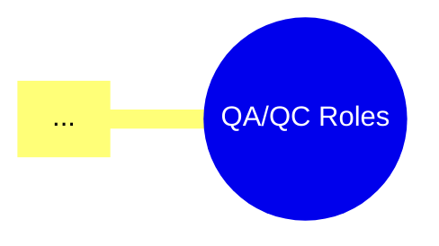

# HW01 – QA/QC Jobs, 20 Defects, Test a Physical Product

**Họ tên:** Lê Tấn Hiệp | **MSSV:** 23120255 | **Cấp độ AI:** Cấp 4 | **Công cụ AI:** Claude
**GitHub repo:** [link](https://github.com/ThachHaoo/software-testing-2627/tree/main/HW01)
**Ngày nộp:** [dd/mm/2026]

> 📝 **Quy ước trong file này (xóa toàn bộ các khối 📝 trước khi xuất PDF):**
> - `[...]` = ô cần điền.
> - `` = chỗ chèn ảnh minh chứng; đặt ảnh vào thư mục `images/` đúng tên file.
> - 🔒 = artifact **cấm dùng AI tạo** (ảnh, giọng nói, screenshot, prompt log). Vi phạm → 0 điểm cả bài.
> - Mỗi lần dùng AI, ghi ngay vào Prompt log (Phụ lục A) với timestamp `HH:MM dd/mm/yyyy` và gán mã `P01, P02...`. Trong bài, dẫn chiếu bằng mã này.

---

## Mục lục

1. Requirement 1 – Thị trường việc làm QA/QC
2. Requirement 2 – 20 Software Defects 2022–2026
3. Requirement 3 – Test thiết bị vật lý
4. AI Audit Report
5. AI Critique
6. Mandatory Disclosure
7. Tự đánh giá
- Phụ lục A, B, C, D

---

## 1. Requirement 1 – Thị trường việc làm QA/QC

> 📝 **Hướng dẫn:**
> - 10 tin đăng **trong vòng 60 ngày tính đến ngày nộp**, nên ghi ngày đăng để TA đối chiếu.
> - Ít nhất **3 tin yêu cầu kỹ năng AI/LLM/AI-automation**, đánh dấu ở cột "Yêu cầu AI".
> - 🔒 Mọi screenshot phải thấy **tên tài khoản đăng nhập của bạn ở góc màn hình** và **ngày đăng tin**.
> - Nên đa dạng: cấp độ (Intern/Fresher/Junior/Senior), loại hình (Manual/Automation/AI QA/Performance), nền tảng (ITviec, TopCV, LinkedIn, VietnamWorks...).

### 1.1 Bảng 10 tin tuyển dụng

**Ngày thu thập:** [dd/mm/2026] | **Mốc 60 ngày:** từ [dd/mm/2026] đến [dd/mm/2026]

| # | Vị trí | Công ty | Nền tảng | Ngày đăng | Cấp độ | Hình thức / Địa điểm | Mức lương | Yêu cầu AI? | Link |
|---|---|---|---|---|---|---|---|---|---|
| J01 | [...] | [...] | [...] | [dd/mm/2026] | [...] | [Onsite/Hybrid/Remote – HCM] | [... hoặc "Thỏa thuận"] | [Có/Không] | [link] |
| J02 | [...] | [...] | [...] | [dd/mm/2026] | [...] | [...] | [...] | [Có/Không] | [link] |
| J03 | [...] | [...] | [...] | [dd/mm/2026] | [...] | [...] | [...] | [Có/Không] | [link] |
| J04 | [...] | [...] | [...] | [dd/mm/2026] | [...] | [...] | [...] | [Có/Không] | [link] |
| J05 | [...] | [...] | [...] | [dd/mm/2026] | [...] | [...] | [...] | [Có/Không] | [link] |
| J06 | [...] | [...] | [...] | [dd/mm/2026] | [...] | [...] | [...] | [Có/Không] | [link] |
| J07 | [...] | [...] | [...] | [dd/mm/2026] | [...] | [...] | [...] | [Có/Không] | [link] |
| J08 | [...] | [...] | [...] | [dd/mm/2026] | [...] | [...] | [...] | [Có/Không] | [link] |
| J09 | [...] | [...] | [...] | [dd/mm/2026] | [...] | [...] | [...] | [Có/Không] | [link] |
| J10 | [...] | [...] | [...] | [dd/mm/2026] | [...] | [...] | [...] | [Có/Không] | [link] |

**Tổng số tin yêu cầu AI/LLM:** [x]/10 (yêu cầu ≥ 3)

### 1.2 Chi tiết từng tin (ảnh chụp + AI Impact Analysis)

> 📝 **Hướng dẫn:**
> - Mô tả công việc: tóm tắt 3–5 ý chính theo lời của bạn, không copy nguyên JD.
> - **AI Impact Analysis (1–2 câu):** phần việc nào AI **thay thế** được, phần nào AI **hỗ trợ**, phần nào AI **không thay thế** được. Nên nói cụ thể theo nhiệm vụ trong JD, tránh câu chung chung kiểu "AI sẽ giúp tăng năng suất".

#### J01 – [Vị trí] @ [Công ty]

 🔒

| Mục | Nội dung |
|---|---|
| Link | [link] |
| Ngày đăng | [dd/mm/2026] |
| Mô tả công việc | - [...]<br>- [...]<br>- [...] |
| Kỹ năng bắt buộc | [...] |
| Kỹ năng ưu tiên | [...] |
| Kỹ năng AI / công cụ AI | [... / Không có] |
| Mức lương | [...] |
| **AI Impact Analysis** | **Thay thế:** [...]. **Hỗ trợ:** [...]. **Không thay thế:** [...]. |

#### J02 – [Vị trí] @ [Công ty]

 🔒

| Mục | Nội dung |
|---|---|
| Link | [link] |
| Ngày đăng | [dd/mm/2026] |
| Mô tả công việc | - [...]<br>- [...]<br>- [...] |
| Kỹ năng bắt buộc | [...] |
| Kỹ năng ưu tiên | [...] |
| Kỹ năng AI / công cụ AI | [... / Không có] |
| Mức lương | [...] |
| **AI Impact Analysis** | **Thay thế:** [...]. **Hỗ trợ:** [...]. **Không thay thế:** [...]. |

#### J03 – [Vị trí] @ [Công ty]

 🔒

| Mục | Nội dung |
|---|---|
| Link | [link] |
| Ngày đăng | [dd/mm/2026] |
| Mô tả công việc | - [...]<br>- [...]<br>- [...] |
| Kỹ năng bắt buộc | [...] |
| Kỹ năng ưu tiên | [...] |
| Kỹ năng AI / công cụ AI | [... / Không có] |
| Mức lương | [...] |
| **AI Impact Analysis** | **Thay thế:** [...]. **Hỗ trợ:** [...]. **Không thay thế:** [...]. |

#### J04 – [Vị trí] @ [Công ty]

 🔒

| Mục | Nội dung |
|---|---|
| Link | [link] |
| Ngày đăng | [dd/mm/2026] |
| Mô tả công việc | - [...]<br>- [...]<br>- [...] |
| Kỹ năng bắt buộc | [...] |
| Kỹ năng ưu tiên | [...] |
| Kỹ năng AI / công cụ AI | [... / Không có] |
| Mức lương | [...] |
| **AI Impact Analysis** | **Thay thế:** [...]. **Hỗ trợ:** [...]. **Không thay thế:** [...]. |

#### J05 – [Vị trí] @ [Công ty]

 🔒

| Mục | Nội dung |
|---|---|
| Link | [link] |
| Ngày đăng | [dd/mm/2026] |
| Mô tả công việc | - [...]<br>- [...]<br>- [...] |
| Kỹ năng bắt buộc | [...] |
| Kỹ năng ưu tiên | [...] |
| Kỹ năng AI / công cụ AI | [... / Không có] |
| Mức lương | [...] |
| **AI Impact Analysis** | **Thay thế:** [...]. **Hỗ trợ:** [...]. **Không thay thế:** [...]. |

#### J06 – [Vị trí] @ [Công ty]

 🔒

| Mục | Nội dung |
|---|---|
| Link | [link] |
| Ngày đăng | [dd/mm/2026] |
| Mô tả công việc | - [...]<br>- [...]<br>- [...] |
| Kỹ năng bắt buộc | [...] |
| Kỹ năng ưu tiên | [...] |
| Kỹ năng AI / công cụ AI | [... / Không có] |
| Mức lương | [...] |
| **AI Impact Analysis** | **Thay thế:** [...]. **Hỗ trợ:** [...]. **Không thay thế:** [...]. |

#### J07 – [Vị trí] @ [Công ty]

 🔒

| Mục | Nội dung |
|---|---|
| Link | [link] |
| Ngày đăng | [dd/mm/2026] |
| Mô tả công việc | - [...]<br>- [...]<br>- [...] |
| Kỹ năng bắt buộc | [...] |
| Kỹ năng ưu tiên | [...] |
| Kỹ năng AI / công cụ AI | [... / Không có] |
| Mức lương | [...] |
| **AI Impact Analysis** | **Thay thế:** [...]. **Hỗ trợ:** [...]. **Không thay thế:** [...]. |

#### J08 – [Vị trí] @ [Công ty]

 🔒

| Mục | Nội dung |
|---|---|
| Link | [link] |
| Ngày đăng | [dd/mm/2026] |
| Mô tả công việc | - [...]<br>- [...]<br>- [...] |
| Kỹ năng bắt buộc | [...] |
| Kỹ năng ưu tiên | [...] |
| Kỹ năng AI / công cụ AI | [... / Không có] |
| Mức lương | [...] |
| **AI Impact Analysis** | **Thay thế:** [...]. **Hỗ trợ:** [...]. **Không thay thế:** [...]. |

#### J09 – [Vị trí] @ [Công ty]

 🔒

| Mục | Nội dung |
|---|---|
| Link | [link] |
| Ngày đăng | [dd/mm/2026] |
| Mô tả công việc | - [...]<br>- [...]<br>- [...] |
| Kỹ năng bắt buộc | [...] |
| Kỹ năng ưu tiên | [...] |
| Kỹ năng AI / công cụ AI | [... / Không có] |
| Mức lương | [...] |
| **AI Impact Analysis** | **Thay thế:** [...]. **Hỗ trợ:** [...]. **Không thay thế:** [...]. |

#### J10 – [Vị trí] @ [Công ty]

 🔒

| Mục | Nội dung |
|---|---|
| Link | [link] |
| Ngày đăng | [dd/mm/2026] |
| Mô tả công việc | - [...]<br>- [...]<br>- [...] |
| Kỹ năng bắt buộc | [...] |
| Kỹ năng ưu tiên | [...] |
| Kỹ năng AI / công cụ AI | [... / Không có] |
| Mức lương | [...] |
| **AI Impact Analysis** | **Thay thế:** [...]. **Hỗ trợ:** [...]. **Không thay thế:** [...]. |

### 1.3 Mindmap vai trò QA/QC do AI sinh và 3 lỗi

> 📝 **Hướng dẫn (CLO G9.1):**
> - Cho AI vẽ mindmap vai trò/quy trình QA/QC (nên yêu cầu output dạng Mermaid hoặc Markdown để dễ render). Lưu prompt vào log.
> - Tìm **đúng 3 lỗi có căn cứ**, đối chiếu với **ISTQB CTFL v4.0** (ghi rõ mục, ví dụ 1.4 "Test Activities, Testware and Test Roles", 1.5 "Essential Skills and Good Practices"). Các kiểu lỗi dễ gặp: nhầm QA với QC, xếp sai hoạt động vào vai trò, gộp test level với test type, thiếu vai trò test management/test analysis, gán hoạt động cho sai giai đoạn.
> - Vẽ lại mindmap đã sửa, **đánh dấu** các nhánh đã sửa (đổi màu hoặc thêm ký hiệu ✎).

**Prompt:** xem `P[..]` – Phụ lục A

**Mindmap do AI sinh (bản gốc):**


**3 lỗi phát hiện:**

| # | Vị trí trong mindmap | AI viết | Vì sao sai | Căn cứ (ISTQB / slide) | Sửa thành |
|---|---|---|---|---|---|
| E1 | [Nhánh ...] | [...] | [...] | [CTFL v4.0 §...] | [...] |
| E2 | [Nhánh ...] | [...] | [...] | [CTFL v4.0 §...] | [...] |
| E3 | [Nhánh ...] | [...] | [...] | [CTFL v4.0 §...] | [...] |

**Mindmap sau khi sửa:**


<details><summary>Mã nguồn mindmap (Mermaid)</summary>



</details>

### 1.4 Tổng hợp xu hướng thị trường 2026+

> 📝 **Hướng dẫn:** Phần này đáp ứng 2 outcome của đề: *mô tả bức tranh thị trường* và *phân biệt việc AI thay thế / hỗ trợ / không thay thế*. Rút ra từ chính 10 tin ở trên, không lấy số liệu chung chung trên mạng.

**Thống kê từ 10 tin:**

| Chỉ số | Giá trị |
|---|---|
| Số tin Manual / Automation / AI-QA / Khác | [x / x / x / x] |
| Số tin yêu cầu AI/LLM | [x]/10 |
| Dải lương Junior / Senior | [...] / [...] |
| Top 5 kỹ năng xuất hiện nhiều nhất | [1. ... (x/10), 2. ..., ...] |
| Công cụ AI được nhắc đến | [...] |

**Phân loại công việc QA/QC theo mức độ tác động của AI:**

| Nhóm | Công việc cụ thể | Minh chứng từ tin tuyển dụng |
|---|---|---|
| AI **có thể thay thế** | [VD: sinh test data, viết test script lặp lại...] | [J..] |
| AI **hỗ trợ** (người vẫn quyết định) | [VD: sinh test case nháp, phân tích log...] | [J..] |
| AI **không thay thế** | [VD: đánh giá rủi ro nghiệp vụ, exploratory testing, giao tiếp stakeholder...] | [J..] |

**Nhận xét (3–5 câu):** [...]

---

## 2. Requirement 2 – 20 Software Defects 2022–2026

> 📝 **Hướng dẫn:**
> - 20 defect được **công bố** trong 2022–2026. Ghi ngày công bố của nguồn.
> - Ít nhất **5 defect AI/LLM** (hallucination, prompt injection, bias, jailbreak, data leak qua LLM...).
> - Ưu tiên nguồn gốc: postmortem/official statement của hãng, báo lớn (Reuters, The Verge, BBC...), CVE/NVD, AI Incident Database (incidentdatabase.ai).
> - Định nghĩa thang severity trước (bảng 2.0) rồi áp dụng nhất quán.

### 2.0 Thang đánh giá Severity

| Mức | Định nghĩa áp dụng trong bài |
|---|---|
| Critical | [VD: gây thiệt hại tài chính/an toàn lớn, sập hệ thống diện rộng, lộ dữ liệu quy mô lớn] |
| High | [VD: mất chức năng chính, ảnh hưởng nhiều người dùng, có workaround khó] |
| Medium | [VD: lỗi chức năng phụ, có workaround] |
| Low | [VD: lỗi hiển thị, ảnh hưởng nhỏ] |

### 2.1 Bảng 20 defect

**Bảng tổng quan:**

| ID | Tên defect | Năm công bố | Tổ chức / Sản phẩm | Nhóm | Loại lỗi | Severity | Nguồn |
|---|---|---|---|---|---|---|---|
| D01 | [...] | [2022–2026] | [...] | [AI/LLM / Non-AI] | [VD: Hallucination / Prompt injection / Bias / Logic / Config / Security...] | [...] | [link] |
| D02 | [...] | [...] | [...] | [...] | [...] | [...] | [link] |
| D03 | [...] | [...] | [...] | [...] | [...] | [...] | [link] |
| D04 | [...] | [...] | [...] | [...] | [...] | [...] | [link] |
| D05 | [...] | [...] | [...] | [...] | [...] | [...] | [link] |
| D06 | [...] | [...] | [...] | [...] | [...] | [...] | [link] |
| D07 | [...] | [...] | [...] | [...] | [...] | [...] | [link] |
| D08 | [...] | [...] | [...] | [...] | [...] | [...] | [link] |
| D09 | [...] | [...] | [...] | [...] | [...] | [...] | [link] |
| D10 | [...] | [...] | [...] | [...] | [...] | [...] | [link] |
| D11 | [...] | [...] | [...] | [...] | [...] | [...] | [link] |
| D12 | [...] | [...] | [...] | [...] | [...] | [...] | [link] |
| D13 | [...] | [...] | [...] | [...] | [...] | [...] | [link] |
| D14 | [...] | [...] | [...] | [...] | [...] | [...] | [link] |
| D15 | [...] | [...] | [...] | [...] | [...] | [...] | [link] |
| D16 | [...] | [...] | [...] | [...] | [...] | [...] | [link] |
| D17 | [...] | [...] | [...] | [...] | [...] | [...] | [link] |
| D18 | [...] | [...] | [...] | [...] | [...] | [...] | [link] |
| D19 | [...] | [...] | [...] | [...] | [...] | [...] | [link] |
| D20 | [...] | [...] | [...] | [...] | [...] | [...] | [link] |

**Thống kê:** AI/LLM: [x]/20 (yêu cầu ≥ 5) · Critical [x] · High [x] · Medium [x] · Low [x]

**Bảng chi tiết:**

> 📝 Mỗi ô 1–3 câu. "Giải pháp" = cách hãng đã khắc phục thực tế (theo nguồn) + bài học kiểm thử (loại test nào lẽ ra bắt được lỗi này).

| ID | Mô tả | Hậu quả | Giải pháp (thực tế) | Bài học kiểm thử |
|---|---|---|---|---|
| D01 | [...] | [...] | [...] | [...] |
| D02 | [...] | [...] | [...] | [...] |
| D03 | [...] | [...] | [...] | [...] |
| D04 | [...] | [...] | [...] | [...] |
| D05 | [...] | [...] | [...] | [...] |
| D06 | [...] | [...] | [...] | [...] |
| D07 | [...] | [...] | [...] | [...] |
| D08 | [...] | [...] | [...] | [...] |
| D09 | [...] | [...] | [...] | [...] |
| D10 | [...] | [...] | [...] | [...] |
| D11 | [...] | [...] | [...] | [...] |
| D12 | [...] | [...] | [...] | [...] |
| D13 | [...] | [...] | [...] | [...] |
| D14 | [...] | [...] | [...] | [...] |
| D15 | [...] | [...] | [...] | [...] |
| D16 | [...] | [...] | [...] | [...] |
| D17 | [...] | [...] | [...] | [...] |
| D18 | [...] | [...] | [...] | [...] |
| D19 | [...] | [...] | [...] | [...] |
| D20 | [...] | [...] | [...] | [...] |

### 2.2 Chỗ AI bias / hallucinate khi giải thích defect

> 📝 **Hướng dẫn:**
> - Hỏi AI giải thích 1 defect trong danh sách (hỏi về ngày, con số thiệt hại, nguyên nhân gốc, số người ảnh hưởng, ai chịu trách nhiệm là những chỗ AI hay bịa).
> - Đối chiếu với nguồn gốc, chỉ ra **chính xác câu nào sai**, sai kiểu gì (hallucination: bịa sự kiện/số liệu/trích dẫn; bias: quy lỗi thiên lệch, đánh giá một chiều).
> - 🔒 Screenshot khung chat thật, khoanh đỏ câu sai.

| Mục | Nội dung |
|---|---|
| Defect được hỏi | [D..] – [tên] |
| Prompt | `P[..]` – Phụ lục A |
| Câu AI trả lời sai (trích nguyên văn) | "[...]" |
| Loại | [Hallucination / Bias] |
| Sự thật theo nguồn | [...] – [link nguồn] |
| Vì sao AI sai (giả thuyết) | [VD: dữ liệu huấn luyện trước sự kiện, trộn 2 sự cố tương tự, thiên về nguồn truyền thông...] |
| Cách phát hiện / phòng tránh | [...] |


---

## 3. Requirement 3 – Test thiết bị vật lý

### 3.1 Thông tin thiết bị (ảnh + thẻ SV)

 🔒

| Thuộc tính | Giá trị |
|---|---|
| Loại thiết bị | [...] |
| Thương hiệu | [...] |
| Model | [...] |
| Năm sản xuất / mua | [...] |
| Serial number | [VD: AB12****7890 – che 4 ký tự giữa] |
| Thông số kỹ thuật chính | [Công suất ..W, điện áp ..V, ...] |
| Tình trạng | [Mới / đã dùng x năm] |
| Tài liệu tham chiếu (test basis) | [Hướng dẫn sử dụng / tem thông số / website hãng – link] |

 🔒

### 3.2 Phạm vi và chiến lược kiểm thử

> 📝 Phần này giúp trả lời câu vấn đáp "vì sao chọn input X". Ngắn gọn, 1 bảng + vài dòng.

**Các chức năng / đặc tính của thiết bị (test conditions):**

| Mã | Chức năng / đặc tính | Nguồn (manual trang ...) | Trong phạm vi? |
|---|---|---|---|
| F1 | [VD: bật/tắt nguồn] | [...] | [Có] |
| F2 | [...] | [...] | [Có] |
| F3 | [...] | [...] | [Có] |
| F4 | [...] | [...] | [Có] |
| F5 | [...] | [...] | [Không – lý do: nguy hiểm/phá hủy thiết bị] |

**Kỹ thuật thiết kế test áp dụng:** [Equivalence Partitioning, Boundary Value Analysis, State Transition, Decision Table, Use Case, Error Guessing] (ISTQB CTFL v4.0 chương 4)

**Loại kiểm thử bao phủ:** [Functional, Usability, Reliability/độ bền, Safety, Compatibility...]

**Môi trường test:** [Nguồn điện 220V, nhiệt độ phòng ~..°C, dụng cụ đo: đồng hồ bấm giờ / nhiệt kế / app đo âm thanh...]

**Ngoài phạm vi (và lý do):** [VD: test chống nước, quá áp, tháo vỏ → nguy hiểm/mất bảo hành]

**Sơ đồ trạng thái (nếu dùng State Transition):**


### 3.3 Bảng 15 test case

> 📝 **Hướng dẫn:**
> - Cột bắt buộc theo đề: **Objective / Input / Steps / Expected / Actual / Verdict**.
> - Cột **Nguồn**: `AI` (lấy từ output AI, giữ nguyên), `AI*` (AI sinh, bạn đã sửa – ghi trong Audit Report), `SV` (bạn tự nghĩ). **≥ 3 TC nguồn `SV` là edge case** (mục 3.4).
> - Expected result phải **đo/kiểm được** (số giây, mức, đèn nào sáng...), tránh viết "hoạt động bình thường".
> - TC không chạy thật: Actual = `—`, Verdict = `Not Run`.
> - Bảng này phải **khớp với sheet "Test Cases" trong file Excel**.

| TC ID | Objective | Kỹ thuật | Precondition | Input / Test data | Steps | Expected | Actual | Verdict | Nguồn |
|---|---|---|---|---|---|---|---|---|---|
| TC01 | [...] | [EP] | [...] | [...] | 1. [...]<br>2. [...]<br>3. [...] | [...] | [...] | [Pass/Fail/Blocked/Not Run] | [AI/AI*/SV] |
| TC02 | [...] | [...] | [...] | [...] | 1. [...]<br>2. [...] | [...] | [...] | [...] | [...] |
| TC03 | [...] | [...] | [...] | [...] | 1. [...]<br>2. [...] | [...] | [...] | [...] | [...] |
| TC04 | [...] | [...] | [...] | [...] | 1. [...]<br>2. [...] | [...] | [...] | [...] | [...] |
| TC05 | [...] | [...] | [...] | [...] | 1. [...]<br>2. [...] | [...] | [...] | [...] | [...] |
| TC06 | [...] | [...] | [...] | [...] | 1. [...]<br>2. [...] | [...] | [...] | [...] | [...] |
| TC07 | [...] | [...] | [...] | [...] | 1. [...]<br>2. [...] | [...] | [...] | [...] | [...] |
| TC08 | [...] | [...] | [...] | [...] | 1. [...]<br>2. [...] | [...] | [...] | [...] | [...] |
| TC09 | [...] | [...] | [...] | [...] | 1. [...]<br>2. [...] | [...] | [...] | [...] | [...] |
| TC10 | [...] | [...] | [...] | [...] | 1. [...]<br>2. [...] | [...] | [...] | [...] | [...] |
| TC11 | [...] | [...] | [...] | [...] | 1. [...]<br>2. [...] | [...] | [...] | [...] | [...] |
| TC12 | [...] | [...] | [...] | [...] | 1. [...]<br>2. [...] | [...] | [...] | [...] | [...] |
| TC13 | [Edge] [...] | [...] | [...] | [...] | 1. [...]<br>2. [...] | [...] | [...] | [...] | SV |
| TC14 | [Edge] [...] | [...] | [...] | [...] | 1. [...]<br>2. [...] | [...] | [...] | [...] | SV |
| TC15 | [Edge] [...] | [...] | [...] | [...] | 1. [...]<br>2. [...] | [...] | [...] | [...] | SV |

**Lý do chọn input (chuẩn bị vấn đáp):**

| TC ID | Vì sao chọn input này (partition / boundary / trạng thái nào) | Vì sao không chọn giá trị khác |
|---|---|---|
| TC01 | [...] | [...] |
| TC.. | [...] | [...] |

**Ma trận truy vết (TC ↔ chức năng):**

| Chức năng | TC bao phủ |
|---|---|
| F1 | [TC01, TC..] |
| F2 | [...] |
| F3 | [...] |
| F4 | [...] |

### 3.4 3 edge case AI bỏ sót

> 📝 **Hướng dẫn (CLO G9.3):**
> - **Trình tự bắt buộc:** cho AI sinh test case trước (lưu prompt + output) → sau đó mới tự tìm edge case → chứng minh edge case của bạn **không có** trong output của AI.
> - Edge case tốt thường đến từ **hiểu biết về thiết bị thật, cách dùng thật, môi trường thật** mà AI không có: mất điện giữa chừng rồi có điện lại, bấm nhiều nút cùng lúc, bấm liên tục nhanh, thao tác ngay lúc đang chuyển trạng thái, pin yếu/điện áp thấp, thao tác sai thứ tự, dùng liên tục lâu, đặc điểm riêng của model đang có.
> - Giải thích **vì sao AI bỏ sót** — đây là phần chấm điểm Analyse.

**Output test case gốc của AI:** `P[..]` – Phụ lục A (AI sinh [x] TC)

| TC ID | Edge case | Vì sao đây là edge case | Vì sao AI bỏ sót | Bằng chứng AI không có |
|---|---|---|---|---|
| TC13 | [...] | [...] | [VD: AI không biết model này có chế độ nhớ trạng thái / không có kinh nghiệm dùng thật...] | [Đối chiếu output `P..`: không TC nào nhắc đến ...] |
| TC14 | [...] | [...] | [...] | [...] |
| TC15 | [...] | [...] | [...] | [...] |

**(Tùy chọn) Kiểm chứng lại:** gửi 3 edge case này cho AI hỏi "bạn có tìm ra không / vì sao bỏ sót" → `P[..]`. Tóm tắt phản hồi: [...]

### 3.5 Kết quả chạy thật và link video

> 📝 **Hướng dẫn:**
> - Chạy thật **≥ 5 TC**, nên gồm ít nhất 1–2 edge case và cố gắng có ≥ 1 TC Fail (để có bug log lên Mantis).
> - Video **≤ 60 giây**, 🔒 **có giọng bạn thuyết minh**, upload YouTube **Unlisted**.
> - Checklist mỗi video: đọc mã TC → nói expected → thao tác → nói actual và verdict. Nên để thẻ SV hoặc tờ giấy ghi MSSV + mã TC trong khung hình.

| TC ID | Ngày chạy | Người chạy | Actual result | Verdict | Video (YouTube Unlisted) | Thời lượng |
|---|---|---|---|---|---|---|
| TC.. | [dd/mm/2026] | Lê Tấn Hiệp | [...] | [...] | [link] | [..s] |
| TC.. | [dd/mm/2026] | Lê Tấn Hiệp | [...] | [...] | [link] | [..s] |
| TC.. | [dd/mm/2026] | Lê Tấn Hiệp | [...] | [...] | [link] | [..s] |
| TC.. | [dd/mm/2026] | Lê Tấn Hiệp | [...] | [...] | [link] | [..s] |
| TC.. | [dd/mm/2026] | Lê Tấn Hiệp | [...] | [...] | [link] | [..s] |

**Ảnh chụp khung hình tiêu biểu:**


### 3.6 Test Summary (+ Mantis)

**Tổng hợp thực thi:**

| Chỉ số | Số lượng | Tỉ lệ |
|---|---|---|
| Tổng TC thiết kế | 15 | 100% |
| Đã thực thi | [x] | [..%] |
| Pass | [x] | [..%] |
| Fail | [x] | [..%] |
| Blocked | [x] | [..%] |
| Not Run | [x] | [..%] |
| TC từ AI (giữ nguyên / đã sửa / SV tự viết) | [x / x / x] | — |

**Defect tìm được:**

| Mantis ID | TC liên quan | Tóm tắt | Severity | Priority | Trạng thái |
|---|---|---|---|---|---|
| [#....] | [TC..] | [...] | [...] | [...] | [New] |

> 📝 Nếu không TC nào Fail: ghi rõ "Không phát hiện defect trong [x] TC đã thực thi" và nêu lý do (thiết bị ổn định / phạm vi test giới hạn). Vẫn cần screenshot trang chủ Mantis.

**Minh chứng Mantis:**

 🔒

 🔒

**Kết luận & đánh giá chất lượng thiết bị (3–5 câu):** [...]

**Rủi ro còn lại / đề xuất test thêm:** [...]

---

## 4. AI Audit Report

> 📝 **Hướng dẫn:**
> - **Mỗi artifact có dùng AI** = 1 entry 5 mục. Output AI phải để **nguyên văn** hoặc screenshot viền đỏ có chú thích — không tóm tắt.
> - Verdict: **VALID** (dùng được nguyên), **INVALID** (sai), **INCOMPLETE** (đúng một phần / thiếu).
> - Reasoning 2–5 câu, **dẫn slide hoặc mục ISTQB cụ thể**.
> - Student fix: **highlight phần thay đổi** (dùng `**in đậm**` hoặc `~~gạch~~` → mới).
> - Nếu output nguyên văn quá dài, để nguyên văn ở file AI-02 (Phụ lục B) và dẫn chiếu ở đây.

**Danh sách artifact có dùng AI:**

| Mã | Artifact | Section | Prompt | Verdict |
|---|---|---|---|---|
| A01 | Mindmap vai trò QA/QC | 1.3 | P[..] | [...] |
| A02 | [VD: Phân tích AI Impact cho J..] | 1.2 | P[..] | [...] |
| A03 | [VD: Danh sách defect gợi ý] | 2.1 | P[..] | [...] |
| A04 | Giải thích defect D.. (hallucination) | 2.2 | P[..] | [...] |
| A05 | Test case thiết bị (bộ gốc) | 3.3 | P[..] | [...] |
| A.. | [...] | [...] | P[..] | [...] |

> 📝 Với A05 (bộ test case), có thể đánh giá **từng TC** trong bảng con để tính tỉ lệ chính xác sát hơn.

### A01 – Mindmap vai trò QA/QC

| Mục | Nội dung |
|---|---|
| (1) Prompt + tool | **Tool:** Claude [model/version] · **Thời gian:** [HH:MM dd/mm/2026]<br>**Prompt:** "[nguyên văn]" |
| (2) AI output | [Nguyên văn hoặc ảnh `images/audit_A01.png` viền đỏ có chú thích] |
| (3) Verdict | [VALID / INVALID / INCOMPLETE] |
| (4) Reasoning | [2–5 câu, dẫn ISTQB CTFL v4.0 §... / slide ...] |
| (5) Student fix | [Phần đã sửa – highlight thay đổi] |

### A02 – [...]

| Mục | Nội dung |
|---|---|
| (1) Prompt + tool | **Tool:** [...] · **Thời gian:** [HH:MM dd/mm/2026]<br>**Prompt:** "[...]" |
| (2) AI output | [...] |
| (3) Verdict | [...] |
| (4) Reasoning | [...] |
| (5) Student fix | [...] |

### A03 – [...]

| Mục | Nội dung |
|---|---|
| (1) Prompt + tool | **Tool:** [...] · **Thời gian:** [HH:MM dd/mm/2026]<br>**Prompt:** "[...]" |
| (2) AI output | [...] |
| (3) Verdict | [...] |
| (4) Reasoning | [...] |
| (5) Student fix | [...] |

### A04 – [...]

| Mục | Nội dung |
|---|---|
| (1) Prompt + tool | **Tool:** [...] · **Thời gian:** [HH:MM dd/mm/2026]<br>**Prompt:** "[...]" |
| (2) AI output | [...] |
| (3) Verdict | [...] |
| (4) Reasoning | [...] |
| (5) Student fix | [...] |

### A05 – Test case thiết bị

| Mục | Nội dung |
|---|---|
| (1) Prompt + tool | **Tool:** [...] · **Thời gian:** [HH:MM dd/mm/2026]<br>**Prompt:** "[...]" |
| (2) AI output | [...] |
| (3) Verdict | [...] |
| (4) Reasoning | [...] |
| (5) Student fix | [...] |

**Đánh giá từng TC do AI sinh:**

| TC của AI | Verdict | Lý do ngắn | Xử lý (giữ / sửa → TC.. / loại) |
|---|---|---|---|
| AI-TC01 | [...] | [...] | [...] |
| AI-TC.. | [...] | [...] | [...] |

### 4.x Tổng kết độ chính xác của AI

| Verdict | Số lượng | Tỉ lệ |
|---|---|---|
| VALID | [x] | [..%] |
| INVALID | [x] | [..%] |
| INCOMPLETE | [x] | [..%] |
| **Tổng** | [x] | 100% |

**Khi nào NÊN dùng AI cho bài này:** [VD: brainstorm test condition ban đầu, gợi ý nguồn defect, định dạng bảng...]

**Khi nào KHÔNG NÊN dùng AI:** [VD: số liệu/ngày tháng của defect cần kiểm chứng, edge case phụ thuộc thiết bị thật, tin tuyển dụng hiện hành...]

---

## 5. AI Critique

> 📝 **Hướng dẫn:** 1 đoạn **200–300 từ**, tự viết. Trả lời đủ 3 câu hỏi của đề:
> 1. AI sai / bias / thiếu ở đâu? → dẫn ví dụ cụ thể (E1–E3 mindmap, hallucination 2.2, edge case 3.4).
> 2. Vì sao AI không bắt được? → thiếu ngữ cảnh vật lý, dữ liệu huấn luyện có hạn, xu hướng trả lời "trung bình/phổ biến", tự tin khi không chắc...
> 3. Nguyên tắc rút ra khi cộng tác với AI? → 1–2 nguyên tắc cụ thể, có thể áp dụng lại ở HW sau.

[Đoạn văn 200–300 từ]

**Số từ:** [...]

---

## 6. Mandatory Disclosure

> 📝 Điền cụ thể, khớp với cột "Nguồn" ở 3.3 và danh sách artifact ở mục 4. Không để lại dấu ngoặc vuông.

*"[Mindmap vai trò QA/QC (1.3), bộ test case ban đầu (3.3), ...] was initially generated by [Claude – model ...]; I reviewed and modified [section 1.3 – 3 errors E1–E3, section 3.3 – TC.., TC.., ...], added [edge cases TC13, TC14, TC15]; [section 1.1–1.2 job research, 2.1 defect verification, 3.5 execution & videos, 5 AI Critique] was written entirely by me. The detailed AI Audit Report is attached as Appendix A. I confirm I did not use AI to generate any artifact listed in the prohibited category below."*

**Prohibited category (không dùng AI):** ảnh thiết bị + thẻ SV; giọng thuyết minh video; 10 screenshot tin tuyển dụng; prompt log có timestamp.

---

## 7. Tự đánh giá

| No. | Tiêu chí | Điểm tối đa | Tự đánh giá | Căn cứ / tự nhận xét |
|---|---|---|---|---|
| 1 | Job Market 2026+ (10 jobs × 3 pts + AI Impact) | 40 | [..] | [VD: đủ 10 tin trong 60 ngày, x tin AI, đủ screenshot...] |
| 2 | Software Defects 2022–2026 (20 defects) | 20 | [..] | [...] |
| 3 | Physical-product test design (15 TCs + 5 videos) | 25 | [..] | [...] |
| AI-1 | [AI-02] AI Audit Report (5-section) attached | 8 | [..] | [...] |
| AI-2 | AI Critique 200–300 words + [AI-03] Disclosure attached | 4 | [..] | [...] |
| AI-3 | [AI-05] Checklist signed + anti-cheat artifacts | 3 | [..] | [...] |
| | **Tổng** | **100** | **[...]** | |

> 📝 Tổng tự đánh giá = 3 chữ số trong tên file `23120255_HW01_AI_<grade>.zip`.

**Checklist trước khi nộp:**

- [ ] 10 tin đều trong 60 ngày, ≥ 3 tin AI, mọi screenshot thấy username + ngày
- [ ] 20 defect 2022–2026, ≥ 5 defect AI/LLM, đủ link nguồn
- [ ] 1 chỗ AI hallucinate/bias có screenshot
- [ ] Mindmap AI + 3 lỗi + bản sửa (PNG/Markdown)
- [ ] Ảnh thiết bị + thẻ SV cùng khung; serial đã che 4 ký tự giữa
- [ ] 15 TC, ≥ 3 edge case SV tự tìm có chứng minh
- [ ] ≥ 5 video ≤ 60s, có giọng thuyết minh, YouTube Unlisted
- [ ] Screenshot trang chủ Mantis (username = 23120255) + bug report
- [ ] File Excel: Test Cases / Checklist / Test Summary Report
- [ ] AI Audit Report 5 mục cho mọi artifact + tỉ lệ VALID/INVALID/INCOMPLETE
- [ ] AI Critique 200–300 từ
- [ ] Mandatory Disclosure đã điền cụ thể
- [ ] AI-02, AI-03 (đã ký), AI-05 (đã ký); AI-06 đã ký từ tuần 1
- [ ] Prompt log .md có timestamp mọi prompt
- [ ] Đã xóa hết khối 📝 và dấu `[...]`
- [ ] Tên file zip: `23120255_HW01_AI_<grade>.zip`

---

## Phụ lục

### A: Prompt log

> 📝 🔒 Tự ghi, **mọi prompt** gửi AI đều phải có. Nộp kèm file riêng `prompt_log.md`; ở đây để bảng tóm tắt.

| Mã | Thời gian (HH:MM dd/mm/yyyy) | Tool / model | Mục đích | Dùng ở section | File/đoạn output |
|---|---|---|---|---|---|
| P01 | [..:.. ../../2026] | Claude [...] | [...] | [..] | [prompt_log.md#p01] |
| P02 | [...] | [...] | [...] | [...] | [...] |

Mẫu mỗi entry trong `prompt_log.md`:

```markdown
## P01 – [HH:MM dd/mm/yyyy] – Claude [model]
**Mục đích:** [...]
**Prompt:**
> [nguyên văn]
**Output:** [nguyên văn hoặc link screenshot]
**Dùng ở:** Section [..] – Audit entry A[..]
```

### B: AI-02, AI-03, AI-05

| Template | File | Trạng thái |
|---|---|---|
| [AI-02] AI Audit Report | `AI-02_AuditReport_23120255.[pdf/docx]` | [ ] |
| [AI-03] AI Disclosure Form (ký) | `AI-03_Disclosure_23120255.pdf` | [ ] |
| [AI-05] Privacy & Responsible Use Checklist (ký) | `AI-05_Checklist_23120255.pdf` | [ ] |
| [AI-06] Student Acknowledgement (ký tuần 1) | [đã nộp ngày ../../2026] | [ ] |

### C: Git commit log

> 📝 Chạy `git log --oneline --date=format:'%H:%M %d/%m/%Y' --pretty=format:'%h %ad %s'` trong thư mục HW01 và dán kết quả hoặc screenshot.

```text
[commit log]
```

### D: Cấu trúc thư mục nộp (zip + GitHub)

```text
23120255_HW01_AI_<grade>.zip
├── 23120255_HW01_Report.pdf
├── prompt_log.md
├── HW01_TestCases.xlsx          # sheets: Test Cases / Checklist / Test Summary Report
├── mindmap/
│   ├── mindmap_ai.png
│   └── mindmap_fixed.(png|md)
├── images/
│   ├── J01.png … J10.png
│   ├── device_with_student_id.jpg
│   ├── mantis_home.png, mantis_bug_*.png
│   └── ...
├── videos.md                    # ≥ 5 link YouTube Unlisted
└── ai-templates/
    ├── AI-02_AuditReport_23120255.*
    ├── AI-03_Disclosure_23120255.pdf
    └── AI-05_Checklist_23120255.pdf
```
